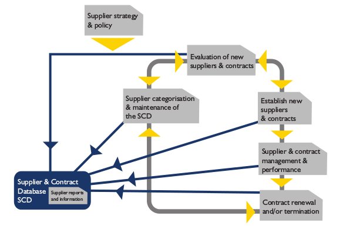

#Service Design
##Allgemeines
###Ziele
Ermittlung Req, Übersetzung in Service- und Service-Mgmt-Lösung, Entwicklung neuer / geänderter Services, Betrachtung Designaspekte bei Plannung, Anpassung Services und Service-Mgmt, 4-P: wichtige Rolle (Processes, Products, Partners/Providers, People)

###Grundbegriffe
Req primär aus Service-Portfolio  

**Service Solution: **  Sicherstellung neue / geänderte Services passen in bestehendes S.-Portfolio, allenfalls Designanpassungen notwendig, Analyse BU-Anforderungen :arrow_right: Überführung in Serviceanforderungen :arrow_right: Erstellung Design Service Solution

**Supproting Systems:** SMS und Tools Prüfung, Sicherstellung Support gewährleistet, Erfolgsfaktor: richtige Tools, Hohe Automation, S.-Portfolio während S.-Design-Phase erstellt, S.P. gemanagt durch S.-Strategy

**Design technologischer Architekturen: ** Sicherstellen: eingesetzte Technologien, Infrastruktur, Applikation mit neuem / geändertem Service vereinbar, Betrieb / Wartung wertschöpfend, ggf. Anpassungen, Enterprise Architecture (div. Frameworks existent), EA Punkte: Service- / Application- / Information- / IT Infrastructure / Environment-Architecture

**Prozessdesign: ** Prozessdesign (inkl. Rollen, Verantwortlichkeiten, Prozessfähigkeiten) in der Lage n/g S. zu betreiben, ggf. Anpassung P. oder S. (Service Design-P, IT-P, SM-P)

**Design Kennzahlensysteme:** Sicherstellung das best. Messmethoden n/g S unterstützen und erlauben notwendige Kennzahlen / Metriken zu liefern. ggf. anpassung / Erweiterung bestehende

##Prozesse im Service Design
###Service Catalogue Management
Einheitliche Verwaltung Inf. Servicekatalog, korrekte Abbildung, aktueller Stand, SST und Abhängigkeiten der Services ersichtlich und aktuell, Betrachtung von zwei Aspekten: Technischer S.-Katalog (techn. Erbringung IT-Services + Beziehungen, nicht für Kunden), BU-S.K. (Sicht IT-S. aus Sciht Kunde, Fokus: GP, Serviceangebot für Kunde)

###Service Level Management
Vereinbarung, Definition, Überwachung, Messung, Review, Report IT-Services zwischen IT-Org - Kunde, Sicherstellung messbare Ziele, Überwachung & Verbesserung Kundenzufriedenheit, Sicherstellung klares & eindeutiges Verständnis, Erfassen, Vereinbaren, Dokumentieren von Req (Service Level Requirements, SLR), Verfassen & Überprüfen SLAs, Konzipieren & Dokumentieren von internen Vereinbarungen im Rahmen Servieerstellung & Integration Partner

**SLA:** SL Agreement, qualitative & quantitative Vereinbarungen, kundenbezogene Formulierung, Leistungs- (Inhalt, Leistungsparameter), kaufmännischer-, juristischer Bereich - Alternative: Multi-Level-Struktur mit Rahmenverträgen (kaufmännisch / juristisch) **-** Arten: Service-based (Service welcher für jeden Kunden identisch ist.), Customer-based (spez. Kundenwünsche für ein / mehrere Services), Multi-Level

**Operational LA:** nach innen gercihtete Vereinbarung Fach - IT-Org Erstellung / Erbringung Teilservies zu Erfüllung SLA, keine jur. Teil

**Underpinning Contract (UC):** extern gerichtete Vereinbarung mit dritter Partei, Lieferung def. Service als Teilerbringung SLA, Vertragswerk mit jur. anteil

###Capacity Management
Ermittlung benötigte, kostenmässig vertretbare Kapazität von IT-Ressourcen, sodass SL zeitgerecht erfüllt werden kann, Fokus: Erstellung & Pflege angemessene und aktuelle Kapazitätsplan welcher momenante Bedürfnisse BU wiederspiegelt, Bereiststellung Inf. und Erstellung Richtlinen über alle Bereiche des BU in Zsh. mit IT zu leistungs- / kapazitätsabhängige Fragen, Sicherstellung Erreichung S. Performance mit vereinbarten Zielen

**Basiskonzepte:**  
  * Business Capacity Management (BCM)
    Trend, Prognose, Modell, Prototyp, Grösse, dokumentation zukünftige BU-Req an IT_Services
  * Service Capacity Mgmt (SCM)
    Monitoring, Analyse, Tuning, Report Service Performance, Erstellung Mindest-Req und Profilen für Gebrauch von S.

  * Component Capacity Mgmt (CCM)
    Monitoring, Analyse, Bericht Auslastung der verschiedenen IT-Komponenten, Erstellung Mindest-Req. und Profilen für Gebrauch

###Availability Management
Bereitstellung Richtlinien & anleitungen für alle BU-Bereiche + IT wo Verfügbarkeit eine Rolle spielt, Erstellung angemessener und aktueller Verfügbarkeitsplan + aktuelle + zukünftige Req des BU an Verfügbarkeit, Sicherstellung, dass S.-Verfügbarkeit den vereinbarten Zielen entspricht, Unterstützung bei Diagnose und Lösung von Störungen und Problemen in Bezug auf V., Untersuchung Auswirkungen von Changes auf V.-Plan + Performance und V. aller Ressourcen in Service

**Basiskonzepte:**
  * Availability
  * Service Ability
    Fähigkeit 3-Anbieter, Bedingungen Vertrag einzuhalten, Vertrag umfasst Umfang der Zuverlässigkeit und die Wartbarkeit oder Verfügbarkeit eiens Configuration Item
  * Reliability
    Zeit zwischen zwei Ausfällen :arrow_right: Aussage über Zuverlässigkeit
  * Maintainability
    Aufwendungen um operativen Betrieb S. sicherzustellen.

Betrachtung aus Sicht einzelner Kompl (Component Availability) und Service-Sicht.
IT-S. nicht verfügbar, wenn die vor Ort benötigten Fkt nicht / eingeschränkt genutzt werdne können. ITIL nur ja / nein :arrow_right: nicht verfügbar, sobald Service Level nicht erreicht wird.

###IT Service Continuity Management
Erstellen IT Service Continuity-Plänen zur Unterstützung Business C-P, Vervollständigung regl. BU Impact-Analysen zur Prüfung, ITSCM-Ziele in Geschäftsbereichen und IT-S.-Bereichen kommunizieren, Sicherstellung Continuity- / Recovery-Mechanismen verfügbar / umgesetzt, Verträge mit Zulieferer für notwendige Leistungserbringung zur Widerherstellung

####Unterschied BCM ITSCM
**BCM:** Management von Risiken, Kontinuität des allg. Geschäftsbetriebs, reduziert Risiko auf akzeptables Niveau, plant Wiederherstellung notwendige. GP und unterstützenden Fkt. im Schadenfall.

**ITSCM:** Bestandteil BCM, legt Fokus auf Wiederherstellung IT-S

###Suplier Management
Absicherungsverträge / Vereinbarungen mit Zulieferern, müssen Req BU entsprechen, Überinstimmung mit im SLM vereinbarten Zielen bzgl. SLR und SLA, Aushandeln / Vereinbaren mit Zulieferern und Verwaltung über gesamten Lebenszyklus, Verwaltung Kundenbeziehungen, Bewerten von Zulieferern, Verwalten Richtlinien Zulieferer und Suppplier and Contract Database, SCD: Def. Rollen & Verantwortungen auf Seiten IT-Org. + Partner, idealerweise des globalen CMS oder SKMS

###Information Security Manaagement
Grad an Sicherheit für Inf und IT-S., ITIL: Grad von kunde oder gesetzlichen Req definiert und vom Anbieter zugesichert, Teil SLA. ISA: Kontinuierliche Planung, Impl und Bewertung Sicherheitsmassnahmen (Personal, Org, Infra, Technologie), Reaktion auf "Security Incidents", Aufgabe Mgmt und aller Ma, Vermeidung Security incidents durch Security Mgmt, angemessene / planvolle Reaktion auf S.I., Erstellung Security-Plan + Doku Req, Festlegung Toleranzen zur Abgrenzung Restrisiko, Berücksichtigung Rahmenbedingungen (strat., taktisch, operativ) - Prinzipien: Confideniality, Integrity, Availability

##Rollen im Service Design
  * Service Design Manager
    Koordination, entwicklung Qualitätslösungen für Services & Prozesse
  * Service Catalogue Manager
    Erstellung & Wartung Service Catalogue
  * Service Level Manager
    Zuständig für Einhaltung Ziele SLM, sicherstellung gegenwärtige & zukünftige Req identifiziert, verstanden, dokumentiert
  * Availability Manager
    Verantwortlich Einhaltung Ziele A.M., Pflege A.M. Information System (AMIS) :arrow_right: Basis Verfügbarkeitsplan
  * IT Service continuity Manager
    Ziel: BC unterstützen, Sicherstellung, dass benötigte IT-S. zur vereinbarten Zeit wiederhergestellt sind.
  * Capacity Manager
    Verantwortlich ausreichend Kapazität für existierende / künftige Req, Kapazitätsplan
  * Supplier Manager
  * IT Planner
  * IT Designer / Architect
  * Security Manager
