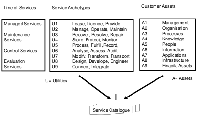
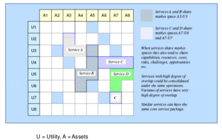
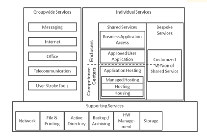
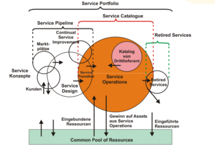
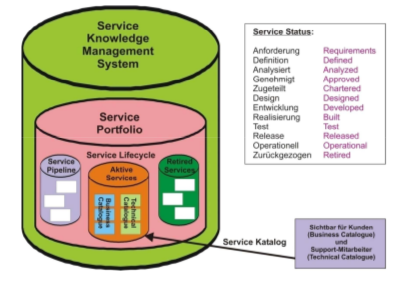
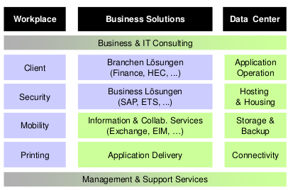
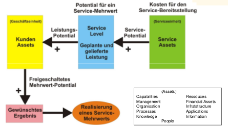
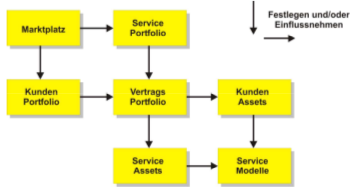
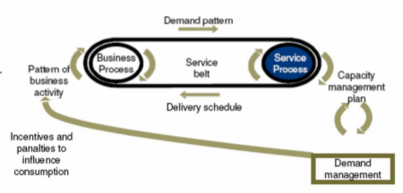

#ITIL
##Service Strategy
*Hinweis: Erster Teil auf gDocs (Bis Slide 28)*  

###Service Klassifizierung
**Klassifizierung von Services**  

**Services klassifizierbar machen**  
  

###Service Portfolio
**Service Portfolio Strukturierung**  

**Service Portfolio Management**

 **Service Portfolio Datenbank**
 

 **Service Portfolio managen**
 Wiederspiegelt Anforderungen Kunden, fortwährendes Hinterfragen, vorausschauend den Bedürfnissen anpassen, auf Basis Finanzieller und Geschäftlicher Informationen - Define (Inventories, Business Case), Analyse (Value Propossition, Prioritization), Approve (Service Portfolio, Authorization), Charter (Communication, Ressource allocation)

**Beispiel SP - SCIS**  

 ###Strategische Assets entwickeln
 

###Service Modelle entwickeln
Beschreibt wie Service Assets mit Kunden Assets interagieren und wie sie einen Mehrwert für best. Portfolio von Verträgen generieren

###Service Packages
Detaillierte Beschreibung IT-Service, sodass dieser an Kunden geliefert werden kann, Bestandteile: Service Level Package und 1:n Core und Supporting Services

  * Core Service Package (CSP): geteilt von  2:n SLP
  * Service Level Package (SLP): definiert Nutzbarkeit und Garantie für best. Service Package, auf spez. Muster von Business Aktivitäten zugeschnitten
  * Line of Service (LOS): core / supporting Service n SLP, gemanagt von einem Product Manager, jedes SLP für spez. Marktsegement designed.

###Finanical Management
Ziel: Schaffung Transparenz, Unterstützung krit. Unternehmensentscheidungen durch konsequente Anwendung:
  * Service valuation (Bewertung)
  * Demand Modelling
  * Financial Modelling of SP
  * Service Provisioning Optimization (Optimierung Bereitstellung)
  * Planning Confidence
  * Service Investment Analysis
  * Accounting (Kostenrechnung)
  * Compliance (Erfüllung)

###Demand Management
**Techniken:** Off-peak pricing, Volume Discounts, gestaffelte Service Levels  
Business Prozesse: Primäre Quelle für Bedarf an Services  

**Nachfragesteuerung:** Wesentlicher Aspekt SM (Abstimmung Angebot:Nachfrage), Vorhersage & Regulierung Kauf der Produkte, Fehler: Risiko (Überkapazität & Kosten), Ungenügende Kapazitäten: Beeinflussung Qualität Service und Beschränkung Wachstum  

**SLA:** Bedingen Vorhersage, Planung, Koordination mit Kunde, Minimierung Unsicherheiten bezg. Nachfrage  
**Problem:** Produktion & Verbrauch findet gleichzeitig statt.

###Diverses
####Return on Investments
  * Business Case
  * Pre-Programme ROI-Techniken
  * Post Programme ROI-Techniken

####Rollen, Chancen, Risiken
  * Chief Sourcing
  * Officer
  * Product Manager

##Service Design
**4 P's:**
  - People
  - Processes
  - Products
  -

**5 Aspekte:**
  -

**Prozess:**
  - Service Design
    - Business Requirements
    - Servic Requirements
    - Service

    - Service Design Package: Gesamte Dokumentation Service  

**Disziplinen für Service Design:**
    - Service Level Management: Kunde (Service Requirements) - SLA -  SL Manager (Service Catalogue), SLM - OLA - RZ, SLM / Rz - Underpinning-Contract (Sicht Externer: SLA) - Externer Provider (Supplier Management)
    - Service Catalogue Managament: Business Service Cataogue (Public), Technical Service Catalogue (Interne Sicht, HW, SW, Anwendungen, Daten)
    - Capacity Management
    - Availability Management
    - Service Continuity Management
    - Information Security Management
    - Supplier Management

###Disziplinen

####Supplier Management
Supplier \& Contract Database (SCD), Parallelen Beschaffungsprozess (Procurement), BP: Strateie, Spezifikation, Offerte einholen, Lieferantenauswahl, Bestellung, Warenannahme, ...

####Availability Management
Reaktive Aktivitäten: Monitoring, Messungen, Analyse, ...

OLA Verfügbarkeit: Abängig: Wartbarkeit
Underpinning Contract: Verfügbarkeit: Abhängig

####Capacity Management
#####BCM

#####SCM

#####CCM

####Security Management
Datensicherheit: Verfügbarkeit, Vertraulichkeit, Integrität  
Physische Sicherheit, Logische Sicherheit, Netzwerksicherheit, Anwendungssicherheit, ...

##Service Transition
Nach Transition :arrow_right: Service Operations

###Disziplinen / Prozesse
  - **Gesamter Life Cycle**
    - Change Management
    - Service Asset Management und Configuration Management System (CMDB)
    - Knowledge Management
  - **Fokussiert auf Tranisition Phase**
    - Transition Planning and Support
    - Release and Deployment Management
    - Service Validation and Testing
    - Evaluation

####Change Management
Service Change: Hinzufügen, Verändern Entfernen von authorisierten, geplanten, supporteten Services / Service-Komponenten und der dazugehörigen Dokumentation, nur über Change Prozess - Gilt für: Service Assets, Configuration Items  

Strategic Change, Tactical Change, Operational Change
TODO: Image Slide 9 ST

**Change Management Prozess für Operational Changes:**
  1.  RFC: Request for Change (Anfrage)
  2.  Review RFC
  3.  Beurteilung Change-Typ (S, N, E)
      - S: Standard Change :arrow_right: Service Request (kleine Änderung, regulär, oft)
      - E: Emergency Change :arrow_right: Spezialfall
      - N: Normal Change
  4.  Verification and Authorization
  5.  Change Planning
  6.  Entscheid Go / NoGo
  7.  CO: Change Order (Übergabe an Techniker, PL, QS-Leiter, etc. für Durchführung)  
  8.  PIR (Post Implementation Review) durch Change Manager

**Change Advisory Board (CAB):** Wenn grosser / teurer Change  
**Emergency Advisory Board (ECAB):** Bei Emergency  

**7 R's:**
  - Raise the Change  (Dokumentation)
  - Reason
  - Return (financial Benefit)
  - Risk involved / Impact Analysis / Risk Analysis
  - Resousrces needed
  - Responsibility
  - Relationship between Changes

**Priorisierung:** TODO: Bild slide 13

**Rollen:**
  - Change Manager
  - CAB
  - EC/CAB

**Voraussetzungen / Best Practices:**
  - Konfigurationsmanagement und Release Management als Basis / Voraussetzung
  - Prozess-Verantwortliche unabhängig von Organisations-Hierarchie

###Configuration Management
CMS: Config Management System, CMDB: Configuration Management Data Base, SKDB: Service Knowledge Data Base, DML: Definitive Media Library
Configuration Item (CI): Asset, Service component or other item that is / will be controlled by configuration management, DML: location in which the definitive or approved versions of all software configuration items are stored

**Configuration Items:** Verträge, Netzwerk / Netzwerkkomponenten, Prozessbeschreibungen, Hardware, Prozesse, Rollen, Handbücher, Dokumentation - Tiefe und Umfang abhängig von Ziel und Zweck, Pro Item: Version, Variante, Baseline (Vergleichsbasis)

//TODO: Von Slides vervollständigen

**Rollen:**
  - Service Asset Manager
  - Configuration Manager
  - configuration Analyst
  - Configuration Administrator / Librarian
  - CMS / Tool-Administrator

//TODO: Bild Slide 36

###Knowledge Management
CMDB - CMS - Presentation and Processing Layer - Service Knowledge Management System, Ziel: Qualität Managemententscheidungen verbessern, DIKW: Data - Information - Knowledge - Wisdom

TODO: Restliche Slides
