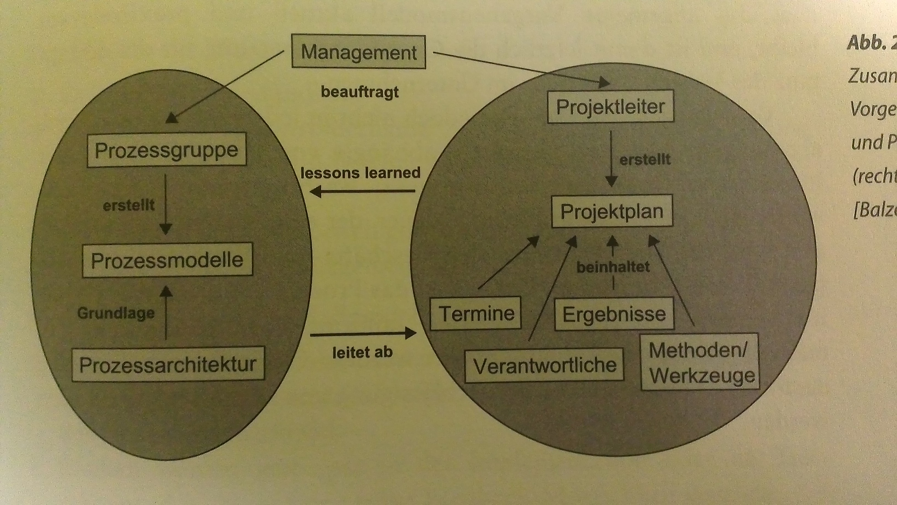
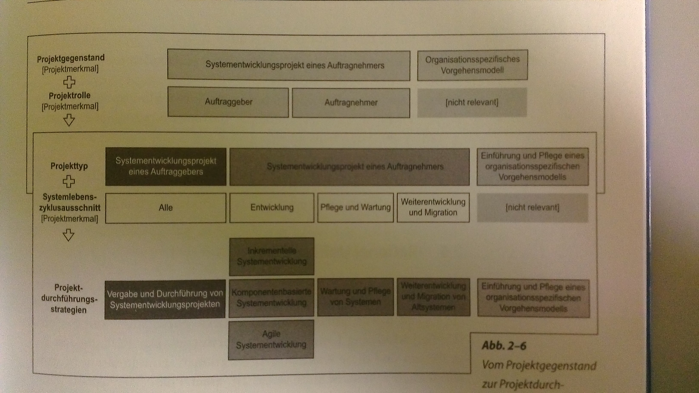
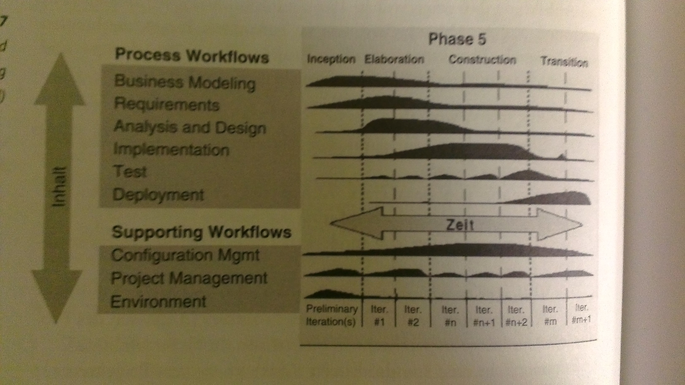
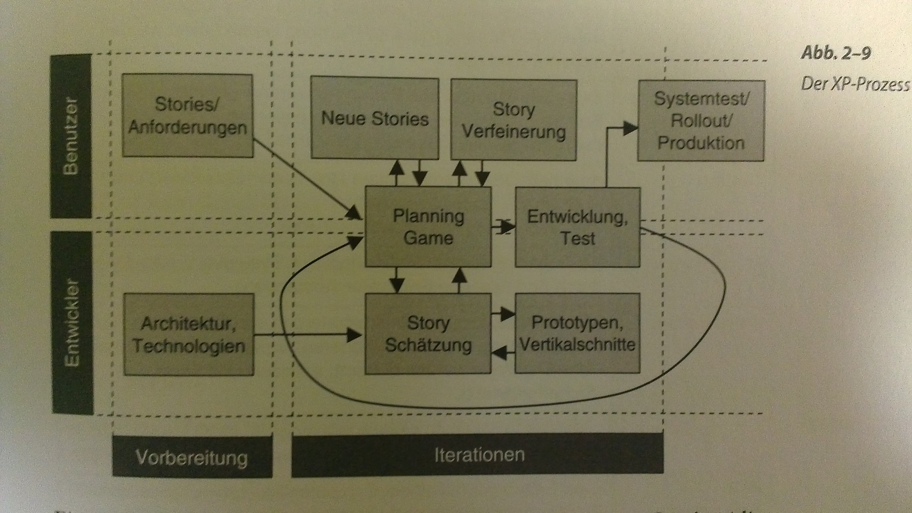
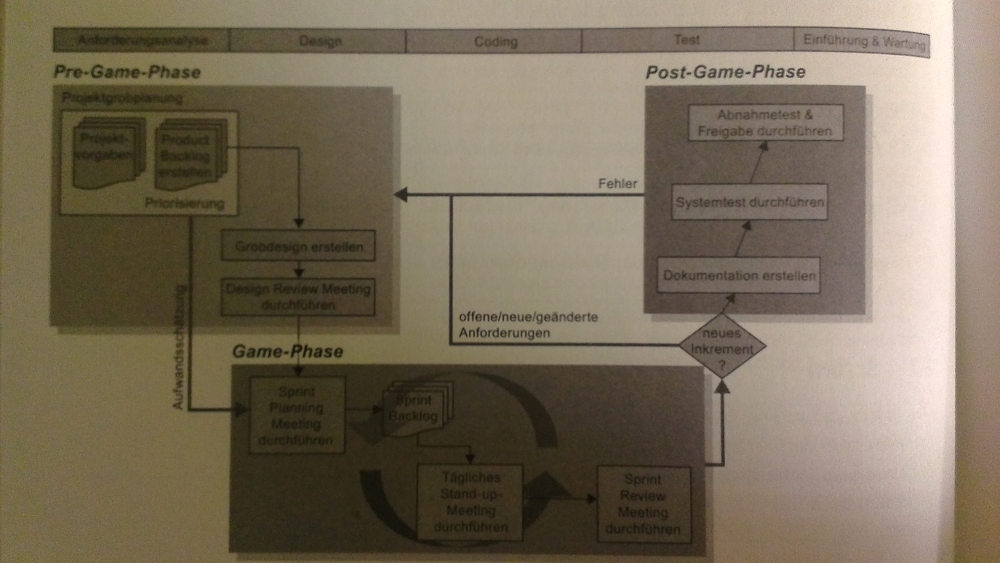

#Vorgehensmodelle Softwareentwicklung
**Wofür: ** Strukturierung, Rollenverteilung, Dokumente / Artefakte, Methoden, Werkzeuge
**Vorgehensmodell:** Methoden und Elemente inkl. PPM zu Prozessen und Projektphasen
**| Vorteile: ** Sicherheit für Projektleiter, Richtiges zur richtigen Zeit tun, Vorlage für tägliche Arbeit im Projekt, Positionsbestimmung, Transparenz bezüglich Aufwand
**| Basis für: ** Projektplanung, Assessment, Performance-Analyse, Prozessverbesserungen

##Typische Bestandteile
Viele frühe Modelle (V-Modell, Wasserfallmodell) sind keine Vorgehensmodelle, sondern strukturieren Entwicklung in Phasen, Definition von Phasen (innere Uhr), Rollen, Aktivitäten, dokumente, Methoden - Beziehung zwischen Parametern

Linke Gruppe: Entwicklung Vorgehensmodell auf Basis Prozessarchitektur, bestehend aus Elementen und Verknüpfungen, Projektleiter: Ableitung konkretes Projektvorgehen + Projektplan aus Vorgehensmodell, auch umgekehrter Erfahrungsfluss (via Änderungsmanagement), nicht in jedem Projekt identisch angewendet, Prozess-Tailoring im Rahmen der definierten Tailoring-Richtlinien, kein Freibrief Vernachlässigung Prozesse

##Wasserfallmodell
Weiterentwicklung "Stagewise Model", Rückkoppelung zwischen zwei aufeinanderfolgenden Phasen, Phasen: Anforderungsanalyse, System- und Moduldesign, Implementierung und Modultest, Integration und Systemtest, Installation und Wartung

**Vorteile: ** einfach verständlich, kontrollierbaren Prozessablauf durch Einführung Meilensteine und Dokumente, organisatorisch gut behherrschbar, wenig Managementaufwand

**Nachteile: **Gefahr: Dokumente wichtiger als System / Projektziel, Risiken erst spät in Impl / Test erkannt, keine frühe Feedback-Möglichkeit, Veränderungen / Detaillierungen von Req bleiben unberücksichtigt, Vorstellung erst nach Vollendung, Test erst nach Entwicklung, oft iterativ besser

**Eignung: ** stabile Projekte nach einheitlichem Ablauf, Req. am Anfang klar und keine Veränderung, kleine Projekte oder WE

##V-Modell
Erweiterung Wasserfall, fokus QS

**Verifikation:** Geplanter, systematischer Prozess, Sicherstellung Arbeitsprodukt = Req, Produkt so entwickelt wie spezifiziert?  

**Validierung: ** Geplanter, systematischer Prozess, Arbeitsprodukt erfüllt beabsichtigten Nutzen, richtiges Produkt entwickelt?

**Unterschied Wasserfall: ** Testfälle können früh spezifiziert werden (Req / Design), Fokus QS

  - Anforderungen  -   Systemtest
  - Systemdesign   -   Integrationstest
  - Moduldesign    -   Modultest
  - Modul-Kodierung

##V-Modell XT(IT-Systeme des Bundes)
Umfangreiches Vorgehensmodell, entwickelt für Bundeswehr, diverse Einflüsse aus neueren Ansätzen (iterativ, Tailoring, XP), Kernelemente: Vorgehensbausteine (Kapselung Rollen, Produkte, Aktivitäten), können eigenständig verwendet werden, ggf. Abhängigkeiten andere VBS, Mittelpunkt: Arbeitsergebniss (dokumentenorientierter Ansatz), Produkt kann aus mehreren untergeordneten Produkten bestehen, Abhängigkeiten zwischen Produkten, rolle: Verantworltich für Arbeitsprodukte (durch Aktivitäten erarbeitet), VBS: keine konkrete Reihenfolge im Projekt, Projektdurchführungsstrategien: Definition Reihenfolge, Ende jeder Projektstufe: Meilenstein (+ MS-kriterium)

**Unterschied V-Modell:** Aktivitätsorientierter Ansatz

**Einführung:** zweistufig, anpassung auf UN-spezifische Bedürfnisse (Tailoring), UN-spezifisches Vorgehensmodell,

**Vorteile: ** Unterstützung Parallelisierung, Vorgabe Aktivitäten, Produkte, Methoden, Rollen und Zuordnung zueinander, Zurverfügungstellung moderner Projektdurchführungsstrategien, generisches vorgehensmodell, standardisierte Abwicklung von Projekten zur Systemerstellung

**Nachteile: ** Hohee Komplexität, Hohe kosten für Einführung, unnötige Bürokratie bezüglich Dokumentation und Vorgehensweisen in kleinen / mittleren Projekten, ohne CASE-Unterstützung schwer handhabbar

##Rational Unified Process
Prozessmodell von Rational (aufgekauft von IBM), Unterstützung objektorientierte Entwicklung mit UML, Gliederung in Phasen, diese in Iterationen, jede Iteration hat wholdefiniertes und überprüfbares ergebnis (Meilenstein), Aktivitäten in 9 kern-workflows (Business Modeling, Requirements, Analysis & Design, Implementation, Test, Deployment, Configuration & Change Management, Project Management, Environment) :arrow_right: verteilen sich auf Phasen mit unterschiedlicher Gewichtung

Artefakte (Dokumente, Use-Case-Diagramme, Modelle, Modellelemente): Zwischenergebnisse während gesamter Entwicklung, jedes Artefakt gehört einem worker (Rolle), Änderung / Benutzung durch mehrere Worker, Artefaktguidelines unterstützen Worker, Checkpoints (Checklisten) für QS, Artefakt-Reports (Schablonen für Berichte, keine Versionierung)

**Best Practices: ** Anforderungsmanagement, Iterative Entwicklung, Architekturentwicklung, Visuelle Modellierung, Qualitätskontrolle, Change- und Konfigurationsmanagement

**Vorteile: **Flexibilität durch periodische Überprüfung Prozessablauf, frühzeitige lessions learned, Frühzeitige Eliminierung Fehler / ungeeignete Alternativen, Früherkennung Risiken, Massgeschneidert auf objektorientierte / komponentenbasierte SWE, ausführliche Sammlung Best Practices, Parallelisierung, Präsentation als Hypertext, Integrierte Umgebung (Prozessbeschreibung, CASE-Werkzeuge), Artefakte als Modellelemente von CASE-Werkzeuge :arrow_right: leben automatisch

**Nachteile: **Hoher Managementaufwand (oft neue Entscheidungen über P.Ablauf), Hohes Mass Komplexität, Hoher Einarbeitungsaufwand, Hoher Aufwand Iterationsplanung, herstellerabhängige Werkzeugunterstützung

**Randbedingungen Einsatz: ** Inkrementelle Entwicklung System möglich, Kunde kann Feedback geben, Kunde ist flexibel, reines SWE-Projekt

##Extreme Programming
**Light:** Leichte P., weniger Dokumentation, Verschärfung mit Agile Manifest  
**Extreme:** leichtgewichtiges P.Modell, wenige Rollen, Phasen und stark iterative Praktiken

Grundlage Stories (+-= Use Cases), Planning Game: Benutzer + Entwickler, Schätzung Storis durch Entwickler, Kunde muss Schützung akzeptieren, Releasebündelung, Priorisierung, Releaes können in mehrere Iterationen unterteilt werden

**Parktiken:**  
  - On-Site Customer (Benutzer, Entwickler im gleichen Raum, direkte Fragen)
  - 40 Hour Week (aktive Kommunikation, Schlechte Plannung muss im Planning Game gleöst werden)
  - Planning Game
  - Testing (Automatisiert, Unit-Tests, Acceptance-Tests)
  - Metaphor (Gemeinsames Verständnis, Vokabular)
  - Refactoring (continuous design, Unit-Tests notwendig)
  - Simple Design
  - Pair Programming
  - Short Releases
  - Coding Standards
  - Collective Ownership
  - Continuous Integration

**Vorteile XP:**
Keine Bürokratie, fokus Code, Verkürzte Releasezyklen, frühes Feedback, weniger Stress, optimale Wisensverteilung  

**Nachteile XP:**
Geeignet für kleine Teams, bedingt für grösssere / verteilte, kein detaillierter Projektleitfaden, keine ausführliche Dokumentation

##Scrum
PM kombiniert mit Rugby, Grundannahme: Entwicklungsprozesse zu komplex für klassische Vorgehensmodelle, produktiver: grober Rahmen vorgeben, Team hat gemeinsame Verantwortung für Zielerreichung, kein Engineering-Vorgehensmodell, nur Ansatz, Praxis: Kombination Scrum und XP

3 Abschnitte: **Pre-Game Phase** (Projektgrobplanung, Projektteam, Werkzeuge, Standards, Erstellung Product Backlog, Grobdesign, keine Gesamtarchitektur),

**Game-Phase** (Sprint, Sprint Planning Meeting, mehrere Sprints, Daily Scrum, ScrumMaster, sprint Review Meeting),

 **Post-Game-Phase** (Überführung System in Produktion, Dokumentation, Systemtests, Feigabe- / Akzeptanztests, Auslieferung)

**Vorteile:** gut strukturiert, flexibel, einfach, gemeinsame Verantwortung, häufige Abstimmungsmeetings, Fokussierung, kurze Sprints, höhere Planungssicherheit

**Nachteile: ** grosse Teams: mehrere Scrum-Temas, Scrum-ofScrum-Ansatz, Product Owner muss Team zur Verfügung stehen, Abhängigkeit des Prozesses von einzelnen Schlüsselrollen
