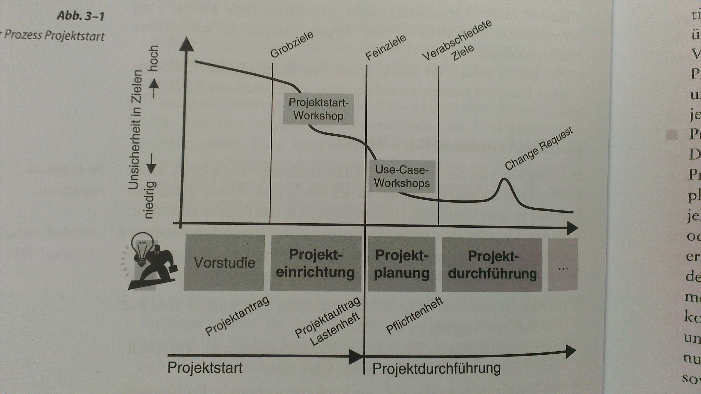

#Projektstart
Prozess, kein Zeitpunkt  

**Ziele: ** Festlegung Projektinhalte mit Kunde **-** Erwartungen Auftraggeber and Ergebniss hinsichtlich P.-Ziele und P.-Inhalte präzisieren (Abgrenzung von Req, schriftlich) **-** P.-Inhalte Basis Angebotserstellung und Pro / Contra für Entscheid **-** Bewertung Projekt für Entscheid (technische Umsetzbarkeit mit Machbarkeitsstudie,Wirtschaftlichkeitsbetrachtung mit  Aufwandschätzungen, Risikoanalyse) **-** Projektziele: Kommunikation an Stakeholder, Verfeinerung Ziele, Priorisierung, Vollständigkeit wichtig **-** Projektablauf (Grobplan) & -organisation (Rollenverteilung, Schnittstellen Teilteams) festlegen **-** entwicklung Projektkultur (Kennenlernen, feste Rituale, Meeting-Kultur, Social Events :arrow_right: Projektstammtisch)  
**Probleme:** Unrealistische Ziele (Budget / Termine) **-** Mangelndes einheitliches Verständnis P.-Ziele (implizite Annahmen) **-** fehlende org. Regeln :arrow_right: ineffiziente Zuammenarbeit **-** unverbindliche P.-Pläne (werdene vom P.Team nicht akzeptiert, Budget, Termine) **-** Mangelnde Unterstützung Mgmt **-** Zu wenig Zeit für Projektstart  

**Projektziel:** DIN 69905, nachzuweisendes Ergebnis und/oder vorgegebene Realisierungsbedingung der Gesamtaufgabe, Eigenschaften: Quantifizierbar, erreichbar, im Einklang mit strat. UN-Zielen

##Prozess "Projektstart"
**Beginn:** schwierig zu definieren, Konsens, etwas muss gemacht werden, Bsp Schritte: Analyse lastenheft, Produktidee prüfen, Machbarkeitsstudie (Gemeinsamkeiten: Afuwände entstehen, keine Kostenstelle, Verantwortung liegt bei einer Person)

**Ende:** Alle notwendigen Infos vorhanden, sodass Leistungserbringung möglich, detaillierte P.-Planung :arrow_right: bereits Leistungserbringung

###Ablauf

**Vorstudie:** Hohe Unsicherheit Projektziele, Wirtschaftlichkeitsbetrachrung, technische Machbarkeit, provisorischer / temporärer Projektleiter, Ende VS: P.-Ziele klar definiert, Rahmenbedingungen gklärt, alles i.O. :arrow_right: Projektantrag an Leitung, grobe Version P.Plan vorhanden

**Projekteinrichtung:** Idee, Auftrag klar, Bildung Kernteam :arrow_right: Aufgabe: Verfeinerung P.-Ziele, Workshops, Auswahl P.-Team, Ergebniss: Lastenheft, überarbeite Version P.-Plan, Auftrag druch Leitung offiziell, endgültiger PL, Lenkungsauschuss

**Projektplanung:** Beginn: Kick-Off P.-Team, Übergang P.-Start und Leistungserbringung, je nach P zu Start oder Durchführung gehörig, Inhalte: Change- / Konfigurationsmgmt, Planung QS, Projektkommunikation, notwendige Weiterbildungen, Beschaffungen, Prüfen & Anpassen Schätzungen und Planung, Detailplanung bis MS 1

**Projektdurchführung:** Pflichtenheft offiziell freigegeben, Start Durchführung

###Auswahl Projekte
Klassifizierung Projekte
Hoher Innovationsgrad: oft wenig Ertrag, Verlust, aber Know-How-Vorsprung, besserer Ertrag später, gesunder Mix aus Projekten

###Projektstartkommunikation

**Vorstudie:** Kommunikationsart Auswahl P.-Team: Einzelgespräche, "Einstellungsgespräche", Rollenbesetzung, Infos

**Projekteinrichtung:** Kick-Off-Veranstaltung: Informationsverteilung, Kennenlernen & Teambildung, Entiwcklung Vision, gleiche Vorstellung Ziele, Einführung Rituale, gleiche Mittel & Werkzeuge - z.T. mehrere Kick-Offs,

**Projektstartphase:** workshops: Sammlung Infos, Erarbeitung / Verfeinerung P.-Ziele / -Meilensteine, / -Planung, /-org, Vorgehensplanung Folgephasen, Verantowrltichkeiten, detaillierte Protokollierung

**Projektplanung:** Zweites Kick-Off für neue, Verfeinerung Planung in Workshop: Prüfung Grobplan, Konkretisierung (Arbeitspakete, Schützungen, Abhängigkeiten), Prüfung & Freigabe, Verteilung an Beteiligte

## Projektdefinition
Ergebnis Projektstart

**Abschnitte:**
  * Projektmotivation  
    Unternehmerische Motive
  * Projektziel  
    Quantifizierbare P.-Ziele (Dreieck) welche erfüllt werden müssen, Messbare Erfolgskriterien
  * Produkte und Projektergebnisse  
    Was wird erzeugt? Hauptbestandteile
  * Projektstrategie
    Vorgehen, Meilensteine, grobe Termin- / Budgetplanung
  * Stakeholderliste
  * Projektorganisation
  * Mitwirkungspflichten Auftraggeber
  * Getroffene Annahmen, Chancen, Risiken

##Anforderungsanalyse im Überblick
*Siehe Requirements Engineering*  

**Probleme:** Vollständigkeit, Eindeutigkeit, Konsistenz  

**Anforderungsanalyse:** systematischer Prozess, iterativ, kooperativ  

**Eigenschaften Req:** eindeutig, vollständig, überprüfbar, konsistent, änderbar, verfolgbar
