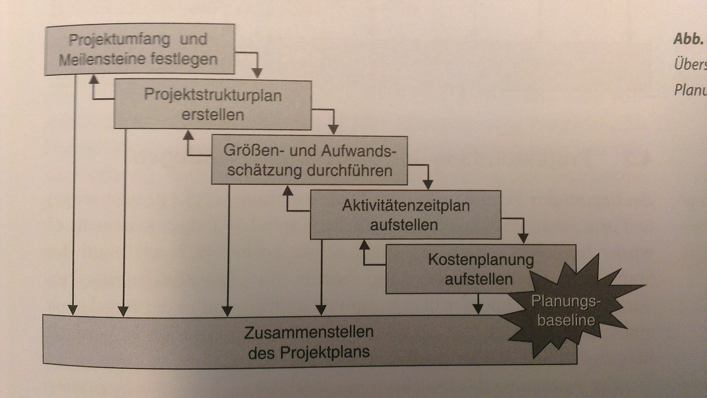
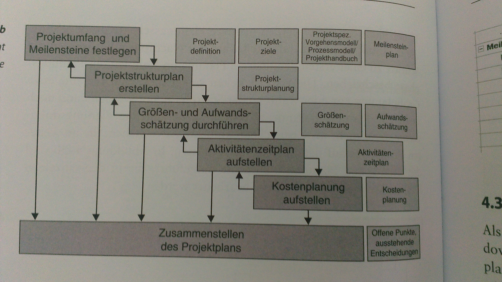
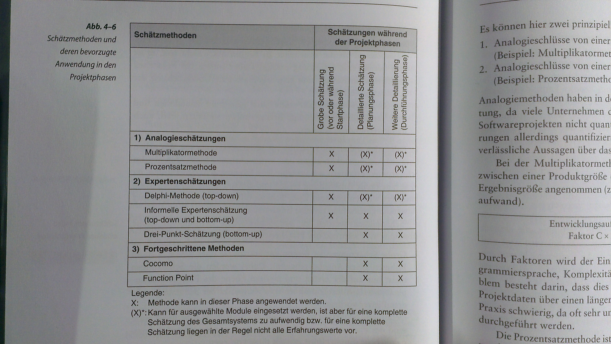
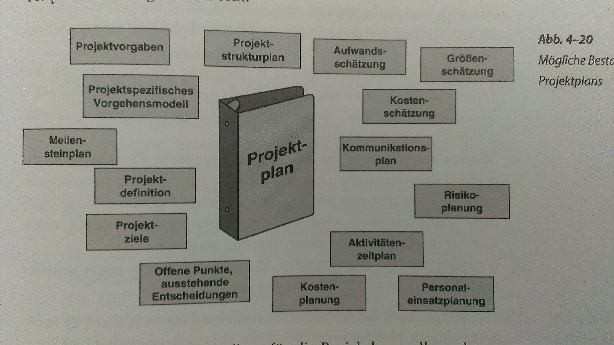

#Projektplanung
Treffen von Annahmen / Entscheidungen, was im P.-Verlauf gemacht wird. Vielzahl von Aktivitäten die den inhaltlichen / zeitlichen Ablauf bestimmen, festhalten in Planungsdokumenten
sfehler, Viele Fehler bereits in Planungsphase verursacht

**Typische Planungsfehler:** Zu viel, zu wenig Zeit, unrealistische Wunschtermine, Senior Mgmt hält an Wunschtermin fest, nicht mit Betroffenen abgestimmt, unzure finanzielle Planung, unreichende Infos, zu wenig Personal, Schätzungen zu optimistisch, Abschätzung noch nicht möglich

**Ziele Projektplanung:** Bereitstellen Basis für Kontrolle & Steuerung Arbeiten, besseres Verständnis P.-Ziele, Verbesserung Effizienz Projektabwicklung, Vermeiden / Verringern Redundanzen, Fundament für Projektgelingen

##Überblick
Nicht gesamte Detailplanung, nur z.B. 2-3 Monate im Vorraus (iterativ: 1-2 Iterationen), andere: Grob, Intensität: Startphase (Grobplanung Angebotsabgabe, Grobplanung), Planungsphase (Detaillierte Planung), Durchführungsphase (weitere Detaillierungen)

Nicht streng sequentiell, sondern interativ, viele Rückkopplungen notwendig, Teilschritte mehrfach durchlaufen bis Planungsbaseline vorliegt, Planung nie fertig, Überprüfung Resultate von vorherigen Phasen

###Projektumfang und Meilensteine festlegen
Definition Projektumfang (project scope) :arrow_right: Projektdefinition (statement of work), Prüfung, falls vorhanden, Festlegung grober Terminplan (Meilensteine, messbar, bedeutendes Ereigniss), Festlegung auf Basis P.- Ziele, Doku in Projektdefinition oder Aktivitätsplanung

###Projektstrukturplan erstellen
Work breakdown structure, Darstellung Projektstruktur, Strukturdiagramm oder Listendarstellung mit Nummerierung & Einrückungen Mindmap, an Liefergegenständen orientierte Anordnung von P.-Elementen, oberste Ebene: Hauptliefergegenstände oder nach Projektphasen strukturiert, Herunterbrechen :arrow_right: Detaillierung einzelner "Elemente" bis Ebene Arbeitspakete, pro Arbeitspaket: 1:n abrechenbare Liefergegenstände + damit verbundene Aktivitäten (gehören nicht zum PSP)

**Daten AP-Beschreibung:**
  - ID + Name
  - Beschreibung AP
  - Durchführende Rollen / Personen
  - Notwendige Fähigkeiten des Durchführenden
  - Dauer und Aufwand
  - Liefergegenstände
  - Voraussetzungen für Durchführung
  - Voraussetzungen für erfolgreiche Abnahme
  - Kennzahlen zur Überprüfung der korrekten Durchführung

**PSP:** oft weitere Infos: Kostenträger, Verantwortlcihe, Termine, Budgets, PSP-Code für jedes Element (bis AP-Ebene), **Hinweise:** Ebenen 1-2: 10x10 Matrix (10 Elem auf 1, mit je 10 Elem auf 2), APs: handhabbar, nicht zu klein / gross (z.B. Richtwert: 4-6 W / 160 h), strukturiert, sodass Verantwortlichkeiten zuweisbar, unabhängig / abgrenzbar, minimale SST, schützbar (Aufwand, Dauer, Kosten, Zeitpunkte), messbar (Fortschritt) - Erarbeitung Ebenen-Weise, unklare Zweige bleiben bis auf weiteres offen / nicht vertieft, PSP muss Gesamtumfang vollständig abdecken (inkl. AP für PPM, QS, Konfig.mgmt, Test und interne Arbeitsprodukte)

###Grössen- und Aufwandschätzungen durchführen
oft zu optimistisch, grosse Unicherheiten, **Regeln:** Schützungen müssen nachvollziehbar sein (baiserend afu Methodik), wenn möglich: basierend quantifizierbare Vergangenheitsdaten, Schützung durch Experten (Bearbeiter), Schätzdoku: Annahmen & Verständnis, Schätzungen zu unterschiedlichen Zeitpunkten: Grobe Schätzung Beginn Start, Detaillierte Schätzung Ende Start / Planung (AP-Ebene), weitere Detaillierungen während Durchführung

####Analogieschätzung
Ganze / Teile Schätzung auf Basis Erfahrungen / Daten ähnlicher / früherer Projekte, geeignet für Grobschätzung Beginn und AP-Ebene, zwei Methoden: Analogieschlüsse von einer Grösse auf eine andere (Bsp: Multiplikatormethode, linearer Zsh Produktgrösse und Ergebnisgrösse, Bsp: Aufwand PT = Faktor C x Modulgrösse), ... von einer Grösse auf eine andere (Bsp. Prozentsatzmethode, nicht eigenständig, Übertragung Werte einer anderen Phase) - geringe Verbreitung, bei vielen UN liegen Erfahrungen nicht quantifizierbar vor, Mittel zum Sammeln von Erfahrungswerten

####Expertenschätzung
Praxis: informell, unsystematisch, top-down (Arbeit als Ganzes, anhand PSP Ebenen 1 & 2), bottom-up (APs)

**Delphi-Methode:** Schützung AP Experte, Anleitung Moderator + gemeinsame Sitzung, top-down, erste Grobschützung, prinzipiell auch bottom-up

Ablauf:
  1. M: Erläuterung Aufgabenstellung, Unterlagen
  2. E: Diskussion unter Moderation
  3. E: getrennte Schützung, Rückfragen, keine Diskussion
  4. M: Zusf. Zahlenwerte & Abweichungen
  5. E: moderierte Diskussion, Ergebnisse notiert
  6. E: Überarbeitung Schätzung getrennt
  7. Repetition bis Konsens / Annäherung, Durchschnitt als Ergebnis

**Informelle Expertenschätzung: **  Hohe Akzeptanz, weite Verbreitung, top-down oder bottom-up, Grob- / oder Detailschätzung, Durchführung nach gewissen Regeln, mind. durch 2 Experten, Dokumentation getroffene Annahmen, Risiken, Rahmenbedingungen, Teilschätzungen

**Drei-Punkt-Schätzung: ** Experten 3 Schätzungen (Optimistisch, Realistisch, Pessimistisch), i.d.R bottom-up für Detailschätzungen, berücksichtigt Unsicherheit in Planung / Schätzung

####Weitere fortgeschrittene Methoden
**Cocomo:** constructive cost model, Basis: Analogieschätzung mittels LOC + gewichtete Einflussfaktoren wie Entwicklungsmodi und Kostentreibern, Änderungshäufigketi Sys, Erfahrung Anwendungsbereich, mittels Tabellen, Richtlinen und Bsp, Verbesserung: Cocomo 2, skalierbare Familie SW-Schätzmodelle  
**Function Point:** 1. Schritt: aufwand aus Produktanforderungen ableiten (Basis: Eingaben, Abfragen, Datenbeständen, etc.), Verdichtung zu Function Point-Summe, Gewichtung mit Einflussfaktoren (dezentrale Verwaltung, Transaktionsraten, Wiederverwendbarkeit, Komplexität, ...), Klassifikation & G Gewichtung mittels Tabellen, Richtlinien, Bsp, aus 2. Schritt: Def Function Points, mittels Erfahrungskurven in erwartete aufwände umrechnen, Weiterentwicklungen

####Kombination verschiedener Methoden
Absicherung & Vergleich, Praktischer Anwendungsvorschlag: Gemäss Delphi in moderiertem Workshop eine Drei-Punkte-Schätzung  

###Zusammenhang zwischen Grössen- und Aufwandschätzungen
Methoden für Grössen- und Aufwandschätzungen, UN häufig nur AS, GS erhöt Qualität der nachfolgenden AS - 1. GS: z.B. LoC, Anz. Module, Masken, Felder Function Points, Parameter, etc. auch Dokumente, anz. testfälle - 2. AS:Basis: GS, Schützung APs (Bsp pro 200 LOC 40 h) - 3. Personalkosten: Multiplikations Schützung mit Pers.Kostensätzen, Weitere Kosten für Ressourcen und Materialien

##Aktivitätszeitplan aufstellen
Alle P.- Aktivitäten inkl. Abhängigkeiten, Ressourcenzuordnungen, Terminen und Meilensteinen

###Überblick über durchzuführende Schritte
  1. Liste Aktivitäten aus PSP ableiten
  2. Alle P.- aktivitäten inkl. abhängigkeiten, Ressourcenzuordnungen, Terminen und Meilensteinen enthält  2. Erstellen A.-Plan, Teilschritte durchführen, bis (terminliche) Ziele erfülltrozess
    * Abhängigkeiten einbringen
    * Aufwände einbringen
    * Zeitdauer einbringen
    * Ressourcen zuordnen
    * Meilensteine einbringen
    * Start- / Endtermine ermitteln
  3. ggf. Optmiierung Planung
  4. PSP & Aufwandschützung evtl. verfeinern / aktualisieren, Dokumentation Risiken, Annahmen, Rahmenbedingungen

###Ableiten Aktivitäten aus dem PSP
Aktivitäten aus einzelnen APs

###Abhängigkeiten zwischen Aktivitäten
Verknüpfung durch Anordnungsbeziehung, Einschränkungen und Annahmen (B nicht beginnen, bis A fertig, etc.) ** - Zwingende AB:** aus log. Abhängigkeiten von Aktivitäten (Def Req bevor Impl) ** - Wahlfreie AB:** sorgsam einsetzen, Best Practices / Wunsch nach best. Anordnung (Erfahrung, Ereignisse, annahmen) (Kostenplanung erst wenn PSP fertig) **- Externe AB: ** Beziehung P.-aktivitäten und aktivitäten ausserhalb P. ** -  Vor- / Nachlaufzeiten: **um Bez. zu definieren

###Personaleinsatz planen
Idealerweise: Planung kalr def Beschr. von Rollen und Verantowrtlichkeiten, Vorbereitung: Ermittlung wie vil Personal mit welchen Qualifikationen von wann bis wann, Umfang, auf Basis Aufwanschützung: Zuordnung Personal und Berechnung reale Aktiviätendauer, A.-Dauer nicht beliebig durch Ressourcenerhöhung verkürzbar, Gegenteil, keine 100% Einplanung, häufige Ressourcenwechsel schwer beherrschbar, möglichst Schwankungsarmer Verlauf (Ressource Leveling)

###Methodisches zur Aktivitätenzeitplanung
Netzplantechnik (A. mittels Beziehungen verknüpfen) oder Gantt-Chart
**Anordnungsbeziehungen zwischen A.:** Ende-Anfang (Normalfolge), Ende-Ende (Endfolge, Vorgänger muss beendet sein, bevor Ende), Anfang-Anfang (Anfangfolge, Vorgänger muss begonnen haben, bevor Nachfolger beginnt), Anfang-Ende (nur theoretisch)  

**Netzplantechnik: **Aktivitäten: Knoten, AB: Kanten, Meilensteine: Knoten mit Länge 0, Berechnung Gesamtdauer, Pufferzeiten, kritischer Pfad, Pro Knoten: A.-Id / -Bezeichnung, Frühestmöglicher Start, Frühestmögliches Ende, spätester Start / Ende (sodass P.-Termin nicht gefährdet), A.-Dauer **- Techniken:** Vorwärtspass (Start am Anfang), Rückwärtspass (Start am Ende) - Freier Puffer: max mögliche Verschiebung Endtermin A., sodass frühstmöglicher Start Nahchfolger nicht verschiebt **- Kritischer Pfad:** Gesamtpuffer 0, evtl. mehrere

###Planungsoptimierung
Zuerst Endtermin oft nach Projektende / Zieltermin, Techniken: Parallelisierungen, Vorzug von Arbeiten, oft mit Risiken verbunden, Änderung Personaleinsatz (mehr, Überstunden, höhere Quali), Outsourcing, Zukauf Standardkomponenten, Leistungsumfang reduzieren / anpassen, Reduzierung Qualität, Effizientere Technologien /Prozesse, Terminverschiebung

##Kostenplanung erstellen
Kosten: Personal, Ressoucen (tech. Rausrüstung, Gerätenutzung, Materialien, Schulungen, Berater, Subunternehmer, ..), Schützung auf AP-Ebene, Darstellung in Diagramm über die Zeit, Grundlage für Überwachung und Steuerung, oft: S-Kurve, Kurven in Diagramm: Kostenplanung, Erwarteter Geldfluss und Finanzierungsanforderungen (stufenweise), Betrachtung ganzer lebenszyklus SW

##Aufstellen des Projektplans
Sammlung verschiedener Planungsdokumente, Summe Einzeldokumente: schlüssiges Gesamtdokument, Abstimmung mit weiteren Planungsdokumenten: Konfigurationsmgmtplan, SWQS-plan, Testpläne, ..., Entstehung: iterativ, Reviews und formale Genehmigungen durchfhren, unterliegt Konfigurationsmgmt.

##Planungsaktualisierung / iterative Projektplanung
Anstoss Änderung während Durchführung von Projektkontrolle und -steuerung, laufende Planungsfortschreibung **- Kategorien: ** Kleinere Planänderungen (Entscheid durch PL, keine formale Genehmigung), grössere PÄ (formales Änderungsmanagement), Neuplanung (gravierende Abweichungen) **- iterative Entwicklung: ** Anzahl Iterationen, Dauer,  etc. Zwei Ebenen: Makroebene (Phasen, Meilensteine grob geplant), Mikroebene (nächste Iteration Detail, übernächste 1-2: weniger detailliert)
