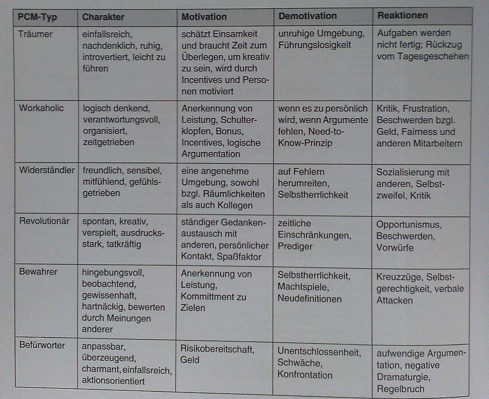

#Personalmanagement
Faktor Mensch, grosser Einfluss auf P., Tompkins in Tagebuch: Wähle die richtigen Leute aus - Betreue die richtigen MA mit den richtigen Aufgaben - Motiviere die MA - Helfe den Teams durchzustarten und abzuheben - alles andere sind Administrivilitäten

##Der Faktor Mensch
**Ursachen für Schwierigkeiten:**
  * Mangelnde Kommunikation mit
    * Kunden
    * Kollegen
    * Vorgesetzten
    * Stakeholdern
  * Unklare Kommunikationswege
  * Der Kunde als Feindbild
  * Mit der Dauer des Projekts sinkt die Motvation
  * Endlose Meetings
  * Zu viel Kontrolle
  * Zu wenig Kontrolle
  * Unrealistische Ziele

Keine Gegenmassnahmen :arrow_right: Teamicide :arrow_right: Gegenmassnahmen:
  * Defensives Management
    Mgmt. traut sich nicht Enscheidungen zu treffen / Verantwortung zu delegieren
    Erlaubniss Entscheidungen durch MA fällen, auch wenn sie Fehler machen, Zeichen von Vertrauen
  * Bürokratie
    Mgmt gibt vor, was zu dokuemtieren ist
    Team wählt Grad der Dokumentation selbst :arrow_right: Dokumentation ist art der Kommunikation
  * Verteiltes Team
    Mehrere standorte / Zimmer
    Kommunikations-Event schaffen (z.B. Projektfrühstük)
  * Häufige Unterbruchen
    Viele projektexterne Zuständigkeiten, andere Projekte, Querschnittsaufgaben
    Umverteilen der nicht projektrelevanten Tätigkeiten (Umleiten / Weiterleitung)
  * Angeordnete Qualitätsreduktion
    finaz. / zeitl. Durck, Einsparung Qualität, Selbstachtung Entwickler leidet
    Keine Qualitätsreduktion, Reduktion Fkt.
  * Unrealistische Termine
    Nicht haltbare Termine, herleitug ausserhalb Projektteam, Abhängig projektexterne Termine (Messen, Marketingpläne, ..)
    Jeder Termin muss mit Team besprochen und eingeordnet werden.
  * Unbekannte und ungenutzte Teamdynamik
    Manager steuern P. häufig zu stark über bilaterale rollenbezogene Gespräche mit einzelnen MA, Scheuen Konfrontation Team, Team: Entstehung positive / negative Initiativen, Manager bekommen das nicht mit
    gute abgestimmte Mischung von bilateralen rollenbezogenen Gesprächen und Teammeetings, workshops und Events

##Teamwork
**Team:** mind 2 Personen, gemeinsames Ziel, jede Person def. Verantowrtung & Aufgabe, Abhängig

**Dream-Team:** oft Vergleich Sportmannschaft, inkompatibel, Sportmannschaft im Wettbewerb, Teammitglieder konkurrieren, Hackordnung - P.Team nicht an gleichem Strick: Konkurrenz :arrow_right: bessere Analogie: Chor (Harmonie-Team), nur erfolgreich, wenn alle gut

###Team-Building
Richtige Charaktere, die genügend Erfahrung mitbringen, vieles wissen und können, zueinander  :arrow_right: MA Details aus Skill-DB oder Mitarbieterprofilen, Unterscheidung Wissen, Können, Erfahrung, Kriterien für Festhaltung stark Abhängig von wichtigen Know-How-Feldern der Firma, Anregung: SWEBOK

**Soft Skills:**
Weitere Parameter für Team-Zusammensetzung, nicht trivial, oft nicht systematisch, sondern aus dem Bauch heraus, viele schlagen sich in Kommunikationsfähigkeit nieder, P.: Wichtig möglichst gute Kommunikationsfähigkeit, Zusammenstellung z.B. via Process communication Model (PCM)

####PCM
6 Charaktere (Träumer, Workaholic, Widerständler, Revolutionär, Bewahrer, Befürworter), unterschiedliche (de)motivierbar, ideal für ein Team: keine übermässige Häufung best. Charakter

**Rollendefinition:** Aufwand Pflege MA-Profile, Skill-DB nur sinnvoll, wenn in P. entsprechende Stellenbeschreibungen vorhanden (bezogen auf beschriebene Qualifiationen) + Rechte & Pflichten

Zusammenstellung, PL: bilaterale Gespräche für Stellen, im Anschluss: Projekt-Kick-off (Inofrmativ), dann Social-Event, Basis konfliktfreier Ablauf

###Team-Managing
Für Team-Management: verschiedene Phasen im Leben P.-Team, Pessimistische Einteilung: Begeisterung, Verwirrung, Ernüchterung, Panik, Suche der Schuldigen, Bestrafung der Unschuldigen, Auszeichnung der Nichtbeteiligten

  * Abtastphase
    Projektziel, Aufgaben, Zusammenarbeit definiert, Führungsstil wird klar, zwischenmenschliche Kommunikatioin / Aufgabenteilung
    Geprägt: Wohlwollen, Höflichkeit, Missverständnisse, Vorsicht
  * Konfrontationsphase
    Diskussionen verschiedene ansätze, Meinungsstreite, Festlegung Rollen, Abwehr Gruppenzwänge, anpassung, kritisch, Konfrontation an der Tagesordnung
  * Organisationsphase
    Aushandlung Gruppenregeln, Festlegung Arbeitsweise & Vorgehen, Widerstände überwunden, Etablierung Regeln & Teamstandards, Entstehung Teamzugehörigkeit, Alltag geprägt Engagement und Kooperationsbereitschaft
  * Arbeitsphase
    Basis für konstruktive Zusammenarbeit, Konzentration Erledigung Aufgaben
    Geprägt: Kreativität, techn. Herausforderungen Gewissenhaftigkeit

Neues Teammitglied: Ablauf von vorne, je nach dem phasendurchlauf unterschiedlich lange

**Meeting-Kultur:** Wichtigste Regeln: Nie ohne Agenda beginnen, Nie zu spät kommen, Nie ein meeting ohne Rollendefinition durchführen, keine zeitliche Überschreitung

**Projekt-Workshop:** Meeting: klar ob Info oder Workshop / Diskussion (letzeres: nie mehr als 7)

**Kommunikationsplattformen:** ausgewogene Auswahl schriftlich & mündlich - Projekt-Mailingliste, -Webseite, -portal, -frühstück, -stammtisch, Kaffee-Ecke mit Espressomaschine, Projektparty, Kamingespräch mit kunden

###Team-Developing
Fortschreibung MA-Profile: gemachte P.-Erfahrung, Weiterbildungsplan pro MA, ab und zu Überarbeitung Stellenbeschrieb notwendig, Zuteilung Querschnittsfunktionen, kann Motivationsschub bewirken, wen so Vergeben, dass niemand benachteiligt, wichtiger aspekt: Vertretung und Nachfolge sehr wichtig, Vertreter: Aufschub Entscheid, bis zurück, Nachfolger: Enscheid, eigener Stempel, oft sinnvoll beides zu besetzen

###Team-Closing
Immer: Feedback-Workshop, Typische Fragen:
  * Was war gut?
  * Was war weniger gut?
  * Wann ging was schief?
  * Warum ging was schief?
  * Welche Merksätze kann man daraus ableiten?
  * Gibt es offene Verbesserungsvorschläge?

Beantowrtung durch: Analyse projektrelevante Mails, Tagesgespräche, Historie Offene-punkte

Ableitung Prozessverbesserungen für nächstes P. - Nachführung MA-Profile, Referenzen, Zeugnisse, grössere P. Projekt-Alumni, regelmässige Treffen, Erfahrungsaustausch

##Qualifikation Projektleiter
**Emotionale Intelligenz**: Umgang Team sehr anspruchsvoll, fachliche Kompetenz im technischen und kaufmännischen Bereich, Verhandlungsgeschick, Organisationstalent, kommunikationsfreudig, natürliche Autorität, emotionale Intelligenz: 1. Selbstwahrnehmung, 2. Eigenmotivation, 3. Selbstregulierung, 4. Empathie, 5. Soziales Engagement - **guter PL:** Eigeninitive, Entscheidungsfreudigkeit, Durchsetzungskraft, Delegationsbereitschaft, Einfühlungsvermögen, konsequent, MA motivieren

###Führungsgrundsätze
Führungskräfte: leben von / für Veränderung, Grundsätze Wandlung:
  1. Die beste Zeit Problem anzupacken, ist Entstehungszeit
  2. Niemandem eingestehen, dass man auf ihn angewiesen ist
  3. Von sich selber mehr verlangen, als andere erwarten
  4. Vom MA mehr verlangen, als jeder andere, Unterforderung beleidigt, keine Überforderung
  5. Am MA mehr persönlichen Anteil nehmen, als jeder andere
  6. MA mehr Sicherheit geben, als jeder andere

###Führungswerkzeuge
Umsetzung Führungsgrundsätze:
  1. Vision
     Verhalten durch Visionen bestimmt
  2. Vorbilder
     Vorbildfkt nur in Tugendenwie Pünktlichkeit, Fairness, Kommunikationsbereitschaft, Anteilnahme, nicht Tätigkeit, Führungskräfte müssen das aufgeben, was sie zur Führungkraft gemacht hat.
  3. Delegation
     Ziel bestimmt Chef, Weg: MA, Manager muss sich nicht im Detail verlieren, Delegieren gelingt durch Gesprächsführung mit offenen Fragen, richtiges Delegieren ist beste Motivation
  4. Motivation
     Wir können andere Menschen nicht motivieren, nur helfen sich selbst zu motivieren, eigene Ziele zu Zielen MA machen
  5. Lob
     Volle Wirkung: nah zum auslösenden Moment
  6. Tadel
     Kein Stress / Druck durch Tadel, menschen unter Druck denken nicht schneller, richtiger Tadel: disziplinierte Gesprächsführung

###Gesprächsstrategien
Grundsätzlich 4-Augen-Prinzip der nachfolgenden Strategien, Lob & Tadel: zeitliche Nähe zu Auslöser - Generall: Gespräch so führen, dass nie Personen angegriffen werden, Ich-Botschaften benutzen, Gesprächsführung bei Person die Fragen stellt

  1. Lob
     FK: Beschreibung lobende Situation mit eigenen Worten, Verwendung Ich-botschaften (...ich finde es gut, dass Sie...), Blickontakt, wann hat sich was ereignet, warum ist es so gelaufen? Was war Positiv, Abschluss mit Ausblick und Aufforderung ähnliches wieder anzustreben
  2. Die ideale Anweisung
     Beginn mit positivem Einstieg, richtige Atomsphäre (z.B. dinge aus Privatem Bereich), Vorhaben als reizvolles Ziel beschreiben (wir wollen...machen Sie mit?), wichtig: Bereitschaft nicht vorausgesetzt, erfragen, an richtiger Stelle mit geschlosener Frage abfragen, Wenn nicht eindeutig Ja: Beschreibung Ziel mit anderen Aspekten, ja: prompte Anerkennung, anschliessend Ideen Umsetzung erfragen, MA darf Wie bestimmen, Chance eigenmotivation, Verbindlcihe Vereinbarung Weg (Wer, was, Wann, Wie), positiver Ausstieg
  3. Tadel
     Entweder Korrektur Verhalten oder Kritik anbringen oder Mängelrüge artikuliert werden
     1. Positiver Einstieg aus persönlichen Bereich, Aussage: person ist o.k.
     2. Objektive Darstellung des zu tadelnden Soll-ist-Abweichung die Beschreibung der dadurch geschaffenen situation / Ergebnisses
     3. Geschlossene Frage "Finden Sie es gut, dass dieses ergebnis vorliegt?", MA: nein, wenn Ja: Zurück zu 2, solange bis Nein
     4. Anerkennung Einsicht, Aufforderung Vorschläge Situation in Ordnung zu bringen
     5. Positiver Ausstieg

###Konflikte lösen
Ungelöste konflikte: Todesurteil Projekt, PL: Fähigketen Konfliktlösung, Konflikte entstehen durch unterschiedliche Ziele, Wertevorstellungen, Missverständnisse, Antipathie, Rivalitäten, mobbing, Zukunftsängste, Erfolglosigkeit, Dramaturgie 4 Phasen:
  1. Diskussion
     Anfang: meist Sachfrage, unterschiedliche Meinungen & Interessen
  2. Überlagerung
     Verlauf Diskussion, Argumente andere Seite nicht mehr akzeptiert, Unterstellung Unaufrichtigkeit, Überlagerung Sachebene durch Beziehungsebene
  3. Eskalation
     Eine Seite: Empörung mangelnde Integrität, Gegenangriff, Eskalation, Emotionen übernehmen
  4. Verhärtung
     Konflikt nicht entschieden, Abkühlung Emotionen, Phase kalten Kriegs, chronischer konflikt

**Konfliktlösung:** emotionen verarbeiten, jeder für sich selbst, Gespräch mit positivem Einstieg, Vertrauen Bezieung wieder aufbauen, absolut offene kommunikation, Lösungssuche, sachgerecht, verbindlich, direkte Kommunikation nicht direkt wiederherstellbar: Vermittler, evtl. auch Gespräch mit Moderator, Emotionen offen legen Aussprache Kränkungen & Verletzungen, Vergangenheit Bewältigen (Gründe & Ursachen eruieren), alles richtig abgelaufen: Win-Win-Situation
