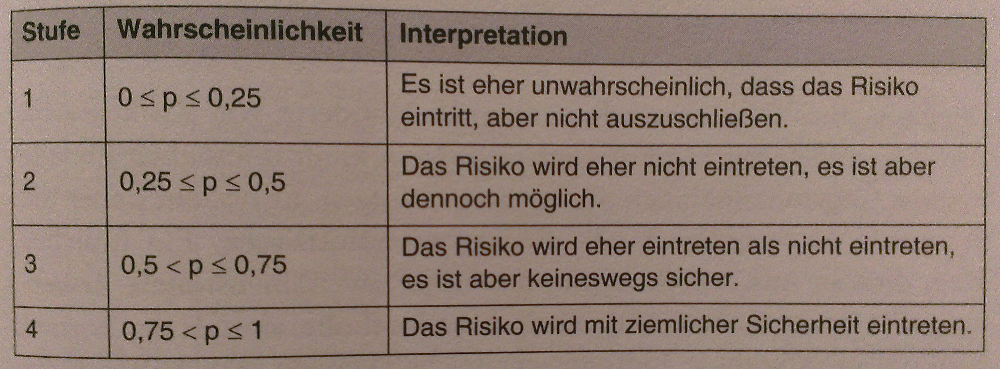
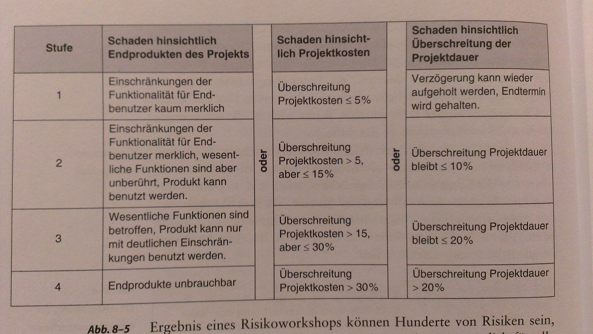
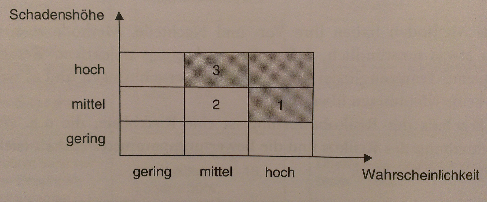

#Risikomanagement
##Überblick
Frühzeitig potenzielle Projektprobleme identifzieren, Gegenmassnahmen ergreifen, kontinuerilicher, projektbegleitender Prozess, Risiko: potenzielles, zukünftiges Problem, dessen Eintritt wichtige Projektzeil oder -Ergebnisse geährden kann - aktiviäten: Risiken identifizieren, analysieren, bewerten, priorisieren, verfolgen, Gegenmassnahmen ergreifen

z.T. gesetzliche Verpflichtungen RM, weiterführende Konzepte: Betrachung Chancen und Risiken, Verschiedene Ebenen von RM

##Risikoermittlung
Workshops (max 15 Personen): Ermittlung, Bewertung, Planung Gegenmassnahmen, mind. 1/2 Tag

**Bsp. Risikoquellen:**
  * Anforderungen
      * unausgereift / unklar
      * Zahlreiche Änderungen vorhersehbar
      * Änderungsfreudigkeit Kunde/Auftraggeber
  * Technik
      * Unrealistisches Design
      * Neue Technologie
      * Unklarheit Performance
      * Erstmaliger Einsatz Tools, SQ, HW
  * Anwendung
      * Hohe Komplexität, ungelöste probleme
      * Fehlende Erfahrung mit Teilaugaben
      * Keine Erfahrung in Domäne
  * Kunde
      * Konkurrierende Interessengruppen / Widerstände
      * Keine Erfahrung mti Auftragsvergabe
      * Mangelnde Kooperationsfähigkeit / -bereitschaft
      * Beistellung Kunden
      *  Integrierte Entwicklung Auftraggeber/Auftragnehmer
  * Projektauftrag, -abwciklung
      * Unrealistische Termine
      * Unrealistische Budgets
  * Projektorganisation
      * Einsatz Unterauftragnehmern
      * Bekannte Probleme von Utnerauftragnehmern
      * Zulieferung von anderen Projekten / internen Stellen
  * Ressourcen
      * Nicht richtige MA (Quali, Erfahrung)
      * Ressourcenengpässe, unzuverlässige Ressourcenzusagen
      * Drohender Ressourcenentzug
      * Nicht der richtige PL
      * Drohnder ausfall MA

**Risikokategorien:**
Container, Zusammenfassung bezüglich Auswirkung, unerlässlich für grössere Projekte, Bsp Kategorisierung nach:
  * Komponente des Produktes
  * Strukturen innerhalb Projekt
  * Projektphasen
  * Thematische Risikoarten

**Teilnehmer Workshop:** Moderator, Projektteam, evtl. externe Experten

**Ablauf:**
  1.  Vorbereitung: Hilfsmittel, Infos an Teilnehmer (Projektstrukturplan, Risikokatalog o.Ä.), Moderationsmaterial
  2.  Instruktion Teilnehmer durch Moderator, Ermittlung Risiken selbstständig (ca. 30 min), auf Post-Its, aufhängen, Kategorisierung, evtl. Aufteilung Teilnehmer nach Kategorien, evtl. mehrere Runden (Grosse Projekte)
  3.  Konsolidierung, Diskussion Risiken, Verfeinerung, Umformulierung
  4.  Bewertung Risiken

##Risikobewertung
viele Bewertungssystematiken, in Praxis Bewährt nach folgenden drei Parametern

  * Eintretenswahrscheinlichkeit
  * Schadenhöhe
  * Risikoprioritätszahl (Risikokennzahl)
    Eintretenswahrscheinlichkeit x Schadenshöhe

erste beide: grossen Interpretationsspielraum, Beurteilungskriterien für Bewertungsparameter möglichst genau definieren

**Schadenshöhe:** Festlegung Art Schaden (Brauchbarkeit, Qualität, Kosten, Schadensersatz, Vertragsstrafen, ...), oft in mehreren Kategorien, , Festlegung Einschätzung Schadenhöhe, wenn in mehreren Kategorien, Ergebniss: Kennahl aus definiertem Wertebreich

oft hunderte Risiken, viele vernachlässigbar, evtl. Sortierung nach Risikoprioritätszahl

**Bewertung im Workshop:**
  1.  Konsensbildung ganze Gruppe / Team
  2.  Punktierug, Mittelwert Markierungen (umständlicher, objektiver)

**Risikoliste:** Ergebniss Workshop / Risikobewertung, anschliessend: Verdichtung zu Gesamtaussage für Projekt, Präsentation Mgmt, Konsequenzen diskutieren

**Risikoportfolio:** Eintragung Risiken entsprechend Bewertung

##Planung von Gegenmassnahmen
Planung in workshop, evtl. nach Workshop, analog andere Aktivitäten: Abschätzung, Planung, Verantwortlichkeiten, Dokumentation massnahmen, ...

**Präventive Massnahmen (risk mitigation plans):** Vermeidung, Reduktion eintritts-WSK

**Notfallmassnahmen (contingency plan):** Vorbereitende Massnahmen, Schaffung Rückzugspositionen, vorbereitung Ersatzlösungen, Alternativ / Ergänzend zu Präventivmassnahmen, nur für hochpriore Risiken, Abstimmung Entscheidungskompetenz Mgmt

##Risikoverfolgung
Gegenmassnahmen: Fortschrittsprüfung analog ander Aktivitäten, Risiken:neue Sachverhalte, etc., Betrachung in regelmässigen zeitabständen, z.T. für kritische: wöchtentlich, sonst monatlich, Geringere Risken: Verteilung auf Personen / Subteam für Tracking, Evtl. Visualisierung Top-10-Risken in Büro

**Neue Risiken:** Regelmässige Risikoworkshops, z.b. bei Phasenübergängen, wichtiger Grundsatz RM: "Keep it simple"
