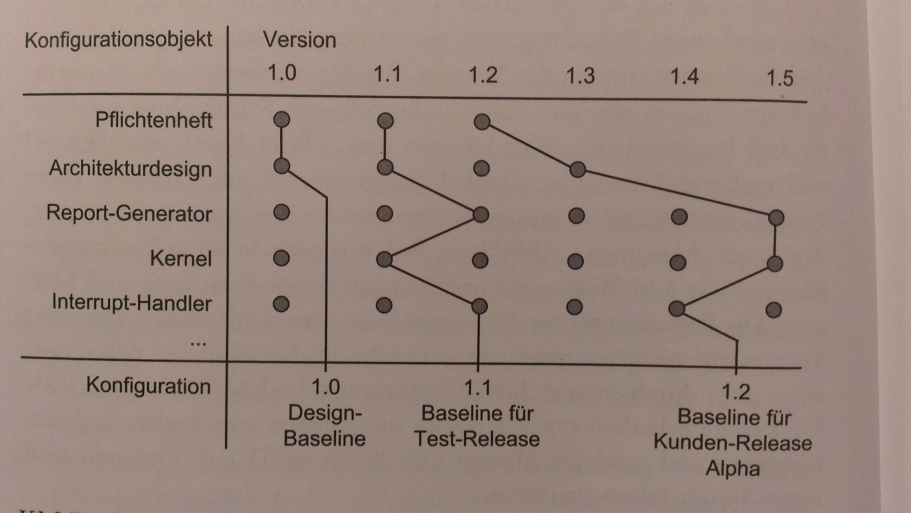
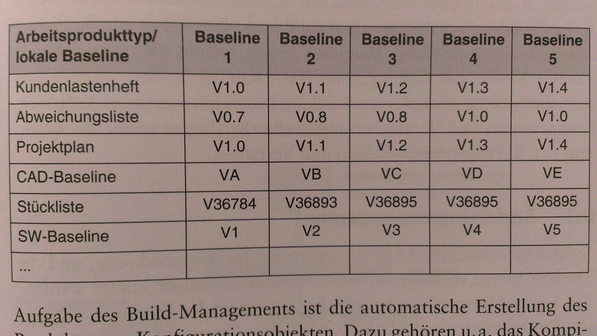

#Konfigurations- und Änderungsmanagement
Besteht aus Methoden zu Sicherstellung vollständige Reproduzierbarkeit eines Produktes durch einduetige Identifizierung aller Teile und relevanter Dokumente

**Lösungen für folgende Problemstellungen:**
  * Identifizierung
    * der Kombination SW-Komp in der jeweils zutreffenden Version für einen bestimmten Entwicklungsstand
    * der zugehörigen Dokumentation + Req-Dokumente
    * der zugehörigen Entwicklungsumgebung
  * Versionierung und Änderungsmanagement
    * Versionierung mit eindeutiger Bezeichnung und Aufzeichnung Änderungshistorie
    * Schutz vor unüberlegten ÄNderungen durch def. Arbeitsablauf von Änderungsantrag bis Validierung und Freigabe
  * Arbeiten im Team an den gleichen Objekten
    * Objekte allen Beteiligten zur Verfügung stellen
    * unwissentliches gleichzeitiges Arbeit am selben Ojbekt verhindern / Mechanismen zur Verfügung stellen

##Konfigurationsmanagement
Definition durch ISO 10007

**Begriffe:**
  * Konfigurationsidentifizierung
    Auswahl Konfigurationsobjekte, deren ID, Formierung zu Produktstruktur, doku, Festlegung Bezugskonfiguration (Baselines)
  * Konfigurationsüberwachung
    Adressiert Probleme im Zsh. Veränderung Konfiguration, Zentrale Aktivität: systematisches Änderungsmgmt, Ziel: alle Dok identifizieren, beschreiben, klassifizieren, bewerten, genehmigen, einzuführen, ÄNderungen relativ zu Baselines, Verantwortlich Änderungen: Change Control Board
  * Konfigurationsbuchführung
    Ziel: rückverfolgbare doku der Konfigurationen und Konfigurationsobjekte
  * Konfigurationsaudit
    Formale Überprüfung Konfigurationen hinsichtlich Erfüllung vertraglich zugesischerten funktionellen / physischen Merkmalen

**Konfigurationsobjekte:** Alle Objekte im Projekt, die dem Konfigurationsmanagement unterliegen, Bestandteile SW, relevante dokumente, etc. - Praxis: häufig nur Code unter Konfigurationsmgmt oder alles unter KM :arrow_right: vieles unnötig / viel Aufwand

**Versionen und Varianten, Branching und Merging:** ID für jeden Stand, z.T. parallelle versionen :arrow_right: Zusammenührung notwendig, KM-Werkzeuge bieten gute Unterstützung

**Konfigurationen, Releases, Baselines:** Konfiguration: Zusammenstellung mehrerer KO, KO nur einmal in best. Version in K, KM-Werkzeuge: Zuweisung Label, K = entsprechender Entwicklungsstand: Baseline

**KM in heterogenen Umgebungen:** grosse / verteilte Projekte: oft unterschiedliche KM-Werkzeuge, Entwicklung Sys aus HW und SW, Vielfalt nicht kompatibler entwicklungs- und Datenhaltungswerkezuge

**Konfigurationsmatrix:** in heterogener Umgebung selten gut beherrscht, unkoordinierte Existenz, Konfigurationsmatrix, Teilprojekte / verschiedene Entwicklungsdisziplinen übergreifendes KM

**Build-Management:** automatische Erstellung Produktes aus Konfigurationsobjekten (Kompilation best. Versionen, Linken, Modifizieren Konfigurationsdateien, Doku, automatische Tests, Automatisierung via Build-Scripts), Build-System für Build-Dependencies notwendig

**Konfigurationsaudit:** formale Prüfung Ausführungsstand eienr Konfiguration, QS-Funktion, Kontrolle Vollständigkeit & Konsistenz Baselines, Nach Prüfung: Freigabe Baseline

**KM-Plan:** Regelungen betreffend KM in projektspez. KM-Plan festscrhreiben, allen zur Verfügung stellen, definiert Geltungsbereich, Aufgaben, Kompetenzen, Verantwortungen

##Änderungsmanagement
Viele Änderungen: Ursachen: kürzere Entwicklungszyklen, Flexibilität, etc.,  Erfolgsfaktoren: Konsequenzen Äm durch leistungsfähiges PM klar aufgezeigt, Vorgehensmodell und Entwicklungsmethodik erleichtert Änderungen, Strategie Schadensbegrenzung, systematischer Prozess für Änderungswünsche

**Zwei Ebenen ÄM:**
  * Projektsteuerungsebene
    Änderungen Projektumfang laut P.Def, Terminänderungen, Erweiterungen Fkt, ...
  * Operative Ebene
    Umsetzung Änderungen oberste Ebene, weitere Änderungen entschieden / ausgeführt (z.B. im rahmen Fehlerbehebung)

Input Änderungen P.Umfang via CCB, anschliesssend auf operative Ebene

###Projektsteuerungsebene
weitreichende Konsequenzen, sorgfältig, systematisch, Lenkungsauschuss (evtl. CCB), erster Schritt: Doku Änderungsantrag, Analyse Auswirkungen, Diskussion Antrag in Gremium: Annahme / Ablehnung, Annahme: Delegation operative Ebene

###Operative Ebene
Umsetzung Änderungen Annahme CCB, weitere Änderungen, welche keine Genehmigungen CCB erfordern, Entscheid durch PL, MA, bei Fehlern: Ursprungsanalyse, z.T. sehr aufwändig, Reproduktion, anschliessend Analyse Auswirkungen Korrektur, Entscheid Durchführung, bei parallelen Versionen: einplannung für bestimmten Release, Dokumentation, Kommunikation, Fortscheibung Planungsdokumente, etc.

**SW-Werkeuge ÄM:** Häufig Kombination KM, viele Produkte auf dem markt, 
