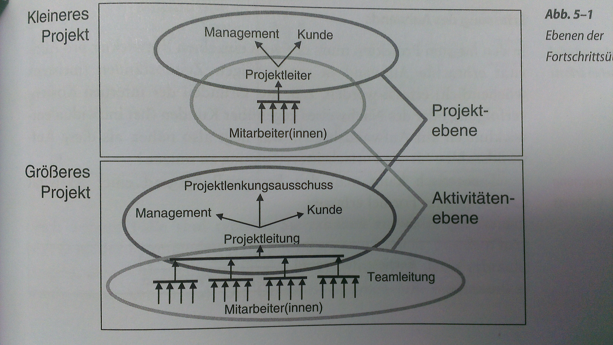
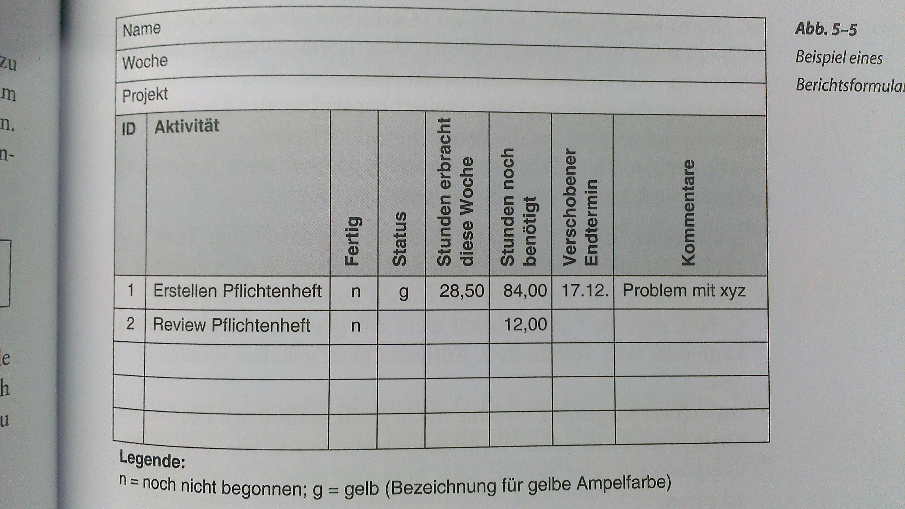
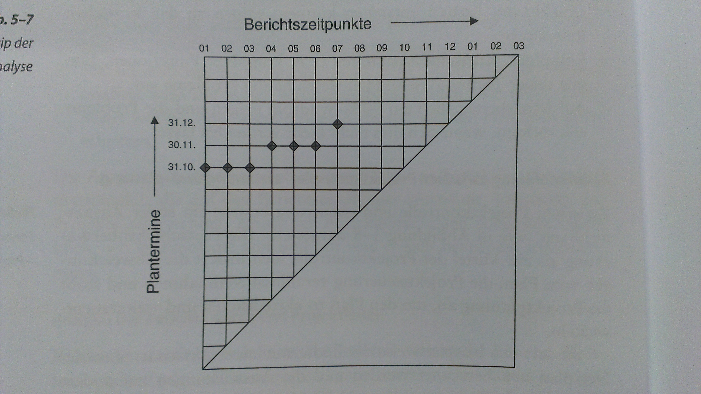
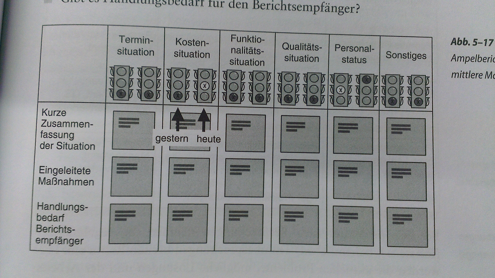
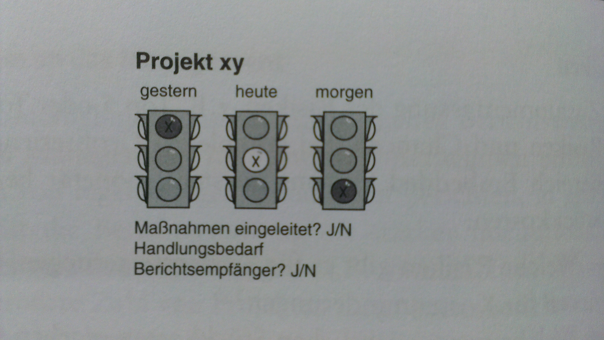
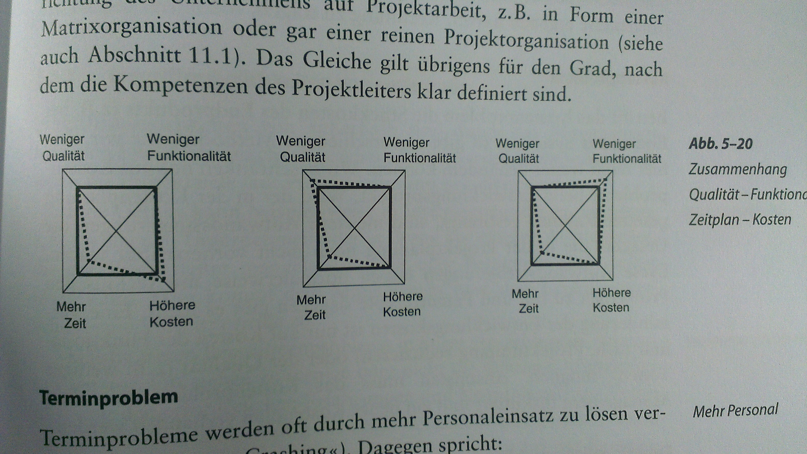

#Projektkontrolle und -steuerung
Planung bis Ende, PL: grösster Teil der Zeit, oft PL nicht 100%, sondern mehrere Rollen :arrow:right: hin und her gerissen, PL: zentrale Aufgabe: lenken, koordinieren, steuern - Anfragen bezüglich Termine, Kosten, etc. erfordert gutes Berichtswissen im P., Änderungen :arrow_right: Anpassung P.- Plan :arrow_right: erfordert viele neue Absprachen, Koordination

##Fortschrittsüberwachung

**Aktivitätsebene:** Entwickler an nächsthöhere Ebene, kleinere P.: PL, grössere P.: Teilprojekt- / Teamleiter, Rohdaten für Reporting  

**Projektebene:** Fortschrittsdaten von unten nach oben über versch. Ebenen verdichtet, PL klares Bild Fortschritt auf Gesamtprojektebene

###Aktivitätsebene
(T)PL: grosse Anz. parallele aktivitäten überwachen / Steuern, Überblick notwendig, kP: informell (Teamsitzung), dokumentation für Berichte, gP: schriftliche Berichterstattung (Mail, Excel bis zu PPM-SW), feste Abgabetermine, Inhalte: Aufwand, Fertigstellungsgrad, Restaufwand, voraussichtlicher Endtermin, Ampelberichte

**Erfassung des Aufwands:** theoretischer Fertigstellungsgrad = erbrachter Aufwand / geplanter Aufwand, praktisch: geplanter Aufwand nicht mehr korrekt, Formel nur korrekt, wen auch geplanter Aufwand aktualisiert wird - Interpretationsproblematik: Interpretation der Berichte unterschiedlich: Bsp: Aufwand steigt steiler als geplant :arrow_right: entweder früher fertig, oder mehr Aufwand - Aufwandszahlen: Überblick Realisierung, Frühindikatoren für Aufwands- / Terminüberschreitungen, müssen durch Restaufwand, fertigstellungsgrad oder Aktivitätsstatus ergänzt werden.

**Erfassung Fertigstellungsgrade: ** Erfassung FG in %: nicht unproblematisch, erlaubt Berechnung aktualisierter geplanter Aufwand (=erbrachter Aufwand / Fertigstellungsgrad), 90-% Syndrom, am Anfang linearer Anstieg, bei 90%: Asymptotisch gegen 100%, z.T. FG schwierig zu schätzen

**Erfassung Restaufwand und voraussichtlicher Endtermin: ** alternativ zum FG: Abfrage Restaufwand, FG = erbrachter Aufwand / (erbrachter Aufwand + Restaufwand), löst Problem nicht, einfachere Beantwortung - Aufwand steigt: mehr Ressourcen einsetzen (nicht immer optimal), Verschiebung Endtermin - Terminverschiebung: kann grosse Auswirkungen haben, besonders wenn auf krit. Pfad

**Verfolgung Projektstatus mit Ampelmethode** Problemüberwachung, geeignet für alle Eben, Reduktion Informationsflut - grün: Keine / geringe Probleme, Termin / Aufwand werden gehalten,  - orange: mittlere Probleme, Gefahr Fkt nicht wie geplant realisiert, Termin / Aufwand evtl. nicht gehalten - rot: schwerwiegende Probleme, erhebliche Überschreitung - Berichtender beschreibti n 3 Stufen (Ampelfarben), z.B. Kosten, Termine, Fkt, Qualität, Definition durch UN / P

**Analyse der Berichte durch PL: ** oft manuell, halbautomtische Verarbeitung - **kP:** Probleme i.d.R. bereits bekannt - **gP:** schwierigere Analyse, Augenemrk: Aktivitäten auf krit. Pfad (Terminverschiebung :arrow_right: Projektendtermin), A. ohne / geringer Puffer, Verlängerungen :arrow_right: neuer krit. Pfad, A. mit krit. Ressourcen (Ma nur best. Zeit), komplexe krit A. (häuffige Verschiebungen), MA die zum 90% Syndrom neigen,

**Zusamenhang zwischen Projektkonrolle, -steuerung und -planung
PK und PS: enger Zsh, Fortschrittsüberwachung :arrow_right: Identifizierung Abweichungen, Veranlassung Massnahmen :arrow_right: Anstoss P.-Planung

###Fortschrittsüberwachung auf Projektebene
Verdichtung vieler Detaildaten, zwei Methoden (eher gP): Meilensteintrendanalyse, Earned Value Analysis

####Meilensteintrendanalyse (MTA)
"Termintrendanalyse", schneller Überblick Entwicklung MS in Zukunft,Terminprognosen, Darstellung: Diagramm: Achsen: Berichtszeitpunkte und Plantermine

Stabil (horizontaler Verlauf), davonlaufen (asymptotisch gegen Diagonale), Tipp: nicht mehr als 7 Termine, wichtigste MS, Hauptsächlich für Berichte gegen aussen

####Earned Value Analysis (EVA)
Methode Fortschrittsbewertung, kleiner Satz an Kenngrössen, treffsichere Aussagen über Termin- / Kostensituation, geeignet für Berichte an Top-Mgmt., zahlreiche Varianten

**Grundlegende Kenngrössen:** Berechnung von drei Kenngrössen für alle Aktiviäten, Zusammenfassung auf P.-Ebene
  * Planned Value (PV)
    Was hätte A. gemäss Plan für best. Zeitraum kosten sollen?
    Quelle: Kostenplanung
  * Actual Cost (AC)
    Was hat A. über best. Zeitraum tatsächlich gekostet?
    Quelle: Verfolgung Personalaufwendungen + sonstige Kosten, FiBu: oft nicht detailliert und auf A.-Ebene, Meistes: Personalkosten der grösste Teil, aureichend für Fortschrittsverfolgung, AC = berichtete Stunden * Stundensatz
  * Earned Value (EV)
    Tatsächlicher Wert der geleisteten Arbeit, geplante Kosten für tatsächlich geleistete Arbeit, Was hätte A. gemäss Plan kosten sollen, gemäss tatsächlichem Arbeitsfortschritt?
    Berechnung: Plankosten A. für Gesamtdauer (Kostenplanung) * Fortschrittsgrad A.
    Problematik: Bestimmung FG

**Abgeleitete Kenngrössen:**
  * Cost Variance CV = EV - AC
    Mass für Kosteneinhaltung
  * Schedule Variance SV = EV - PV
    Mass für Termineinhaltung / Fortschritt

**Weitere Kenngrössen:**
  * Cost Performance Index (CPI) = EV + AC
    Verhältnis geleistete Arbeit und tatsächliche Kosten
  * Schedule Performance Index (SPI) = EV + PV
    Verhältnis geleistete Arbeit und für Berichtszeitpunkt geplanten kosten

|  Wert   | Bedeutung                                | Gründe     |
|:-------:|:-----------------------------------------|:-----------|
| CPI > 1 | Weniger Kosten als geplant, unter Budget | Personalaufwand geringer, zu viel Puffer |
|  CPI=1  | Genau gemäss Budget                      | |
| CPI < 1 | Mehr Kosten als geplant, über Budget     |  Personalaufwand höher, weniger effektiv gearbeitet, unterfahren, unterwartete tech. Probleme |
| SPI > 1 | Im Zeitplan voraus                       | Aufgabe einfacher, erkauft durch mehr Personal, zu viel Puffer |
| SPI =1  | Im Zeitplan                              | |
| SPI<1   | Hinter dem Zeitplan                      | zu geringer Personaleinsatz, unerwartete tech. Probleme |

**Eingriffsgrenzen:** sinnvoll, Alarmsignal, Analyse Ursachen, Massnahmen - **Obere EG:** Bsp: 1.5 :arrow_right: Fkt.-Umfang verstanden? zu viel Puffer? - **Untere EG** Bsp: 0.8 :arrow_right: schlechte Teamleistung?, genügende Qualifikation?, tech. Probleme?

**Weitere Auswertungen & Kenngrössen:**
  * Budget at Completion (BAC)
    ursprünglich geplante Gesamtkosten
  * Estimate at Completion EAC = BAC+CPI
    Prognostizierte Gesamtkosten aufgrund aktueller Situation
  * Voraussichtliche Projektdauer: geplante Dauer / SPI

####Fortschritsgrad
**Aufwandsproportionale Methode**: Verbuchung best Prozentsatz pro verstrichener & angefangener Zeiteinheit der A. als Earned Value. Zeiteinheit: einheitlich alle A., Fehler: EV = PV, geringe Aussagekraft auf A.Ebene, betrifft nur laufende A., fehler geringer, je mehr A. im P. enthalten sind und je kleiner A. im Durchschnitt  

**50/50-Methode:** 50% beim Start, 50% bei Beendigung  

**0/100-Methode:** 100% bei Beendigung  

**Meiensteinmethode:** Plankosten für MS, Erreichung MS: Verbuchung Plankosten als EV, sinnvoll wenn P. viele lange A. enthält, Problem: genügend MS finden, bewerten

**Weitere Methoden:** Metriken bzgl P.-Phasen, etc.

###Berichte an das Mgmt
####Unteres Mgmt
  * Kostensituation (Entiwcklungskosten, aus der EVA)
  * Terminsituation (Endtermin, SPI, MTA)
  * Leistungsumfang (Fkt, Abweichungen?)
  * Qualitätsituation (Produktqualität?, kundenrelevante Probleme)
  * Personalstatus (kritische Engpässe?)
  * Risiken (Zusf, Chancen, Kosten)
  * Ausgewählte Probleme (soweit relevant für Kosten, Terimne, fkt-Umfang)

####Mittleres Mgmt
Zusammengefasste Ampelberichte

####Topmanagement
Minimalbericht, massive Probleme? Verbesserung / Verschlechterung Situation, Massnahmen eingeleitet? Handlungsbedarf für Berichtsempfänger?

##Projektbesprechungen
###Arten von Besprechungen
  * Teambesprechungen
    wöchtenlich, aktuelle Probleme / Lösungen, Arbeitsfortschritt
    Projekt/Teamleiter, Entwickler
  * Interne Fortschrittsbesprechung
    Loslösung Detailprobleme, kritische Ausenandersetzung P.-fortschritt, Probleme & Massnahmen, Evtl. Risiken, CRs, regelmässig (monatlich), Kombination Teambesprechung möglich, gleiche Teilnehmer
  * Formale Fortschrittsbesprechung
    Beteiligung Managementvertreter, regelmässig, übergeordnetes Meeting für mehrere Projekte
    PL, Mgmt, QS
  * Meilensteininterviews
    Bei Erreichung wichtiger MS, Prüfung formale Voraussetzungen (z.b. Dokumente, Püfungen
    PL, Mgmt, QS, ggf. Kundenvertreter
  * Lenkungsauschuss
    Entscheidungsauschuss, grosse & wichtige & komplexe Projekte, verschiedene Parteien involviert, Koordination Interessen, Rechenschaftsbericht + strat. Fragen, wichtige P.-Entscheidungen,

###Besprechungskultur
enormer Kostenfaktor, Frustrationsfaktor, gute Kultur: hilft Kosten zu sparen, Steigerung Effizient / Zufriedenheit

**Vor der Besprechung:** Notwendig? sinnvoll? hat best. Ziel, alle Infos / Vorarbeiten da? effizientere Möglichkeit? Verteilung via mail, Sitzung bei Bedarf - **Teilnehmerkreis:** hinterfragen, allenfalls nur Info über Ergebniss - **Terminvereinbarung: ** rechtzeitige Vereinbarung, Festlegung bei P.-Beginn - **Einladung:** schriftliche Einladung (Besprechungsziele, Tagesordnung, Vorbereitungen, Beginn & Ende) - Vorbereitung sehr wichtig, TN: Reservation Vor- / Nachbereitungszeit

**Während der Besprechung:** gute Moderation / Gesprächsleiter, Abstimmung Besprechungsziele mit TN, Einhaltung Tagesordnung, moderiert Gesprächsfluss um pro Punkt gewünschtes ergebniss zu erzielen, Zusammenfassung Ergebnisse, Bestätigung einholen, Protokollierung, Einhaltung Dauer und Ziele, realistische Tagesordnung (gg. standard bei regelmässigen Besprechungen), Protokollführung klar, Kotnrolle durch Gesprächsleiter, To-do-Liste, strikte Einhaltung Dauer (ggf. Punkte abbrechen, verschieben)

**Nach der Besprechung:** zeitnaher Versand Protokol, To-do-Liste, weiteres, evtl. Abnahme Protokoll durch TN

##Eingriffsmöglichkeiten bei Abweichungen
###PL
Unterscheidung der Abweichungsart (Terminproblem, Kostenproblem, Funktionalitätsproblem, Qualitätsproblem), verknüpft untereinander, gegenseitige Einflüsse, Eingriffsmöglichkeiten stark von Kompetenzen PL und von Org. Abhängig

**Terminproblem:** Mehr Personaleinsatz (Crashing): keine gute Lösung, oft noch mehr Verzögerung - Funktionsumfang zu Stichtag reduzieren - Abstriche bei Qualität: sehr häufig, nicht ideal - Kürzung kritischer Pfad: Optimierung Plan, allenfalls überlappen (Fast Tracking), meist Zusatzaufwand (Nacharbeit)

**Kostenproblem:** Stückkosten betroffen: verschiedene Methoden, Kostenprobleme Entwicklungs-P.: oft nicht vorhersehbare Aufwände, Verminderng kosten nur auf Kosten Fkt, Qualität möglich

**Funktionalitätsproblem:** Fkt nicht wie gewünscht realisierbar: technische / Req Probleme, individuell behandeln, Möglichkeiten: evtl. projektexterne Experten?, alternative Realisierungskonzepte, Outsourcen an erfahrenen Subunternehmer?, Ersetzung Eigenentwicklung durch Kaufkomponenten

**Qualitätsproblem:** Oft erst spät im Projekt, einzige Strategie: gründliches Teste von Anfang an, Einsatz bewährter SWE-methoden, konsequenter Einsatz von Reviews

###Eingriffsmöglichkeiten von ausserhalb
Durch Mgmt. / Lenkungsauschuss - **Interessenkonflikte: ** Gefahr, UN, Externe, nicht lösbar durch PL mangelns Autorität / Befugnisse, Vermittlerrolle Mgmt, Lenkungsauschuss - **Ressourcenprobleme: **häufig fehlende Arbeitskräfte, Lösung nur durch Mgmt: Priorisierung Ressourcenvergabe, zusätzliche externe Mittel - **Projektleiterprobleme:** oft erst im Projekt, keine sofortiger Austausch, allenfalls Unterstützung durch Vorgesetzter (methodisch) - **Überlastung PL:** zwischen operativen und Leitungstätigkeiten zerrieben, kP: OK, gP: NOK, z.T. PL-Rolle auf mehrere Personen aufgeteilt

##Ressourcenmanagement
Planung / Steuerung Ressourcen auf verschiedenen org. Ebenen

**Sachmittel: ** Arbeitsplatz: typischerweise über Linienorganisation bereitgestellt, Rest: via Projekt

**Personalreservierung: ** Portfoliomanagement: optimaler Einsatz Ressourcen - **Personalreservierung:** Personalmenge aufgrund Planung ungefähr bekannt, nach Rollen, Reservation Personal in entpsrechenden Fachabteilungen, problematisch bei unsicheren Projekten - **WSK gestützte PR:** Benötigte Personen * WSK :arrow_right: Reservation -  wichtige Inputs für Personalplanung + Qualifikationsprofile - Ständige Aktualisierung bei ÄNderungen (Planung, Durchführung, etc.), - **Mitarbeiterallokation:** Durchüfhrung sicher, Zuteilung konkreter MA anhand Qualifikationen, Vorauswahl mit zuständigem Manager - **Personenbezogene Kapazitätbuchführung** geeignete Person genügend kap. in fraglichen Zeitraum, kleine Organisationen: mündlich, informelle Abklärung, grösere Org: Buchführung Kapazitäten - **Überlappung P.-Reservierung:** wenig Überlappung, wenn MA gut austauschbar, Gegenteil: frühe Allokation - **Ressourcenmanager:** UN für externe Kunden tätig: Ressourcenmanager, Abstimmung und Allokation Ressourcen mit Linienmanagern, klare Allokationsstrategie - **Incentivierung der Beteiligten:** beteiligte Personen durch persönliche, gehaltswirksame Zile zu incentivieren, möglichst gute Auslastung gesamte Mannschaft, allenfalls Auslastungsziel (mind so und so viele Projektstunden pro Jahr :arrow_right: variable Vergütung)

**Änderungsmanagement:** Störungen: Krankheit, Unfall, Kündigung, Vorzeitiges Projektende / Pause / Verschiebung, Ressourcenverschiebungen zwischen P. (Taskforces), Austausch MA aufgrund "Inkompatibilitäten", permanentes Änderungsmanagement um permanente Auslastung zu gewährleisten, evtl. externe Arbeitskräfte

**Künstliche Ressourcenverknappung:** Kostendruck, bewuste Knapphaltung Anzahl MA, Geschäft & Arbeitsvolumen wächst, MA und Mgmt: Ansporn zu mehr Effizienz, gewisse Anspannung üblich & sinnvoll, zu gross: Probleme & Beschwerden, Reaktion-Mgmt: Taskforces :arrow_right: Abzug aus anderen P. :arrow_right: Spirale / Teufelskreis
