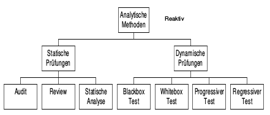
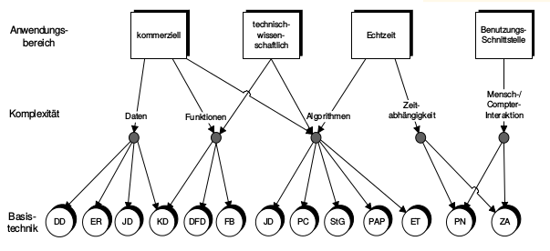

#Prozess- und Projektmanagement
##Projektstart
gDocs

##Projektplanung
gDocs

###Schätzverfahren
  - Zerlegungsmethode (100% :arrow_right: x%)
  - Analogiemethode (X=Y)
  - Relationsmethode (+/- von 100%)
  - Prozentsatzmethode (% von Total)
  - Multiplikationsmethode (Faktor C mal Modulgrösse in LOC)
  - Delphi Methode (Brainstorming: (Worst-Case + Best-Case) / 6)
  - Function Point Methode (FPM, Basis Regressionsrechnung Dreipunkt)
  - COCOMO Methode (Dito FPM Schätzung)
  - Regressionsgerade
  - Expertenschätzung (Bottom Up / Top Down)
  - Dreipunkt Schätzung

:exclamation: Aufwand nicht gleich Durchlaufzeit. (1 Jahr = 220 Tage)

##Projektdurchführung

###Kickoff Meeting
**Ziele**  
  1. Alle Beteiligte gleicher Wissensstand
  2. Zusammenarbeit im Team wird umrissen
  3. Festlegung Rollen der Mitglieder

**Themen**  
  - Präsentation Projektauftrag
  - Präsentation Projektplanung
  - Präsentation Projektorganisation
  - Fragerunde
  - Erste Arbeitssitzung planen :arrow_right: Arbeitspakete besprechen

###Projektsteuerung, Kontrolle
**Fortschrittsüberwachung**  
  * Fertigstellungsgrad = erbrachter Aufwand / (geplanter Aufwand + Restaufwand)

**Earned Value Analysis**  
*Diagramm, x-Achse: Zeit, y-Achse: Aufwand / Kosten*
  - PV: Planned Value (Budgetkosten, Plankosten, Soll)
  - AC: Acutal Cost (Erbrachte Leistungen, Ist)
  - EV: Earned Value (Plankosten x Fortschrittsgrad
  - CV: Cost Variance (Kosteneinhaltung), EV-AC
  - SV: Schedule Variance (Termineinhaltung), EV-PV
  - CPI: Cost Performance Index (Kosteineinhaltung), EV/AC
  - SPI: Schedule Performance Index (Termineinhaltung), EV/PV

|  Wert   | Bedeutung                                |
|:-------:|:-----------------------------------------|
| CPI > 1 | Weniger Kosten als geplant, unter Budget |
|  CPI=1  | Genau gemäss Budget                      |
| CPI < 1 | Mehr Kosten als geplant, über Budget     |
| SPI > 1 | Im Zeitplan voraus                       |
| SPI =1  | Im Zeitplan                              |
|  SPI<1  | Hinter dem Zeitplan                      |

**Meilenstein-Trendanalyse (Projektebene)**
*Diagramm: x-Achse: Berichtszeitpunkte, y-Achse: Meilenstein-Termine, Quadrant 4, Trapezförmig*  

Einzeichnen des Status pro Berichtszeitpunkt und Meilenstein  

**Management Bericht**
  - Kostensituation
  - Terminsituation
  - Leistungsumfang
  - Qualitätssituation
  - Personalstatus
  - Risiken
  - Technische Probleme

  

###Projektbesprechungen
**Hinweise aus der Praxis**
  - Termine regelmässig einplanen
  - Klare Kommunikation was Ziel des Termines ist
  - Saubere Vorbereitung der
  - Dokumentieren, Wer protokolliert der führt. :arrow_right: Projektleiter schreibt Protokoll, Reflexion, Bestimmung über Inhalt, Zeitnah, Verbindlich

###Steuerungsmassnahmen
Terminprobleme, Kostenprobleme, Funktionalitätsprobleme, Qualitätsprobleme: Einbindung Team, Besprechung in Projektbesprechungen

###Projektführung
PL: Ist eine Begabung, man macht es gerne oder nicht
  - Verhaltens- / Motivationsprobleme?
  - Regeln im Team festlegen
  - Führungsmittel
  - Teamregeln

###Verhaltensprobleme  
  - Mangelndes Verantowrtungsgefühl
  - Mangelnde Eignung zur Gruppenarbeit
  - Mangelnde Sachbezogenheit
  - Konkurrenzdenken
  - Diktatur
  - Fehlendes zuhören
  - Undiszipliniert in den Besprechungen
  - Zu wenig Einsatz, kein Interesse
  - Fehlende fachliche Qualifikation
  - Mangelnde Zuverlässigkeit
  - Fehlende Kritikfähigkeit
  - Hierarchiedenken
  - Autoritäres Verhalten
  - Mangelnde Methodik bzw. Know-How im Vorgehen

###Motivationsprinzipien
  - Wort gegenüber Team und Kunde halten
  - Regelmässige Gespräche führen
  - Zu neuen Ideen ermutigen
  - Betroffene an Entscheide beteiligen
  - Erfolg belohnen
  - Konflikte sofort angehen
  - Alle gleich behandeln
  - Vertrautheiten vermeiden
  - Sich vom Team bewerten lassen, Feedback einholen
  - Mit gutem Beispiel vorangehen

###Teamführung
  - Aufgabe und Ziele vorgeben
  - Anforderungsprofile  definieren
  - Ausgleich im Teamfinden
  - Auswahl geeignete Methoden
  - Verantwortung tragen
  - Vertrauen schaffen
  - Teammitglieder ausschliessen
  - Bearbeitung Konflikte / Kriesen
  - Teamsitzungen leiten

###Teambildung
Max. 6-8 Personen, Recht auf Meinungsäusserung

###Das 4 Ohren Modell
**Sender:** Es hat keinen Kaffee mehr.  

  1. Sachohr (Die Kaffeekanne ist leer)
  2. Beziehungsohr (Kaffee machen ist deine Sache)
  3. Selbstoffenbahrungsohr (Ich möchte auch noch Kaffee)
  4. Appellohr (Mach bitte Kaffee!)

###Gewaltfrei Kommunikation GfK  
  1. Beobachtung (ohne Wertung)
  2. Gefühl (Wie wirkt das auf mich?)
  3. Bedürfnis (formulieren)
  4. Bitte (umwandeln in Bitten)

###Das Harvard Konzept
*Position einnehmen: Problem, nicht lösbar, keine Person will von Position zurückkommen (Gesichtsverlust)*  
  1. Menschen und Probleme getrennt voneinander behandeln
  2. Auf Interessen konzentrieren, nicht auf Positionen
  3. Entwicklung von Entscheidungsmöglichkeiten zum beiderseitigen Vorteil
  4. Anwendung neutraler Beurteilungskriterien

##Projektabnahme /-abschluss
  - Projektabnahme (Protokollieren)
  - Mängelliste erstellen
  - Projektreview (Lessons learned)
  - Nachkalkulation durchführen
  - Teambesprechung durchführen
  - Kundenzufriedenheit ermitteln
  - Projekt formell abschliessen

##Qualitätsmanagement
**Definition:** Besschaffenhiet, Merkmal, Eigenschaft, Zustand, nach DIN EN ISO 9000:2005 (Qualitätsmanagement, "Grad", Erfüllung Satz inhärenter Merkmale Anforderungen), bezeichnet alle org. Massnahmen zur Verbesserung von Produkten, Prozessen oder Servies jeglicher Art

**Qualität:** Kundenbedürfnisse abdecken (Q ist, wenn Kunde zurück kommt)  

**Konfliktdreicek:** Kosten - Qualität - Termine

###Qualitätsmerkmale Produkte
  - Funktionalität
    - Aufgabenangemessenheit
    - Richtigkeit / Genauigkeit Ergebnisse
    - Verknüpfbarkeit
    - Konformität Regelungen
  - Zuverlässigkeit
    - Reife
    - Fehlertoleranz
    - Wiederherstellbarkeit
  - Benutzerbarkeit
    - Verständlichkeit
    - Erlernbarkeit
    - Bedienbarkeit
  - Effizienz
    - Zeitverhalten
    - Verbrauchsverhalten
  - Wartbarkeit
    - Analysierbarkeit
    - Änderbarkeit
    - Stabilität
    - Prüfbarkeit
  - Übertragbarkeit
    - Anpassbarkeit
    - Installierbarkeit
    - Konformität
    - Austauschbarkeit

###Konstruktive Methoden

###Analytische Methoden

  - Progressiver Test: Test von neuen Komp. bei Neu- / Weiterentwicklungen

###Entwicklungsprozess - V-Modell
  - Anforderungsdefinition (Anforderungsspezifikation) - Abnahmetest
  - Technischer Systementwurf (Detailspezifikation) - Integrationstest
  - Komponentenspezifikation (Programmspezifikation) - Komponententest
  - Funktionaler Systementwurf (Systemspezifikation) - Systemtest
  - Implementierung

Jeweils Testspezifikation pro Ebene, Review auf gleicher Ebene  
Jeweils Spezifikation pro Level, Review zwischen Levels

###Prüfwerkzeuge

###Qualitätsplanung
  1. Geltungsbereich
  2. Zuständigkeit / Befugnisse QS-Personal
  3. Benötigte Ressourcen
  4. Budgetierung der QS-Aktivitäten
  5. Qualitätssichernde Massnahmen & Zeitplan
  6. Zugrunde liegende Normen & Verfahren
  7. Behandlung von Abweichungen
  8. Eskalationsverfahren
  9. Zu erstellende Dokumentation
  10. Art und Weise der Zusammenarbeit im Projekt

##Vorgehensmodelle
  * Wasserfallmodell (mit Rückkoppelung): Req - Analyse - Design - Constr. Design - construction - Prod. / Maint. - Analyse bis Prod: QS / Test
  * V-Modell  
    Validierung: erste zwei Ebenen und Links gegen Rechts, Verifikation: untere drei Ebenen und rechts gegen Ergebniss links
    * Req-Def - Abnahmetest
    * Fkt. Sysentwurf - Systemtest
    * Techn. Sysentwurf - Integrationstest
    * Komp. Spez. - Komponententest
    * Implementierung
  * V-Modell 97
  * Rational Unified Process (RUP)
  * Sprialmodell

###Basistechniken

###Einsatzarten

###Strukturierte Analysen

###Real Time Analysis

###Allgemeines Vorgehen SW/HW Evaluation
  * Projektvorgaben
  * Marktanalyse
  * Erarbeitung Pflichtenheft
  * Vorbereitung Bewertungsdokumente
  * Vorauswahl (KO Kriterien)
  * Einholen der Offerten
  * Evaluation im engeren Sinne
  * Ergebnisanalyse
  * Kosten- / Nutzen Analyse
  * Erstellen Evaluationsbericht
  * Antrag / Weiteres Vorgehen
  * Verträge

###Aufbau Pflichtenheft / Offerte
  * Angaben über Offertsteller
  * Summary (Ausgangslage, Generelle Ziele, Gesamtübersicht, wichtigste Kriterien, Preis- / Kostneübersicht)
  * Applikationsbeschreibung
  * Systemplattform (Übersicht, Komponenten, Netzwerk, Infrastruktur, SW)
  * Anbieter-Information (Generelle Angaben, Referenzen, Wartung, Support, Org, Verträge)
  * Preise / Kosten (Zusf, Details)
  * Antworten Fragekatalog
  * Diverses / Beilagen

###Nutzwertanalyse
Relatives Gewicht: Gewicht Sub-Punkt % Gewicht Oberpunkt = Absolutes Gewicht, Vergabe Punkte x Absolutes Gewicht = Total

###Kosten / Nutzen Diagramm
y-Achse: Kosten (tief zu hoch), x-Achse: Nutzwert (tief zu hoch)

###SWOT-Analyse
Strength, Weaknesses, Opportunities, Threats

###Erhebungstechniken
Diverse, Kreative Techniken: Brainwriting (6-3-5er): 6 Tn, 3 Gedacken, 5 mal zirkulieren - Morphologischer Kasten: Zerlegung Problem in Teilprobleme, Delphi-Befragung (Befragung Experten),

###POSAT ZH

###Prince 2

#Prozessmanagement
**Warum:**: Repetitiv / Messbar, Optimierung Abläufe, Qualitätssicherung, Effizienz steigern, Effektivität sichern, Personen unabhängig, Schulungszwecke, Vorgabe Workflow

##Definition
Sachlogische zusammenhängende Reihe von zielgerichteten Aktivitäten zur Erreichung eines def. Ergebnisses, Kosten durch Ressourcenverbrauch

**Merkmale:**
  - Ziel
  - Input (Auslöser)
  - Aktivitäten (Tätigkeiten)
  - Output (Ergebnis)
  - Bedingungen (soziales Umfeld)
  - Qualität (Leistungsindikatoren)
  - Messbar
  - erbringen Resultate
  - haben Kunden

**Rollen:**
  - Sponsor
  - Owner (Ergebnisverantwortlicher)
  - Manager (Durchführungsverantowrtlicher)
  - Performer (Mitwirkender)
  - Coach (Beratender)
  - Koordinatoren
  - Controller
  - ....

**Empfehlungen:**
  - Top Down
  - Im Team
  - Teilnehmerzahl: 5-6
  - Modellierungsworkshop: mx 4 h
  - Mind. 4 Termine
  - Termine nicht mehr als 14 Tage auseinander
  - Fokus auf 80% der Standardabläufe
  - Implementierung als Projekt

  **Begriffe:**
    - BPR: Business Process Reengineering
    - GPO: Geschäftsprozess Optimierung
    - KPI: Key Performance Indicators
    - CSF: Critical Success Factors
    - Grundsätze ordnungsgemässer Modellierung

###Richtige Prozesse Finden
Vision - Strategie - Ziele - | Leistungen und Produkte | - Prozesslandkarte, Prozessdetails und STeuerung - Geschüftsprozess / Führungsprozess - Leistungserbringender Prozess / wertschöpfungsprozess, Unterstützungsprozess / Supportprozess
