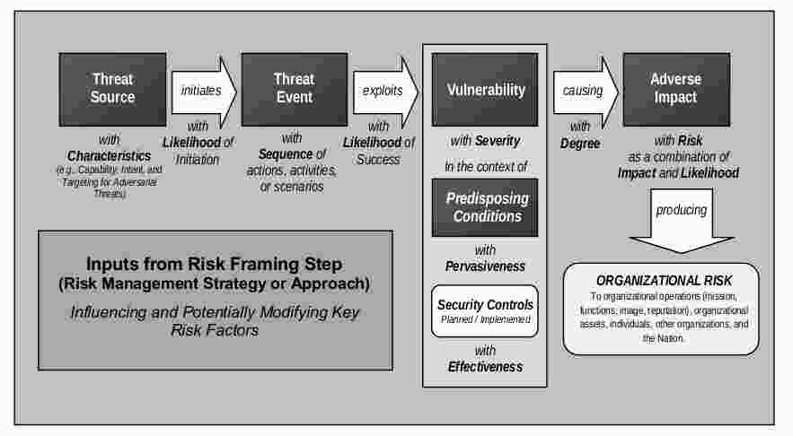

# Risikoanalysen in der IT
## Einleitung
**Risiken:**
  - Potenzielle Schadensereignisse / Unerwünschtes Ereignis
    - Technisch
    - Finanziell
    - Physisch
    - Personell

**Risiken:**
  - Erkennen
  - Bewerten
  - Massnahmen
  - Protokollieren / Dokumentieren
  - Zukünftige Ereignisse

**Risiko-Fragen:**
  - How safe? (Risiko-Analyse, risk estimation)
  - How safe is safe enough? (Risiko-Beurteilung, risk assessment)
  - How safe is too safe? (Risiko-Management, risk management)

**Messung:**
  - R = f(F,C) *F: Frequency, C:Consequence*

**Risikoanalyse / Risikoassessment:** Risiken erkennen & bewerten (berechnen, beurteilen)

**Ansätze:** Klassische Ansätze sind für moderne IT nur bedingt genügend.

**Begriffe:**
  - Gefährdung: Potenzielle Schadensquelle
  - Bedrohung: Alles, was eine Schwachstelle ausnutzen könnte

**Begriffe gemäss ISO 73 / 31000:**
  - Risiko: Auswirkung der Unwägbarkeit auf Schutzziele
  - Auswirkung: Abweichung vom Erwarteten (positiv / negativ)
    - Welche Gefährdungen gibt es?
    - Welche Szenarien gibt es?
    - Welche Auswirkungen hat es?
  - Unsicherheit (uncertainty): Informationsmangel in Bezug auf ein Ereignis, eine Entwicklung ..., Wahrscheinlichkeit ist ein Mass für Unsicherheit
    - Wie wahrscheinlich ist es?
  - Schutzziele (objectives): unterschiedliche Aspekte, relevant auf verschiedenen Ebenen
    - Welche Ziele gibt es?

**Für uns:** Häufigkeit und Ausmass unerwünschter Ereignisse

**IT:**
  - Probability: Statistische Wahrscheinlichkeit
  - Likelihood: Geschätzte Wahrscheinlichkeit

**Analysen:**
  - Risikoanalyse: R = (A,C,P)
    - A: Accident (unerwünschtes, zufälliges Ereignis)
    - C: Consequence (Folge)
    - P: Häufigkeit (Prob.) von A
    - Erweiter: R = (A,B,C,P,U,K)
      - B: C hängt von Barrieren-Wirksamkeit ab
      - U: A und C enthalten Ungewissheiten
      - K: U hängt vom Kenntnisstand K ab
  - Vulnerability-Analyse: V = (B,C,P,U,K|A)
    - K|A: Wissen um Anfälligkeit bestehender Stelle gegen Unfallereignis A
    - Analyse Systemschwachstelle
  - Resilence-Analyse: Re = (B,C,P,U,K|Ai)
    - K|Ai: Wissen um Anfälligkeit best. Stelle auf alle Arten von Bedrohungen Ai i = 1,2, ...
    - Einfluss aler Bedrohungen, Mass Widerstandskraft

**Anwendung in Praxis:** Definition von "Risiko" ist wichtig, Auswahl Risikobeurteilungs-Methoden

### Risk-Assessment-Prozess

### Vulnerabilitätsanalyse

## Management und Entscheidungsprozesse

## Probleme Risikoanalytik
  - Ergebnisse innerhalb von Monaten Erwarteten
  - Systeme veralten schnell, hochdynamisch
  - wachsende Bedeutung IT-Systeme
  - Hardware-Software-Dualität
  - Knappe Resourcen
  - Komplizierte Architekturen / Security
