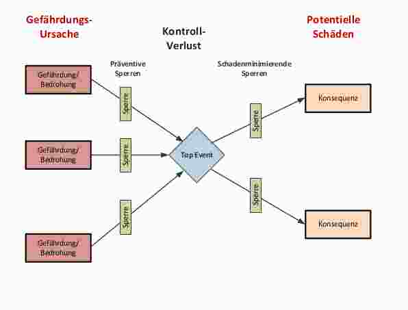

## Lektion 2
### Review Übungen 01
ISO 31'000: Auswirkung von Unsicherheit (Mangel an Wissen) auf Ziele
  - Ziel definieren
  - Definition Unsicherheiten / Ungewissheiten (gemessen mit Wahrscheinlichkeiten)
  - Definition (unterwünschtes) Ereignis (Abweichung vom Ziel: positiv / negativ), pro Ereignis:
    - Auswirkung + Ausmass

## Risikoanalyse
Was wird wirklich erwartet / gebraucht? Aus Methode kann Zahl ermittelt werden, aber Aussagekraft muss von Aussen gegeben werden.

As Low As Reasonable Practicable (ALARP), umgekehrte Pyramide, unterteilt in 3 Bereiche:
  - Tiefe Einzelrisiken, Massnahmen getroffen --> Inkaufnahme (Pyramide: Unten)
  - Normen, Standards, Anforderungen, etc. erfüllt --> Inkaufnahme höhere Risiken (Pyramide: Mitte)
  - Ausgebildet für Risiko VS. "Konsument"-Risiko (Pyramide: Oben)

## Methoden

|  Methode | Häufigkeit |  Ausmass   | Auswirkungen | Unsicherheiten | Ursachen |
|---------:|:----------:|:----------:|:------------:|:---------------|---------:|
| Fishbone |    Nein    |    Nein    |     Nein     | Nein           |       Ja |
|      MLD |    Nein    |    Nein    |     Nein     | Nein           |       Ja |
|  Bow-Tie |    Nein    | Ja (Prosa) |   Indirekt   | Nein           |       Ja |

Nachteile Fishbone, MLD, Bow-Tie: Top-Event wird benötigt

### Fishbone-Diagramm (Ishikawa-Diagramm)
Brainstorming-Methode, Beginn mit Top-Event (Unterwünschtes Ereignis, o.ä.), Definition von Auslösern / Ursachen, Bsp: Wie können User zum Datenverlust beitragen? wichtigsten Pfad ankreuzen

Keine Risikoanalyse für Ausmass und Häufigkeit!, Nur Ursachen von Ereignissen darstellen

### Master-Logik-Diagramm (MLD)
Beginn mit Top-Event (Unterwünschtes Ereignis), wie kann es zu diesem Datenverlust kommen? Hierarchie von Ursachen, grafisch dargestellte Liste

Keine Risikoanalyse für Ausmass und Häufigkeit!, Nur Ursachen von Ereignissen darstellen

### Bow Tie
Top-Event: Unterwünschtes Ereignis, Ursachen des Ereignisses (Gefährdungen), Schäden der Ereignisse (Konsequenzen), zwischen Urachen - Ereignis: Präventive Sperren, zwischen Ereigniss und Schaden: Schadensminimierende Sperren

**Sperren:** Mehrere Sperren pro Verbindung möglich  
**Eskalationsfaktor:** Pro Sperre Eskalationsfaktor, Schwächt Wirkung der Sperre, Massnahmen zur Verhinderung der Abschwächung

### Frequency/Consequence-Diagramm & Risikomatrix
X-Achse: Ausmass, Y-Achse: Häufigkeit, Häufigkeit und Ausmass pro Top-Events eintragen

**Akzeptanzlinie:**
Bewertung (Was ist noch akzeptabel? unterhalb: gute Risiken, oberhalb: böse Risiken), Wer legt die Linie fest? (Grundsätzlich: Durch Management festgelegt), Festlegung: Evtl. durch Ausschluss best. Ausmasse / Häufigkeiten (z.B. Es dürfen nie Katastrophale Risiken, oder Ausklammerung von Bagatellen), vor der Analyse eintragen / definieren

**Verschiebung Punkt:** Minimierung Konsequenz oder Häufigkeit oder Beides
