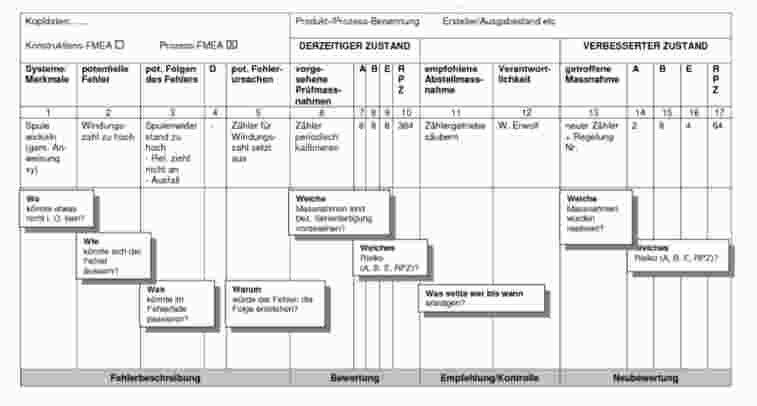

##Lektion 3 & 4
##Prüfung
Risikodefinitionen: ISO 31'000, llgemeinere Form und formalere (Auswirkungen von Unsicherheiten auf Ziele)

Hilfsmittel: 1 Blatt A4, PC oder Handgeschrieben

##Allgemeines
Risiko: Frequency x Consequence (Kosten),C: Worst-Case, F: Gewichtung wie weit man von Worst-Case weg ist, Für Risikoabschützung: Rahmen für Betrachtung / Auswirkungen angeben

##Failure Mode and Effects Analysis (FMEA)
Failure Modes: Ausfallarten  
Effects: Konsequenzen

**Ziel:** Qualitative Untersuchung von Einheiten auf Ausfallarten und deren Auswirkungen auf das übergeordnete Systeme, induktiv

**Prozess: ** PDCA

**Gründe für FMEA:**
  -  Umsetzung Unternehmensziele (z.B. Null-Fehler-Produkte)
  - steigende Kundenanforderungen
  - verschärfte gesetzliche Auflagen

###Arbeitschritte
  1.  Auflistung aller Einheiten (E) (Personen, Computer, ...)
  2. Identifizierung aller Ausfallarten für jede der in 1. aufgelisteten E
  3. Bestimmung der Auswirkungen jeder Ausfallart auf andere E und Auswertung daraus resultierender Auswirkungen auf das System oder den Systemzustand
  4. Klassifizierung nach Gefahr und Auswirkung für die einzelnen Ausfallarten
  5. Ermitteln von Vorgehensweisen zur Reduzierung der Ausfallhäufigkeiten und Ausfallauswirkungen (Risikoverminderung)
  6. Ausfüllen eines Formblattes, das die Ergebnisse der Arbeitsschritte 1. bis 5. zusammenfassend darstellt.

###Ausfallarten
Bestimmung aus Funktionselementen oder Einzelteilen

###Auswirkungen
Klassifizerung Systemendzustand und dessen Auswirkung (Klassen 1 -4, sicher - katastrophal)

Klassifizierung der Ausfallwirkung (sehr schwer - sehr gering, Der Ausfall einer Einheit E führt...)  

Klassifikation der Häufigkeiten (wahrscheinlich (z.B. > 1x in 10^4 Betriebsstunden) - sehr selten (< 1x in 10^7 Betriebsstunden))

###FMEA-Arten und Zusammenhäng
  - System-FMEA: Einheiten eines Systemes, Funktionstüchtigkeit
  - Konstruktions- / Produkt-FMEA: Einheiten hinsichtlich Erfüllung beschriebener Teilfunktionen
  - Prozess-FMA: Tätigkeit / Arbeitschritt innerhalb einer Arbeitsfolge oder Prozesses

###Bewertung
  - Kleinstes Risiko: 1
  - Mittleres Risiko: 25 (5 x 5)
  - Höchtes risiko: 100 (10 x 10)

###Struktur
  - Spalte 1: Baugruppe / Teil / Prozess / Arbeitsschritte
  - Spalte 2: Ausfall- / Fehlerart
  - Spalte 3: Fehlerfolgen
  - Spalte 4: Control Item D (sicherheitsrelevante, dokumentationspflichteige Einheit)
  - Spalte 5: Fehlerursachen (Gliederung z.B. nach 5M: Mensch, Maschine, Material, Methode, Mitwelt)
  - Spalte 6: Verhütungs- / Prüfmassnahmen
  - Spalte 7: Auftreten A (1-10)
  - Spalte 8: Bedeutung B (1-10)
  - Spalte 9: Entwdeckbarkeit (vor Auslieferung Kunde) E (1-10), Betrachtung von zeitpunkt betrachtete Arbeitsphase (1-10)
  - Spalte 10: RPZ = A*B*E

  **Kunde:** derjenige, bei dem der ungünstigste Fall auftreten kann, K-FMEA: meist Endbenutzer, P-FMEA: letzter Arbeitschritt, bei dem Fehler zu Störungen der Weiterbearbeitung führen kann  

  **RPZ:** Orientierungsgrösse zur Prioritätssetzung, RPZ mit grossem A zuerst

##Risikoanalysen in der IT
ISO 27002:2005, COBIT (Control Objectives for IT), Mehari (Méthode Harmoniséee de Resques), BSI, US-CERT

###Mehari
Einfache Risikoanalyse, Hilfe Erstellung Sicherheitskonzepte, ISO 2700x konform
