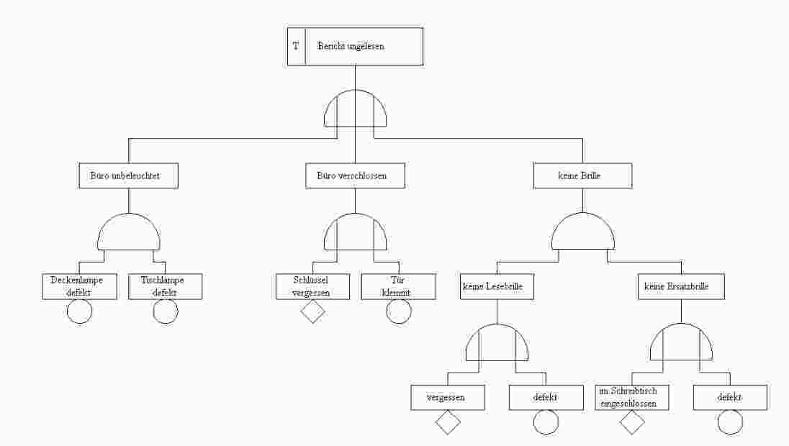
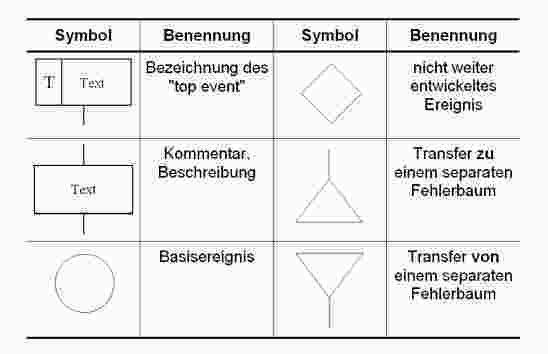
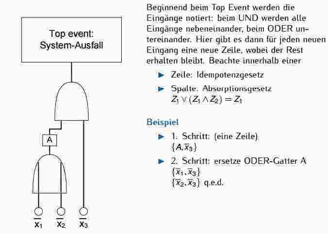
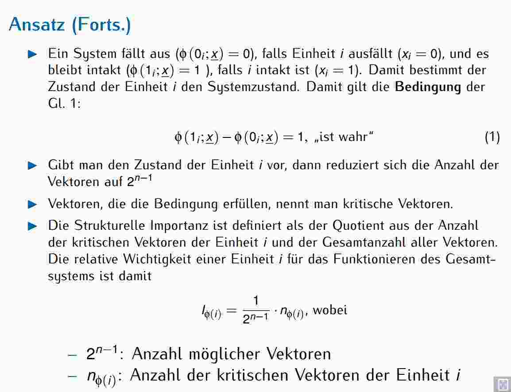
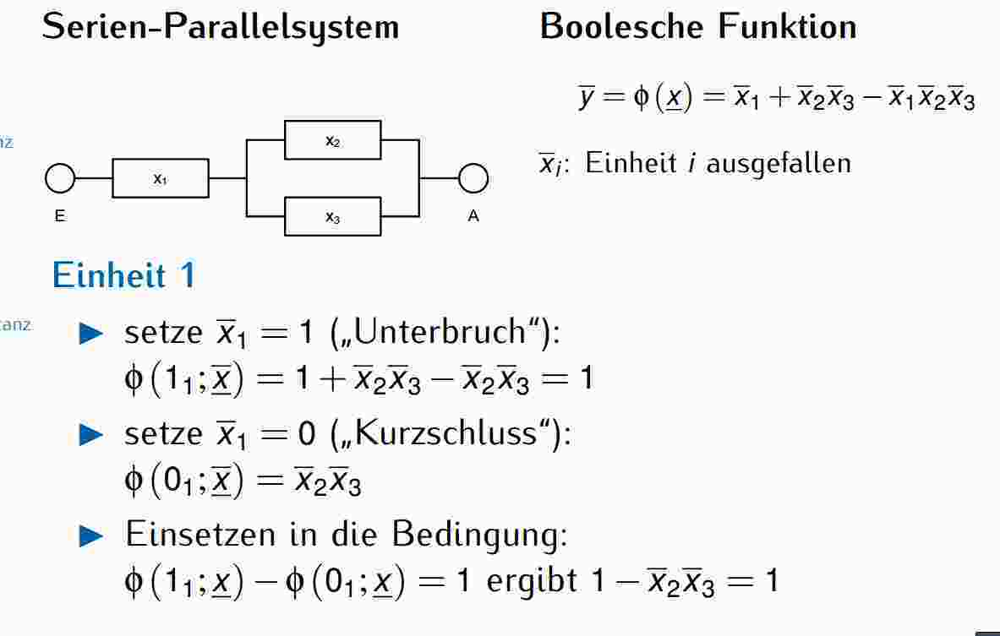
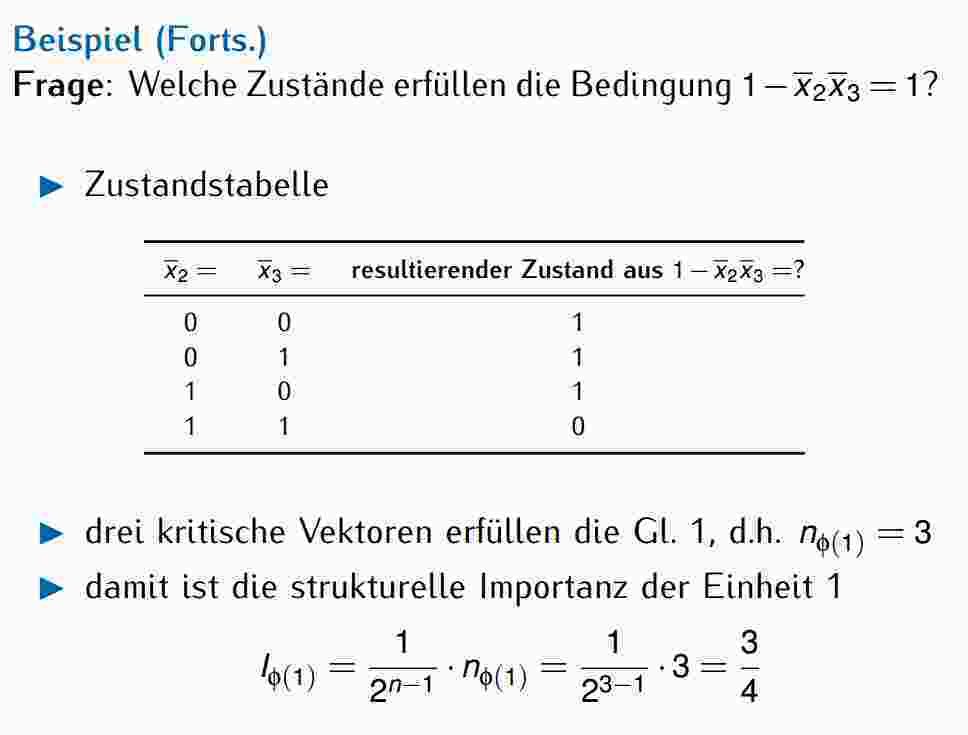
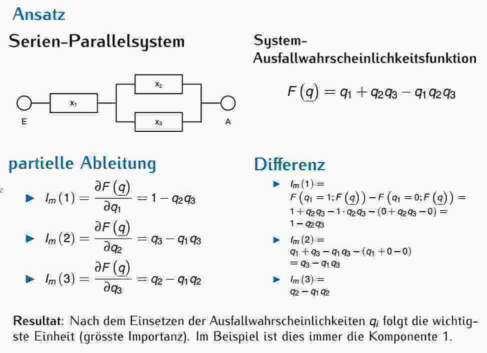
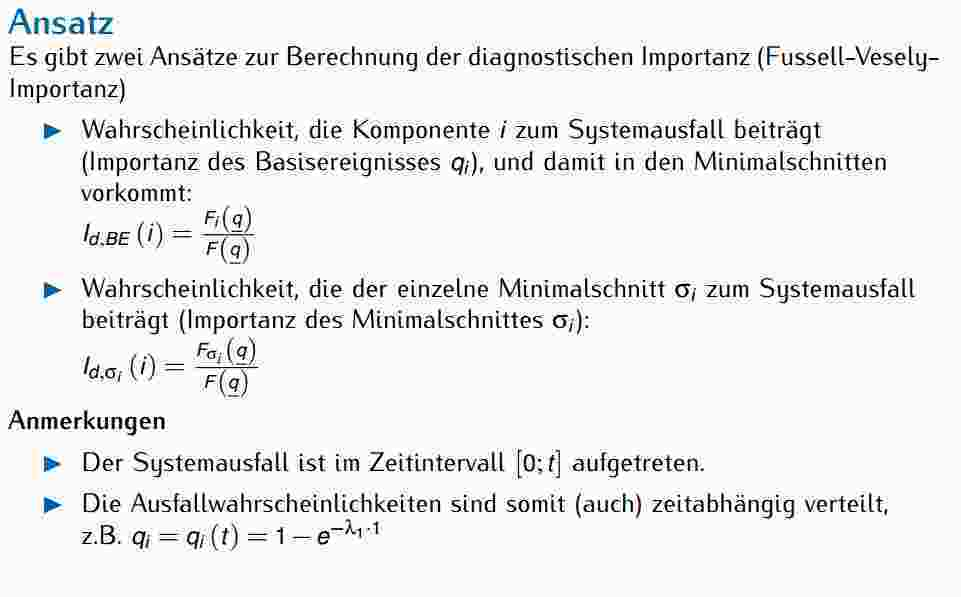
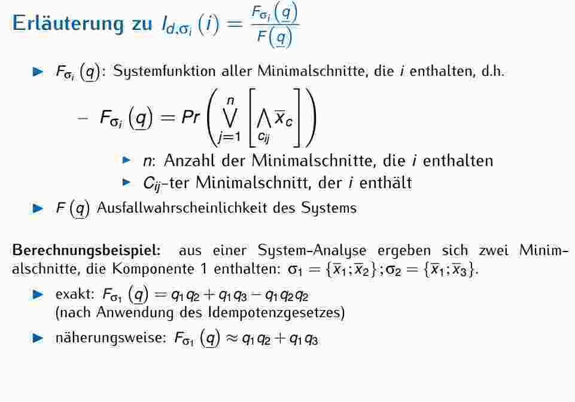
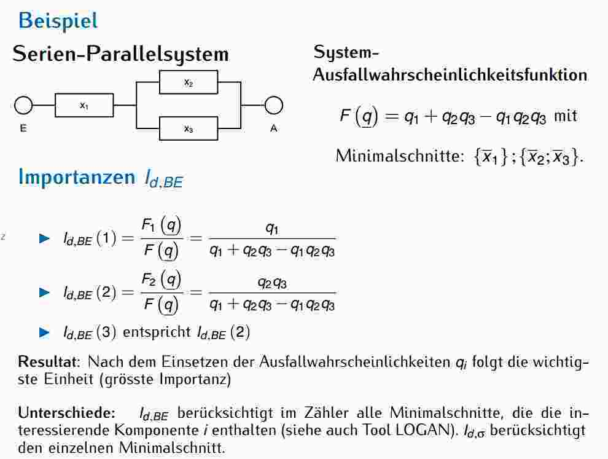

# Lektion 8 & 9
## Fehlerbaumanalyse
Ausgehend von Ursache (Top-Event, Worst-Case), basierend auf boolscher Algebra

### Problematik
In komplexen Systemen Fehlerursachen via Brainstorming schwer ermittelbar, hochzuverlässige / einzigartige Systeme: kaum Zuverlässigkeits- / statistische Daten vorhanden

Logische Verknüpfungen: UND, ODER, NICHT, Und (Halb-Kreis ohne Striche innerhalb), Oder (Halb-Kreis mit Strichen innerhalb), Basisereignisse, Gatter

### Boolsche Logik im Fehlerbaum
  - Grafische Darstellung Boolsche Gleichung
  - Zeigt nur Ausfälle / Fehler
  - Reihenfolge Ereignis spielt keine Rolle
  - Zeitlos
  - Quantitativ
  - Korrekte Berechnung nur via Boolesche Algebra

### Berechnung
Einsetzen Ausfallwsk in Basisereignisse, Verwendung Kanonische Darstellung für Berechnung, Und-Verknüpfung = Multiplikation, Oder-Verknüpfung = Addition

### Regeln
  1.  Kleine WSK: Oder-Verknüpfungen einfach addierene, ohne Subtaktion
  2.  Genaue Berechnung nur möglich, wenn jedes Basisereignis nur 1 x vorkommt
  3. Wenn Minimalschnitte von Fehlerbäumen gleich -> Wahrscheinlichkeit auch gleich

### ZBD
Zeigt Funktionieren System, grafische Darstellung B.A.

### Vom Fehlerbaum zu Minimal-Schnitten
  - Beginn bei Top-Event
  - UND: Alle Eingänge nebeneinander
  - ODER: Alle Eingänge untereinander
    - Pro Eingang: Neue Zeile, Rest bleibt erhalten
  - Hinweis Zeile: Idempotenzgesetz
  - Hinweis Spalte: Abosrptionsgesetz

## Importanz-Analysen
Wichtigkeit einzelner Systemeinheiten kennen / beachten, Beitrag für Systemzuverlässigkeit: Importanz-Analysen
  - Zuverlässigketi System bestimmt durch:
    - Merkmale siner Einheit
    - Anordnung der Einheiten
    - Zuverlässigkeitskenngrössen der Einheiten
  - Wichtigkeit (je nach Problemstellung anders definiert)
  - Je nach Datenbasis unterschiedliche Methoden

### Problemkreise
  - Verbesserung einzelner Einheit, beste auswirkung auf System (Systemoptimierung)
  - Einheit i löst den Systemausfall aus, Systemausfall korrespondiert mit Zeitpunkt Ausfall i
  - Fehlererkennung / -diagnose Reihenfolge zu reparierenden Einheiten bedeutungsvoll (Optimierung Instandhaltung)

### Strukturelle Importanz
#### Ansatz
  - Jede Einheit i weist Zustand xi = 0 (ausgefallen) oder xi = 1 (intakt) auf.
  - Systemfunktion φ(x), besteht aus Einheiten xi, System: Zustand 0 oder 1
  - Zustandsvektor x: Realisierung Einheiten-Zustände in System
  - Anzahl Kombinationen: 2^n unterschiedliche Zustandsvektoren

#### Beispiel: Serien-Paralellsystem

### Marginale Importanz
WSK, dass sich System in Zustand befindet, in dem der Betrieb kritisch ist, partielle Ableitung der Systemausfallwsk F(q) in Bezug auf eine zu untersuchende Komponente q

### Diagnostiische Importanz
Am meisten verwendet

## Hints mündliche Prüfung
  - Fehlerbäume
  - Fehlerbaum aus ZBD ableiten + berechnen, Was muss man bei der Berechnung beachten?
  - Importanz-Analyse (Was kann man damit machen?)
  - Analyse eines Datenblattes
