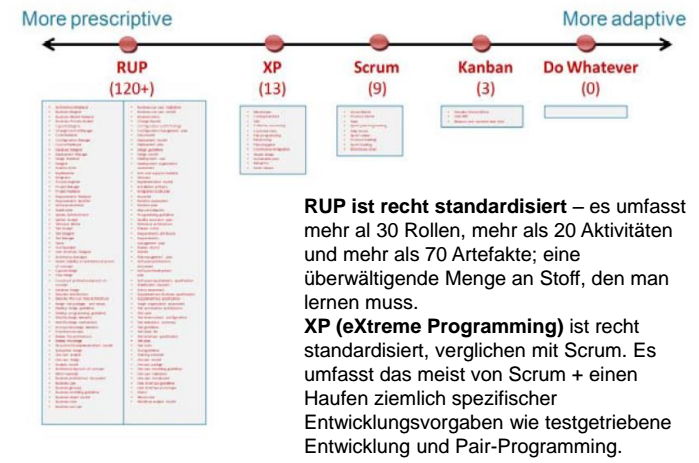
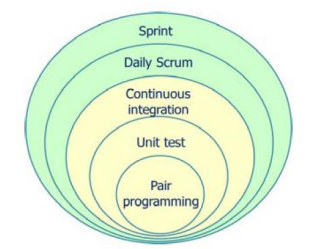

#Kanban
**Kanban**: visuelle Karte / Anschlagbrett, Transparez schaffen, von Toyota, visualisiert die maximal erlaubte WIP (Work in Progress) --> jeden Punkt auf eine Karte schreiben & aufhängen, Spaltentitel -> Position Packet im ARbeitsablauf, Limit Work inn Progress (Begrenzung Arbeitspakete pro Arbeitsschritt), Messung Durchlaufzeit (Lead Time) -> mittlere Durchlaufzeit, Optimierung Prozess um Durchlaufzeit so kurz und vorhersehbar wie möglich zu machen

| To do  |   Dev   |  Test  | Release |  Done  |
|:------:|:-------:|:------:|:-------:|:------:|
|   5    |    3    |   2    |    3    |        |
| Task1  |  Task2  | Task3  | Task 5  | Task 7 |
| Task 4 |  Task9  | Task10 |  Task6  | Task8  |
| Task20 | Task 37 |        | Task 23 | Task40 |

##SCRUM und KANBAN
Frameworks / Werkzeuge für Ausgestaltung Prozesse, Mittel um Aufgabe zu bewerkstelligen, Prozesswerkezuge --> effektiver Arbeiten, kein Werkzeug ist komplett, kein Werkzeug ist perfekt, basieren auf ständiger Entwicklung, Arbeit in kleine Stücke runterbrechen, Scrum schreibt Rollen / zeitbegrenzte Iterationen vor, ist standardisierter als Kanban, schreibt Schätzung vor - Kanban gibt keine Rollen und fixen Iterationen vor, Ziel: Minimierung Durchlaufzeiten, Arbeitsverlauf gleichmässig halten :arrow_right: Anreiz Zerlegung Arbeitspakete in kleine Teile, keine zwingende Schätzung,keine Daily Standups vorgeschrieben -
,empirische Kontrollinstumente (Scrum, Kanban), mit Vorgehen exmperimentieren und ihrer Umgebung anpassen, Kontrollknöpfe: Kapazität (hoch), Durchlaufzeit (kurz), Qualität (hoch), Vorhersehbarkeit (hoch) - funktionsübergreifende Teams mit wem? Exp. - Wieviel Arbeit pro Sprint? Exp. - WIP-Grenze? Exp.

  

**Unterschied Scrumboard & Kanbanboard:** Beide: Verfolgung Bündel einzelner Arbeitspakete :arrow_right: flow, Bsp. 3 zustände: to do, ongoing, done - Scrum: WiP begrenzt pro Zeiteinheit, Board pro Sprint und Team - Kanban: WIP begrenzt pro Zustand entlang des Arbeitsablaufes, Board bleibt bestehen, Board auch über mehrere Teams hinweg,

**Rückkoppelungsschleifen**: Kaizen (kontinuierlicher Verbesserungsprozess in Leansprache), Inspierieren & Adaptieren (Inspect & Adapt, Scrumsprache), Scrum :arrow_right: zugrundeliegende Rückkoppelungsschleife :arrow_right: Sprint, insbesondere wenn kombiniert mit XP

**Neue Anforderung**: Scrum: Aufnahme ins Backlog - Kanban: ins ToDo :arrow_right: Grenze erreicht _arrow_right: entweder ein anderes Element rausnehmen, sobald freie Kapazität: oberstes Element aus dem Stapel

**Arbeit an mehreren Produkten:** Scrum: je ein Board, was wenn nur ein Team? Pro Sprint ein Produkt, oder pro Sprint Komponeten von beiden Produkten (gemeinsames Board) - Kanban: analog

**Überblick:**
  - Lean & Agil
  - Scrum: Push Prinzip, Kanban: Pull Prinzip
  - Nutzung Transparenz für Prozessverbesserungen
  - Konzentration auf schnell und oft ausführbare SW bereitzustellen
  - Selbstorganisierende Teams
  - Aufteilung arbeit
  - Releaseplan auf Bais empirischer Daten kontinuierlich verbessern
