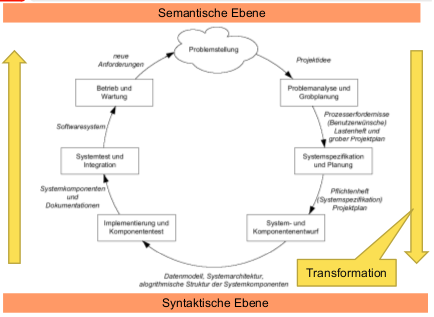
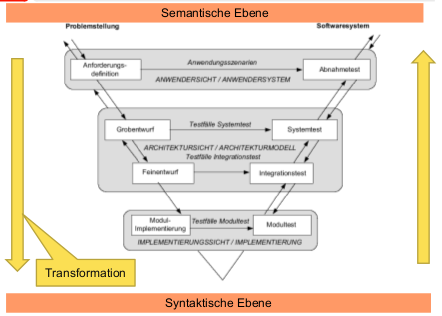
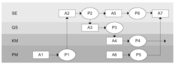
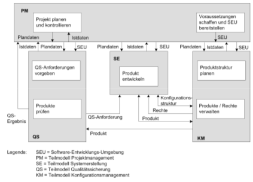
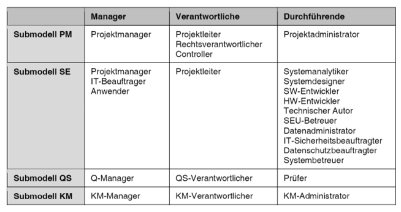
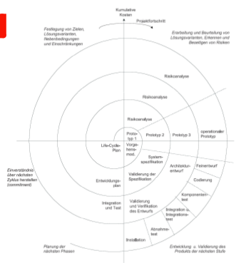

##Basismodelle
###Vorgehensmodelle
beschreibt in abstrakter und idealisierter Form die zeitlich-sachlogische Abfolge von Aktivitäten, Auffassung 1: Jede SWE kann / muss nach def. Prozess ablaufen, Auffassung 2: Jede SWE ist empirischer / dyn. Prozess  

Kurz: org. Rhmen für SWE, soollen zu disziplinierten, sichtbaren, kontrollierbaren Entwicklung führen  

**Basismodelle:**
  - Sequenziells Modell
  - Waserfall-Modell
  - V-Modell
  - Prototypen-Modell
  - Evooluationäres / Inkrementelles Modell
  - Objektorientiertes Modell
  - Nebenläufiges Modell
  - Spiralmodell

**Monumentalmodelle:** UP, RUP, V-Modell, Hermes  

**Rahmenmodelle**

###Prozessmodelle
*Mehr oder weniger starker Bezug zu Softwaretechnik*  

  - ITIL
  - EFQM (European Foundation for Quality management)
  - Six Sigma (Q-Modell um GP möglichst fehlerfrei zu gestalten)

Legt aus VM konkret fest:
  - Reihenfolge Arbeitsablauf (Entwicklungsstufen, Phasenkonzepte)
 - Durchzuführende Aktivitäten
 - Definition Teilprodukte (inkl. Layout & Inhalt)
 - Fertigstellungskriterien
 - Notwendige MQ-Qualifikationen
 - Verantwortlichkeiten und Kompetenzen
 - Anzuwendende Standards, Richtlinien, Methoden, Werkzeuge

###Rahmenmodelle
Rahmen für Einteilung P in Kategorien, Beschreibung Tätigkeitsmerkmale

  - CMMI (Capability Maturity Model Integration)
  - Spice Modell / ISO 15504 (Software Prozess Improvment and Capability Determination Modell), Rahmen Bewertung & Verbesserung SWP
  - ISO 9000 (Rahmenmodell QMS)
  - TQM Modell (Führungsmethode), Qualität im Mittelpunkt

###Vorgehensmodell vs. Prozessmodell
Oft synonym verwendet, verwechselt, VM: sagt, was wir zu tun haben, nicht wie - PM: Konkrete Beschreibung, wie die durch ein VM auszuführenden Tätigkeiten durchzuführen sind

###Arbeitsschritte und Aktivitäten
**Arbeitsschritt:**
bestimmte Sicht auf Gegenstand Proj. beinhaltet konkrete Aktivitäten Schritte: Analyse, Entwurf, Impl., Test, Inbetriebnahme, Wartung | **Projektphase:** Zeitdauer in welcher AS ausgeführt werden, besteht aus 1 AS  

**aktivitäten:** Arbeitseinheiten, Ziel: Konkretes Produkt oder Erbringung einzelne Leistung, wird durch eine Rolle alleine ausgeführt, Gegenstand von konkreten Arbeitsaufträgen, kann in Arbeitspaketen beschrieben werden.

###Code & Fix Prozess-Modelle
1. Code Schreiben, und testen, 2. Code verbssern, 3. GOTO 1 - Ja, wenn Problem klarspezifiziert, und Impl 1 Person - **Nachteile**: Für Behebung Fehler Umstrukturierung, weitere Fehlermeldungen immer teurer :arrow_right: Entwurfsphase vor Programmierung - gut enworfen, SW von Endbenutzer nicht akzeptiert :arrow_right: Definitionsphase vor Entwurf - Fehler schwierig zu finden, Tests schlecht vorbereitet :arrow_right: separate Testphase

###Klassisches sequenzielles Phasenmodell
zahlreiche Variantionen **| Phasen: ** Problemanalyse und Grobplanung, Systemspezifikation und Planung, System- und Komponentenentwurf, Implementierung und Komponententest, System- und Integrationstest, Betrieb und Wartung - In der Praxis meist so nicht anwendbar, idealmodell

####Vorgehensweise Transformation
  - Topdown-Dekomposition in Black Boxes
  - Ausgangsbasis einzelne Phasen: wohldefinierte Produkte (meist Dokumente)
  - Resultat: Input nächste Phase
  - Phasen sind klar voneinander abgegrenzt
  - Verifikationsschritt: Prüfung ob Phasenergebniss Systemspez. erfüllt.
  - Evaluierungsschritt: Prüfung ob Produkt in vorliegender Form den Benutzerwünschen entspricht
  - Entwurfsphase: Weitere Zerlegung
  - Komponentenspez.
  - Synthese Sys.komp.

###Wasserfallmodell
Verfeinerung klas.. Phasenmodell, Rückkoppelung zwischen Phasen + Einschränkungen, dass diese nur bei aufeinanderfolgenden Phasen vorkommen, Einbindung Validierung der Phasenergebnisse, optional: iterativer Charakter :arrow_right: eingeschränkt inkrementelle Entwicklungsstrategie (mit Prototypen), zweimal-Bauen (Vorwiegend Sys.spez. und Sys.Arch. - zuuerst Prototyp, dann sauber) :arrow_right: Reduktion Fehler Sys.Spez. und Design-Fehler.

**Phasen:** Problemanalyse, Sys.spez, Grobentwurf, Feinentwurf, Impl, Integration, Installation, Betrieb & Wartung

**Charakteristika nach Balzert:** Aktivität in richtigen Reihenfolge, volle Breite durchführen, nach jeder Aktivität: fertiges Dokument (Dokument-getriebenes Modell), Entwicklungsablauf: sequentiell (jede Aktivität abgeschlossen vor der nächsten), Orientierung top-down, einfach, verständlich, wenig Management, Benutzerbeteiligung nur in Definitionsphase

###V-Modell 97
Erweiterung Wasserfall, integriert QS, Verifikation: Überprüfung Übereinstimmung SW-produkt und Spez, Validation: Eignung / wert Produkt auf einsatzzweck  

**4 Submodelle**
  - Systemerstellung (SE)
  - Qualitätssicherung (QS)
  - Konfigurationsmanagement (KM)
  - Projektmanagement (PM)

  

Ai: Aktivitäten, Pi: Proudkte

V-Modell XT (Xtreme Tailoring), anpassbar an Bedürfnisse, Einbindung Auftraggeber, Stärkere Modularisierung, Tedenz: agil, vier Submodelle gibt es in dieser Form nicht mehr.

**Tailoring:** Ausschreibungsrelevantes Tailoring vor Entwicklungsbeginn: sinnvolle Aktivitäten & Produkte festlegen, Streichen, Wahl vorhabentyp - Technisches Tailoring: Aktivitäten & Produktinhalte bei Beginn jeder Haupt-A festgelegt., Entscheidung ob A oder P im konkreten Fall sinnvoll ist (Vermeidung Papierflut)

###Prototypen-Modell
**Traditionelle Probleme:** Auftraggeber kann Anforderungen nicht explizit / vollständig formulieren, keine Kooperation nach dem Anforderungen erstelllt wurden.  

Unterschiedliche Lösungsmöglichkeiten, experimentell mit Auftraggeber erproben / diskutieren., Realisierbarkeit theoretisch nicht immer garantierbar, Während Akquisitionsphase: Auftraggeber von prinzipieller Durchführbarkeit überzeugen.  

**Prototyp:** Ausführbares Modell (einfach änder- / erweiterbar)  
**Prototyping:** Tätigkeiten welche für Prototyp notwendig sind.

####Einteilung Prototyping
  - Exploratives Prototyping (Ziel: Vollständige Systemspez.)
  - Experimentelles P. (Ziel: Vollständige Spez. Teilsysteme)
  - Evolutionäres P. (Ziel: inkrementelle Systementwicklung)

####Prototyparten
  - (un)vollständige P
  - Wegwerf / wiederverwendbare P
  - horizontale P (nur spez. Ebenen des Sys, möglichst Vollständig)
  - vertikale P (impl ausgewählte Teile vollständig durch alle Ebenen, geeignet: offene Fkt. / Impl.optionen)
  - Demonstrations.P
  - Prototyp im engeren Sinne
  - Labormuster
  - Pilotsysteme

###Inkrementelles Modell
Entwicklung stufenweise, Steuerung durch Erfahrung Entwickler / Kunde, Wartung: Erstellung neue Version besth. Produkt, Entwicklung durch Code, Zentrum: lauffähige Systemteile,  geeignet: Kunde hat Req. noch nicht vollstänig überblickt, noch unformuliert

##Evolutionäres Modell
~agiles Modell, rasch einsatzfähige Produkte, Kombination Prototyp-Modelle, Erfahrung Einsatz P in nächste Version, Zerlegung in überschaubare Arbeitsschritte, bei: WE Standardprodukte

###Objektorientiertes Modell
**Merkmal:** Wiederverwendung Klassen von Klassen-Biblio. und von Frameworks durch Komposition, Vererbung, Polymorphie, vielfältige Aspekte Wiederverwendung (eigen- /fremdentwickelt) müssen im Prozessmodell berücksichtigt werden

**Konsequenzen:** Entwurf nicht losgelöst von Impl durchgeführt werden, Berücksichtigung Lösungsbausteine während Entwurf, Dauer Impl verkürzt, Lib muss ständig gewartet werden, neue Klassen: PRüfung auf allgemeine Verwendbarkeit

###Nebenläufiges Modell
**Charakteristika:** Aktivitäten parallelisieren (org. / technische Massnahmen), Erfahrung betroffener Personengruppen frühzeitig zusammenbringen, Zeitverzögerungen reduzieren (Parallelisierung, Minimierung Ausprobieren, Reduktion Wartezeiten), Ziel: Vollständiges Produkt ausliefern

###Spiralmodell
Kombination bisheriger Modelle (einbetten), Metamodell :arrow_right: Wahl der am besten geeignetsten Vorgehensweise

**Schritte:**
  1. Identifikation Ziele Teilprodukt (leistung, Fkt), Alternative Möglichkeiten, Randbedingungen
  2. Evaluierung Alternativen (Berücksichtigung Ziele & Randbedingungen), Aufzeigen Evaluierungsrisiken, kosteneffektive Strategie entwickeln
  3. In Abhängigkeit verbleibende Risiken: Prozess-Modell für Schritt festlegen, Kombination mehrere Modell zur Risikominimierung
  4. Planung nächster Zyklus + Ressourcen (inkl. Aufteilung Komp.), Review (1-3, Planung nächster Zyklus), Commitment für nächsten Zyklus

  
