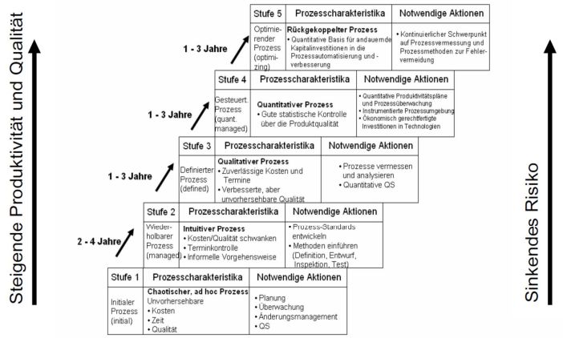

#Rahmenmodelle
##Grundlagen
Rahmen für Prozesse, Einteilung in Kategorien, Tätigkeiten mit Merkmalen beschrieben, oft anhand Best Practicies wie Ziele erreicht, Grundlagen betreffend Anforderungen an Prozesse und Beurteilung, Modelle SW: CMMI, spice, Modelle industrie: ISO 9000, TQM - z.B. als Referenzmodelle

###Prozessqualität vs. Produktqualität
Prozessmodelle: Produktqualität und Prozessqualität verbessern, Produktqualität eigentliches Ziel, Qualität nicht messbar (via Erfüllung Anforderungen), Erfüllung Anforderungen oft nicht messbar :arrow_right: Entwicklung von Metriken, bei Formulierung Angabe über Messung

###Verbesserung Prozessqualität

###Software-Prozessverbesserung
PDCA

##Modelle aus der SW-Branche
ISO 15504:2004 (Req Assessments und Prozessmodelle): CMMI (Prozesse) + SCAMPI (Assessment) oder ISO 12207 AMD 1 (Prozesse) und SPICE (Assessment)

###Assessments
Wo stehen wir? Was können wir verbessern?

###Assessmentmethode vs. Prozessmodell
Prozessmodell :arrow_right: Unternehmensspezifische definierte Prozesse :arrow_right: Gelebte / angewendete Prozesse (Überprüfung letzerer)

##CMMI
Capability Maturity Model Integrated, Rahmenmodell Prozessmanagement mit betriebsspez. Bezug auf: Prozessdefinition, -schwerpunkte, schulung, -leistung, Innovation und Einführung

###Verlaufsdarstellung vs. gestufte Darstellung
**Verlaufsdatstellung (Continuous Representation):** jeder Prozessbereich einzeln beurteilt, 6 Fähigkeitsstufen (capability levels), Resultat: Fähigkeitsprofil, Prozessverbesserung durch Transition, entspricht Bewertungsmodell von SPICE

**Gestufte Darstellung (Staged Representation):** Fünf Reifestufen (maturity levels), Fähigkeitsstufen 1-5, Einstufung durch Feststellung welche Prozessbereiche welche Fähigkeitsstufe, Resultat: Zahl 1 - 5, Prozessverbesserung durch schrittweisen Stufenanstieg, entstpricht etwa Bewertungsmodell CMM

###Prozessbereiche
22, beurteilt, pro Bereich: specific goals (verbindlich, muss), specific practices (zur Erreichung der Ziele) jeweils Zuordnung von Fähigkeitsstufen (goals and practices), CMMI kann auf spez. Problembereiche zugeschnitten werden (Tailoring)

###Fähigkeitsgrade (0-6) - Capability level
Pro Generische Ziele und Generische Praktiken  

  * 0:  Incomplete
        fachliche Ziele nicht erreicht
  * 1:  Performed
        fachliche Ziele erreicht
  * 2:  Managed
        Arbeit wird geführt
  * 3:  Defined
        Arbeit wird mit Hilfe eines angepassten Standardprozesses durchgeführt und Arbeitsweise verbessert
  * 4:  Quantitativley Managed
        Arbeit mit Hilfe statistischen Prozesskontrolle
  * 5:  Optimizing
        Arbeit / Arbeitsweise mit hilfe statische Prozesskontrolle verbessert

**Kategorien:**
  * Process Management
    Alle Gebiete mit Mgmt org.weite Prozesse.
  * Project Management
    Prozessgebiet mit Mgmt einzelnes Projekt
  * Engineering
    technische Entwicklungsthemen, umfassen einfachen Lebenszyklusmodell + Verifikation + Validation Ergebnisse
  * Support
    Querschnittsthemen Unterstützung Prozesse

Es entsteht Fähigkeitsprofil

###CMMI - Fähigkeitsstufen (capability levels)
charakterisiert durch Generische Ziele die durch Generische Praktiken erreicht werden

**Fähigkeitsstufen:**
  * Null  
    Prozesse Org decken P.-Bereich nur teilweise / nicht ab
  * 1  
    Gen. Ziel: Spezifische Ziele erreichen (für jeweiligen Prozessbereich)  
    Gen. Praktiken: Spezifische Praktiken ausführen (für jeweiligen Prozessbereich)
  * 2  
    Gen. Ziel: Geführten Prozess institutionalisieren  
    Gen. Praktiken:  
      2.1: Unternehmens-/Organisationspolitik etablieren  
      2.2: Prozesse planen  
      2.3: Ressourcen bereitstellen  
      2.4:  Verantwortlichkeiten zuweisen  
      2.5:  Leute schulen  
      2.6:  Konfiguration verwalten  
      2.7:  Relevante Beteiligte (STH) identifizieren und involvieren  
      2.8:  Prozess beobachten und lenken  
      2.9:  Einhaltung des Prozesses objektiv evaluieren  
      2.10: Status mit höherem Mgmt überprüfen
  * 3  
    Gen. Ziel: Definierten Prozess institutionalisieren  
    Gen. Praktiken: Definierten Prozess etablieren  
    3.2: Verbesserungsinformation sammeln
  * 4  
    Gen. Ziel: Quantitativ geführten Prozess institutionalisieren
    Gen. Praktiken:  
    4.1:  Quantitative Vorgaben für den Prozess etablieren  
    4.2:  Leistung der Subprozesse stabilisieren
  * 5  
    Gen. Ziel: Optimierende Prozesse institutionalisieren  
    Gen. Praktiken:  
    5.1: Kontinuierliche Prozessverbesserung sicherstellen  
    5.2: Probleme an ihren Wurzeln beheben

**Reifegrade (maturity levels)**
  1. Initial (Keine Anforderungen, automatisch jede Org.
  2. Managed (Projekte geführt, ähnliches Projekt kann erfolgreich wiederholt werden)
  3. Definied (Projekte werden nach angepassten Standardprozessen durchgeführt, org.weite kontinuierliche Prozessverbesserung)
  4. Quantitatively managed (Durchführung statistische Prozesskontrolle)
  5. Optimizing (Arbeit / Arbeitsweise mit Hilfe eienr statistischen Prozesskontrolle verbessert)

###Bestimmung Reifestufe
**Reifegrad 2:**
Mind auf Fähigkeitsstufe 2
  * REQM (Requirements Management)
  * MA (Measurement and Analysis)
  * PMC (Project Monitoring and Control)
  * PP (Project Planning)
  * PPQA  (Process and Product Quality Assurance)
  * SAM (Supplier Agreement Management)
  * CM (Configuration Management)

**Reifegrad 3:**
Alle FS 3 bis auf:
  * OPP(Organizational Process Performance)
  * QPM (Quantitative Project Management)
  * OID (Organizational Innovation and Deployment)
  * CAR (Causal Analysis and Resoluation)

##Gestufte Darstellung der Reifegrade

##CMMI Beurteilungsverfahren
Kein vorgeschriebenes Verfahren, sondern vorgaben, die ein Verfahren erfüllen muss (SCAMPI, ARC)

**Ziele:** Festellen des aktuellen Standes, Identifikation Verbesserungsmöglichkeiten, Überprüfung Wirksamkeit eingeleiteter Massnahmen, Darlegung Prozessqualität der eigenen Org. gegenüber Kunden / Lieferanten

##ISO 9000
Klassische Fertigungsbetriebe bezieheun Zulieferteile, Zulieferteile beeinflussen wesentlich Qualität Endprodukt, Teile qualitativ hochwertige, Auftraggeber prüft Produktqualität Teilprodukte + Qualität Herstellungsprozess

###Normwerk
Auftraggeber-Lieferanten-Verhältnis: allgemeinen, übergeordneten, organisatorischen Rahmen zur QS von materiellen und immateriellen Produkten fest. Teilnormen: 9000-1 (Allgemein, Überblick normen, Leitfaden Auswahl, Anwendung in Bezug auf QM, QS-Nachweisstufe), -2, -3 (Richtlinie wie ISO 9001 für Entwicklung, Lieferung, Wartung SW), -4, 9001 (Modelle Darlegung QS Design/Entwicklung, Produktion, Montage, Kundendienst), 9002 (Def Modelle Darlegung QS in Produktion / Montage), 9003 (Beschränkt Darlegung QS Endprüfung), 9004 (Erläutert die von Norm def. QS-Elemente)

###ISO 9000-Ansatz
####ISO 9000-3
Relevant Software-QS, Erleichterung Anwendung ISO 9001 für SWE, vollständige Realisierung ISO 9000-3 :arrow_right: automatisch ISO 9001, Zertifizierbar, bestimmte Req an Güte oder Sicherheit eines Produktes werden nicht verlangt (produktzertifikate), 3 Hauptartikel, Inhalt: Entwicklung, Lieferung, Wartung SW, Gliederung: einmalig, periodisch, pro Projekt, vorgehensmodell: kein spzeifisches, Voraussetzungen: SWE in Phasen, Vorgaben für Phasen festgelegt, geforderte Ergebnisse pro Phase festgelegt, Verifizierungsverfahren pro Phase festgelegt, dokumente: Vertrag Auftraggeber - Lieferant (Qualitätsrelevante Vertragspunkte), Spezifikation, entwicklungsplan, Qualitätsicherungsplan, Testplan, Wartungsplan, Konfigurationsmanagementplan

####Zertifizierung
**Qualitätsaudit:** systematische, unabhängige Untersuchung  
**Systemzertifikat:** Zertifizierungsstelle, Audit, bescheinigt Qualitätsfähigkeit, 3 Jahre gültig, jährlich Überwachungsaudits, nach 3 Jahren: Wiederholungsaudit (+ 3 Jahre)

##TQM (Total Qualitlity Management)
Ziel: magsiches Dreieck (Qualität - Zeit - Kosten)

###Qualitätsmanagementkonzept
Qualitätsphilosophie, operationalisierung in betrieblichem Alltag, allgemeine Modelle, abstrakte Schablonen

**Herkunft:** Autoindustrie Japan

**Definition:** Mitwirkung aller Mitglieder, führungsmethode einer Organisation, qualität in Mittelpunkt durch Zufriedenheit der Kunden, langfristiger Geschäftserfolg

**Zielsetzung:** Integriert werden Interessen: Kunden, MA, Unternehmen, Lieferanten - Zentrales Ziel: Qualität aus Sicht Kunden, Kunde entscheidet über Qualität, TQM soll führen zu: höherer MA-Zufriedenheit, gesteigerter Produktivität, reduzierte Kosten, kürere Entwicklungszeiten - TQM muss: aktiv gestaltet, eingeführt, aufrecht erhalten, gelebt werden

###EFQM-Modell
European foundation for Quality Management, Kern: Bewertungsmodell, Messung Umsetzung QM, Grundlage Preisvergabe & Selbstbewertung

###Bewertungskriterien
3 Säulen (Menchen, Prozesse, Ergebnisse)

###Elemente "Excellence"
Stufen: Selbstbewertung, Commited to Excellence (Selbstbewertung, Priorisierung Verbesserungspotentiale, durch Validator - EFQM-Prüfer, Zertifikat 2 Jahre gültig), Recogniced for Excellence (umfangreiche Selbstbewerter, Datenerhebung Assessoren, Workshop von Assessoren und Bewerbern vor Ort)

###Prinzipien TQM
  * Quality first
  * Alle Prozesse: Qualitätsprozesse
  * Req an Prozesse: 100% erfüllt
  * Jeder MA am P beteiligt: sofort beim ersten Mal und jedes Mal erneut richtig tun
  * Qualitätsverbesserungen durch Verbesserungen Entwicklungsprozesse
  * Verschwendung und Nachtarbeiten vermeiden
  * Zuständigkeit aller MA
  * Ständige Verbesserung
  * Berücksichtigung soziales System mit gewachsenen Strukturen
  * Kundenorientierung
  * Interne Kunden-Liefernaten-Verhältniss

###Einführung TQM erfordert
  * Kenntnis der Prozese in einem UN
  * Ausreichende Dokumentation
  * Ständige Anpassung an neue Erfordernisse
  * QS-System zur sätnigen Verbesserung aller Prozesse
  * Konsequente Schullung aller MA in Sachen Q und QM

###TQM Methoden
####Qualitätszirkel
  * Primat der Qualität
  * Zuständigkeit aller MA
  * Ständige Verbesserungen
  * Vorgehensweise
    * Problemidentifikation, Problemauswahl
    * Problembearbeitung
    * Ergebnispräsentation
    * Einführung und Erfolgskontrolle

####Pareto-Prinzip
80:20 Regel, 80% Aufwand um 20% der Probleme zu lösen, 80% Probleme können mit 20 % Aufwand gelöst werden, Bezogen auf QS, 20% Fehlerursachen erzeugen 80% der Fehler und der Kosten, 80% Fehler können mit 20% des Gesamtaufwands behoben werden.

####Ursache-Wirkungs-Diagramm

