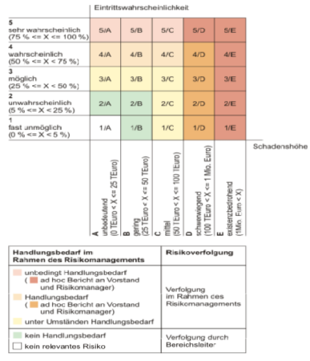
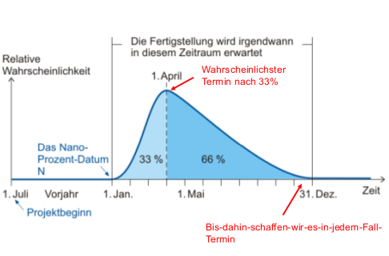

#Risiko Management
**Risikomanagement**
Fester Bestandteil in Managementplänen in Unternehmen, Basis für gewisse Geschäftsbereiche (Versicherungen), Tehma in der SWE

**Risiko**  
Neagative (Bestandesgefährdende) Entwicklung, allenfalls Verfehlung geplannter Ziele (Unternehmens- / Bereichsziele, ...), Risiko :arrow_right: gewichtetes Muster möglicher Ereignisse + verbundene Folgen, potentielles Problem, ein Problem ist ein Risiko, das eingetreten ist.

**Risikomanagement**  
Systematische Vorgehensweise über Korrekturmassnahmen nachzudenen, vevor ein Problem eintritt, syst. Erfassung, Bewertung, Steuerung Risiken, Bestandteile: identifikation, Analyse, Bekämpfung, Gegenteil: Krisenmanagement

**Bezug SWmanagement**  
Entwicklung SW-Sys historisch junge Disziplin, viele innovative MA

##Risikomanagementprozess
SWE: Besonders schwierig Risiken rechtzeitig zu identifizieren, start bei Projekten, Risiken aller Projekte :arrow_right: Zusammenfassung auf Unternehmensebene, Risikoprozess etablieren um Risiken bewertbar zu machen, **Continuous Risk management Paradigma**: Center: Communicate, Circle: Identify - Analyse - Plan - Track - Control - ... | PMA müssen in der Lage sein, erkannte Risiken an zuständige Stellen weiterzuleiten ohne berufliche Konsequenzen fürchten zu müssen, , Vollständige Integration des RiskM in den Entwicklungsprozess

##Risikobewertung und Risikobeherrschung
**Risikobewertung:** 1. Risikoidentifikation, 2. Risikoanalyse, 3. Risikoprioritätenbildung
**| Risikoidentifikation:** Brainstorming / Checklisten, Ergebnis: Liste der projektspez. Risikoelmente, die den Projekterfolg gefährden, allenfalls Analyse vergangener / nicht erfolgreicher Projekte
**| Risikoanalyse:** Wahrscheinlichkeit (Verständnis Risiko, Festhaltung genauer Umstände und Auswirkungen)+ Einfluss des Risikos (Erfahrungen oder Abschützung via Skala), für quantitative Bewertung Risiko muss Risikofaktor berechnet werden, Risikofaktor = Eintrittswahrscheinlichkeit x Schadenshöhe, nicht alle Risiken müssen gemanaged werden (sehr kleine Eintrittswsk, bei Eintritt wird Produkt nicht mehr benötigt, Folgen Risiko sind minimal, Risiko wird von anderer Partei getragen)
**| Risikoprioritätenbildung:** Ordnung Risiken nach Prioriäten, z.B. via Risikofaktor

**Risikobeherrschung:** 4. Schritt: Planung Risikofall (für kritische Risiken Eventualfallspläne, was tun im Schdenfall), 5. Schritt: Risikoverminderung (wichtig: gute Planung Massnahmen + Verfolgung Durchführung), 6. Risikoüberwachung (Eintrittsindikatoren laufend überwachen)

##Unsicherheiten und Risikodiagramme
**Unsicherheiten:** Anforderungen, Zusammenspiel (Produkt mit Benutzern / anderer SW), Umgebungsveränderungen, Ressourcen (MA, Skills, ..), Management (Zusammenstellung produktiver Teams), Supply Chain (erbringen andere PMA Leistung?), Politik (Machtspiele, unrealistische Ziele, etc..), Konflikt, Innovation (neue Techniken / Methoden), Skalierung (zusätzliche Fkt auf Projektleistung)

**Risikodiagramm:**

Abweichung Graph von x-Achse definiert das erste Datum, dessen WSK nicht bei null, aber dennoch im nanoprozentbereich liegt (Nanoprozentdatum), Regelfall: Ermittlung dieses Wertes bei Schätzung :arrow_right: Fehler: Festlegung Fertigstellungsdatum, Fertigstellungsdatum: liegt zwischen frühstmöglichem Termin und dem Bis-dahin-schaffen-wir-es-in-jedem-Fall-Termin

##Kernrisiken
1. Fehlerhafter Zeitplan, 2. Inflation der Anforderungen, 3. Mitarbeiterfluktuation, 4. Spezifikationskollaps, 5. Geringe Produktivität

##Verfolgung der Top Ten-Risiken
Schritte: Risikoelemente in Reihenfolge bringen, Festlegen Überprüfungstermine, Sitzung beginnt mit Bericht über Fortschritt bei den Top Ten-Risikoelementen, Sitzung: Konzentration Beseitigung RE
