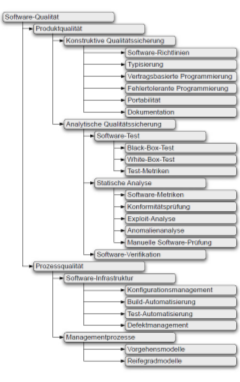
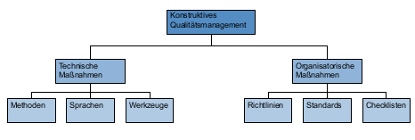
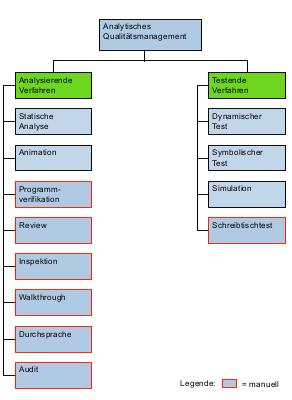

#Qualitätsmanagement
##Begriffe
**Qualität:** Grad, in dem Satz inhärenter Merkmale Anforderungen erfüllt (ISO 9000:2000), gibt an in welchem Masse ein Produkt (Ware / Dienstleistung) den bestehenden REQ entspricht, REQ: Erfordernis / Erwartung vorausgesetzt / festgelegt, Inhärentes Merkmal: Kennzeichnende Eigenschaft einer Einheit, welche diese aus sich selbst heraus hat und die ihr nicht explizit zugeordnet ist
**| Qualitätsmanagement:** aufeinander abgestimmte Tätigkeiten zum Leiten / Lenken einer Org. bezüglich Qualität, enhält: Festlegen Qualitätsprolitik, Qualitätsziele, Qualitätsplanung, Qualitätslenkung, Qualitätssicherung, Qualitätsverbesserung
**| Qualitätssicherung:** Aktuelle Qualität :arrow_right: Massnahmen zur Korrektur, Abstrakt: Geplante und sys. Tätigkeiten, die innerhalb QM-Sys verwirklicht sind, und die wie erforderlich dargelegt werden, um angemessenes Vertrauen zu schaffen, dass eine EInheit die QA erfüllen wird.

##Produkt vs. Prozessorientiertes QM
**Produktorientiertes QM: ** Überprüfung von SW-P und Zwischenergebnissen auf vorher festgelegte Q-merkmale **| Prozessorientiertes QM: ** Erstellungsprozess SW-Methoden, beinhlatent Werkzeuge, Richtlinien, Standards

##Konstruktive vs. Analytische QM-Massnahmen
**Konstruktive Massnahmen:** Methoden, Sprachen, Werkzeuge, Standards, Checklisten, die dafür sorgen, dass entstehende Produkte / Erstellungsproz. bestimmte Eigenschaften besitzen. **| Analytische Massnahmen: ** diagnostische Vorgehensweise, keine Qualität in Produkt / Proz., Messung existierende Qualitätsniveau

** Hauptgruppen: Prüfungsrelevant, inkl. Beispiele**
###Konstruktives QM
Gewährleistung das es dokumentierte Vorgehensweisen für SWE gibt, z.B. Programmierrichtlinien, Reviews, etc.

**Bsp. produktorientierte konstruktive Massnahmen: ** Gliederungsschema Pflichtenheft (Richtlinie), alle wichtigen Infos auf einer Seite (Methode), Einsatz Programmiersprache mit statischer Typprüfung können keine Typfehelr zur Lfz auftreten (Sprache)
**| Bsp. prozessorientierte konstruktive Massnahmen**: Festlegung welche Teilprodukte mit welchem Inhalt und welchem Layout wann und von wem erstellt werden müssen, standardisiert den Entwicklungsprozess (Richtlinie), Konfigurationsmanagementsystem zur Identifikation SW-Elemente - Konfiguration (Richtlinie, Werkzeug), Festlegung zulässiger Zustandsübergänge, Festlegung Vorgehensmodell

###Analytisches QM

**Gliederung:** Bezug zur Prüfung (Produkt- / Prozessprüfung), Automatisierungsgrad / Nachvollziehbarkeit / Einsatzbereich Prüfung (Definitions- / Entwurfs- / Impl- / Abnahme / Wartungs- & Pflege-phase)
