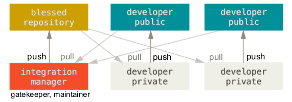

#Version Control, Git and Github
Grösstes Problem: DB wird kopiert, nicht gescriptet (z.B. mit Liquibase)

##Version control System
  - Repository
  - Working Copy (local, private)
  - Checkout
  - Commit
  - Update (Git: merge / rebase)

###Typen
  - Local Version Control
    Local, separate repository dirs to keep track of changes, single point of failure, only individual files
  - Centralized VC
    one authoritative server, one complete repo, multiple working copies, one official truth, fine graiend access control, single point of failure, slow
  - Distributed VC
    local copy on each computer, no single authoritative repo, so spf, offline, fast, good changing & merging, many possibilities for workflows, collaboration, no real latest version, no reall revision numbers

###Tracking Changeset vs. Snapshot
**Changeset:** stores files in form of differences (deltas) bethween either previous / next version - **Snapshot:** stores each changed file entirely, uses directed acyclic graph to store file-trees

###Directed acyclic graphs
consists of nodes and edges, edges are directed, contain no circles, often called trees, efficient algorithms

###Revision ID & Tagging
Continuous Numbers or Hash-Values, for usability: User can define Tags for commit

##Git
**Design Goals:** Speed, simple design, strong support for non-linear dev (branching, merging), fully distributed (allows complex workflows, stable sync), ability to handle large projects

**Concepts:** file system (snapshot storage method), Integrity (checksum for everything, SHA-1, first few chars usually sufficient), no delete (recoverably), tracks contents not files (file with same content :arrow_right: only once uploaded, reference)

###Buckets
  - Working Directory
    checked out version of files the user is currently working on
  - Staging Area (index)
    Collect changes for next commit
  - Repository
  - Stash area
    storage to temporary keep modified tracked files of a branch while working on different branch, required on branch switch

###File Status Lifecycle
**tracked:** under version control (unmodified, modified, staged)  
**untracked:** new files, ignored files

###Commands
around 150

  - Local commands
    - git config (--global user.name "Test")
    - git init (new repo for existing dir)
    - git add
    - git status (status of working dir, current branch, staged files, unstaged changes, untracked files)
    - git commit (-am :arrow_right: add and commit)
      Create commit object, pointer to staged files (snapshot), pointer to previous commit (parent), commit metadata
      --amend (change commit message)
    - git log (log history, -10, --since=2.weeks, Display: --graph, --decorate, --oneline, --all)
    - git diff (unstaged changes), --cached: staged changes, specific version)
    - git tag
    - git revert (revert (last) commit specific or HEAD)
    - git reset (remove file from staging area, unstage, undo last commit: --soft HEAD~1)
    - git rm --cached (untrack file, but keep in working dir)
    - git rm (untrack and delete)
    - git mv (move reference, rename)
  - branch / merge
    - git branch (display branches, last commit: -v, remote tracking branches: -r, local & remote: -av)
    - git merge
      git checkout master && git merge dev, creates new commit
    - git checkout (checkout branch, -b: replace files in wd with files of branch)
      -- <file> (get file from repo, --force master: get all)
    - git rebase (order commit of the source branch after target branch)
      git checkout dev && git rebase master, cleaner history, powerful and dangerous
    - git stash (save [message], git stash pop [stashId], list)
  - remote commands
    - git remote (show: -v, Details: show <name>, add, rename, remove)
    - git clone (create copy of repo)
      Mehrere Befehle (init, remote add origin, fetch origin, branch master origin/HEAD, checkout master)
    - git fetch (info from remote not in local repo, git fetch <remote>)
    - git pull (=Fetch + Merge, alternative: rebase instead of merge)
    - git push

**Config:** local, global or system  
**Repo:** config, objects, refs, logs, hooks, index

###Branching Models
  - Progressive stability branching
    one linear shared flow of commits, multiple branch to express stability
  - Feature / topic branching
    one long running branch (master), stable, new features in separate branches, merge to master
  - Git Flow

##Collaboration model
  - Shared repository (similar centralized VCS, small projects & teams)
  - Integration manager
    each contributor: own private/public repo
    1. project maintainer: push to public main
    2. contributors: clone repo & make changes
    3. contributors: push to their public repo
    4. c.: inform maintainer of a finished feature
    5. m: add c. public repos and merge changes
    6. m: push the merged changes to public main
    
  - Dictator & Lieutenant
    Extension integration
    1. Dev: work on topic branch, rebase changes on top of blessed master of dictator
    2. Lieutenants merge D. topic branchs into their master branch
    3. Dictator merges the l. master branches into the dictators master
    4. Dictator pushs his master to the main reference repo, dev: rebase again

###Pull-Requests (github Only)
  - Maintainer: push to public
  - Cont: fork repo and make changes
  - Cont: push to public
  - Cont: Send pull request for specific feature
  - M: merge changes & push to repo
