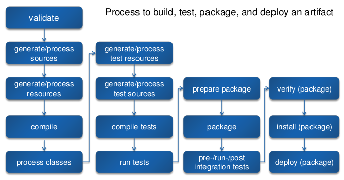
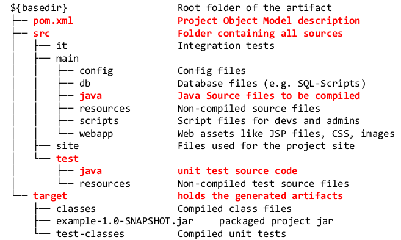
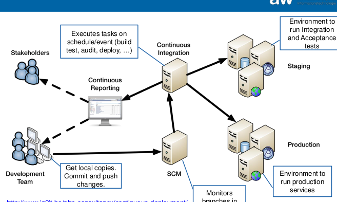

#Build Automation & Continuous Integration
##Software Automation
  - On-Demand (run script or press a button)
  - Scheduled (timed)
  - Triggered (event)

**Types of Automation:**
  - Build Automation (source code, packaging, doc)
  - Test Automation
  - Deployment Automation
  - Operation Automation (provisioning, monitoring, health, scaling)

**Goals:**
  - Improve Product Quality
  - Faster time to market
  - Minimize risks

**Reduce risk by releasing often: ** minimal changes, less review and test, small improvements, faster bug fixes

**Software Automation Pipeline:** Development (Code, Build, Unit Tests), Integration (Integrate, Integr. Tests), QA (Release, Acceptance Tests), Operation (Deploy, Operate) - Build automation (Dev), CI (Dev + Int), Continuous Delivery (Dev, Int, QA), Continuous Deployment ( bis und mit Deploy), DevOps (all),

##Build Automation
  - Resolve dependencies
  - Compile source code
  - Create documentation
  - Run unit tests
  - Package SW
  - Deploy to runtime systems
  - Clean up temp files

**Requirements:** automated, repeatble, consistent, icnremental, platform independent, seamless integration

###Maven

**Archetype:** vordefinierte Projektstruktur / Beispiel / Template

**Project ID:** GAV (GroupId, ArtifactId, Version: {Major}.{Minor}.{Maintenance} + -SNAPSHOT (dev version))

##Continuous Integration
**Integration:** Making different modules working together, modularization, they must be integrated, they do compile, pass tests, run, deploy

**Challanges:** Modules are built independently, should be reusable, passing modules tests :arrow_right: not automatically pass system test, incompatible dependencies, code quality fails, performance insufficient, expensive integration

**CI:** reliable builds, fully automated, reproducible build, including tests, runs many times a day, revular intervals

###Practices
maintain single source repo, automate build, build self testing, every commit should build on integration machine, keep build fast, test in clone of prod, easy get latest version, everyone can see what's happening, automate deployment

###Infrastructure

###Workflow
  1. Dev: check out into private repo
  2. Dev: commit changes to repo
  3. CI: monitor for changes, checkout
  4. CI: build
  5. CI: run unit & integration tests
  6. CI: run code audit tools
  7. CI: release deployable artifacts for testing on staging
  8. CI: assign build label to the version of code
  9. CI: inform team about successfull build
  10. CI: Publish application (optional)
  11. CI: on fail: alert team
  12. continue...

###Successfull build
compiles? tests successfull? released? deployed? or event failed (we were notified about problem)

###Team responsibilities
frequent check in, don't: check in broken / untested code, when the build is broken, go home after chcking in until the system builds

###Required tools
VCS, Build Server, Deployment Server, Automation tools, CI-Server
