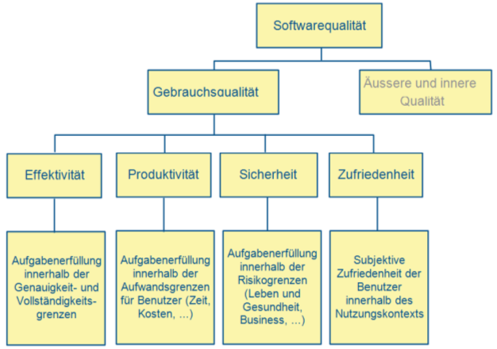
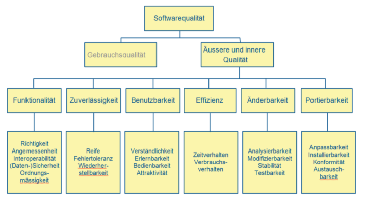
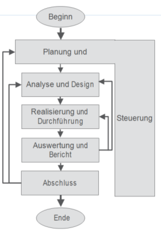
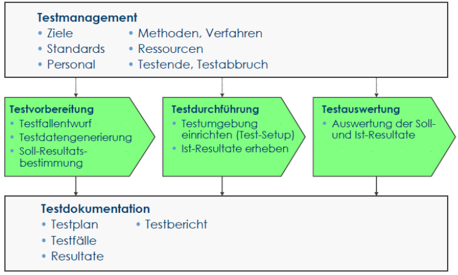
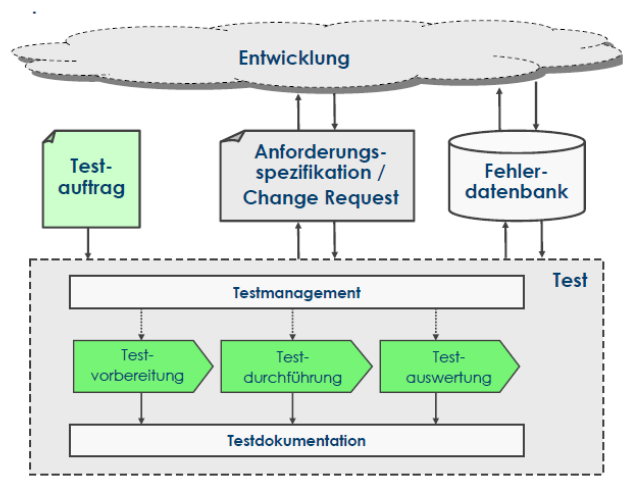

#Kapitel 2
##Grundlagen
###Begriffe und Motivation
**Test:** An activity in which a system or component is executed under specified conditions, the results are observed or recorded, and an evaluation is made of some aspect of the syste mor componente

**Validierung:** Prüfung, ob Entwicklungsergebnis die individuellen Anforderungen bzgl. einer speziellen beabsichtigten Nutzung erfüllt.

**Verrifikation:** Prüfung (formaler Beweis), ob Ergebnisse einer Entwicklngsphase die vorgaben der Phaseneingangs-Dokumente erfüllen.

**Error/Mistake:** (Fehlhandlung, Versagen, Irrtum), Fehlerhafte Aktion einer Person (irrtum), die zu einer fehlerhaften Programmstelle führt - Eine Person macht einen Fehler - (Schulung, Konvention, Prozessverbesserung)

**Fault/Defect/Bug:** Fehlerhafte Stelle eines Programms, die ein Fehlverhalten auslösen kann - Programm enthält Fehler - (Inspektion, Review, Programmanalyse)

**Failure:** (Fehlverhalten, Fehlerwirkung, Mangel) - Fehlverhalten Programm gegenüber spezifikation, das während seiner Ausführung tatsächlich auftritt. - Anwendung zeigt einen Fehler - Test

**Wirkung Defect:** Lokalisierung, Bekannt: Wirkung, debugging: Dynamische Tests (können Fehlwirkungen zeigen, die durch Fehlerzustände versursache werden), Debugging (Entwicklungsaktivität, die Ursache einer Fehlwirkung identifiziert, analyisert, entfernt)

**Ziele:** Aufdecken Fehlerzustände (möglichst viele Fehlerwirkungen verursachen), Erzeugen von Vertrauen bzgl. Qualitätsniveaus des Systems, Liefern von Informationen zur Entscheidungsfindung, vorbeugen von Fehlerzuständen

###Begriffe
**Testfall (Test case):** Ausführungsbedingungen, Eingabedaten, Sollresultat

**Testsuite:** Sammlung von Testfällen

**Expected result:** Für Eingabe spezifziertes Resultat

**Coverage:** Testvollständigkeitsabdeckung

**Testware:** Gesamte Testumgebung (test harness)

**Test-Orakel:** Modul, dass das Sollresultat für einen Testfall berechnet

**Testobjekt:** Prüfling

**SUT:** System under Test

###Unsystematischer Test
**Laufversuch:** Entwickler testet, Test ist beendet, wenn Programm läuft und die Ergebnisse vernünftig aussehen

**Wegwerf-Test:** Test ohne Systematik, Probieren, Notiz bei Ungereimtheiten, Test endet wenn Tester findet es sei genug getestet

**Ziele:** Reproduzierbarkeit, Planbarkeit (Aufwand / Nutzen prognostizieren), Wirtschafltichkeit (Optimierung Aufwand / Nutzen), risiko- / Haftungsreduktion

###Systematischer Test
spezialisten testen, Test ist geplant (Testvorschrift), Programm gemäss Testvorschrift (Testspez), Ist- / Sol-Vergleich, Dokumentation Ergebnisse, Fehlersuche / -behebung separat, Wiederholung nicht bestandene Tests, Test endet, wenn Ziele erreicht, Laufende Aktualisierung Testspezifikation

###Software Qualität nach DIN/ISO 9126

###Qualitätsanforderungen
Vorgabe pro Produkt: Welche Güte (Qualitätsniveau) pro Qualitätsmerkmale, Nicht alle QMM lassen sich gleich gut erfüllen, Prioritäten festlegen (Absprache Auftraggeber, Anwender), Bestandteil NFA

###Testen und Qualität
Testen misst Qualität anhand anzahl gefundender Fehlwirkungen, erhöht indirekt Qualität, erhöht indirekt Prozessqualität (Fehler dokumentiert, analysiert, etc.), erhöhen Vertrauen in Q

###Testaufwand
Vollständiges testen eines Programmes nicht möglich, Testaufwand in der Praxis: 25% - 50% des Entwicklungsaufwandes, Testintensität und -umfang in Abhängigkeit Risiko und Kritikalität, 2/3 Testaufwand z.B. auf Komponententests, Testen unterliegt beschränkten Ressourcen, Wichtig: Adäquate Testverfahren auswählen, Unnötige Tests vermeiden, Sowohl Positiv / Negativ-Tests berücksichtigen, Tests auf Fkt, die nicht gefordert sind, können sinnvoll sein

##Qualitätssicherung
Analytische QS (Ergebnisse - Dokumente - Software | Prozesse) - Konstruktive QS (Normen, Standards, PL, SW-Technik, ...)

###Fundamentaler Testprozess
In jedem Vorgehensmodell, V-Modell: Trennung konstruktive / prüfende Aktivitäten

z.T. Aktivitäten überlappend / parallel, geeignet für jede Teststufe

###Testplanung und Steuerung

###Testplanung und Steuerung
**Testauftrag:** Prüfling, Termine, Testaufwand & Ressourcen, Testgüte (Rerun-all, Modifikationstest, Fehlernachtest, Nur Testfälle best. Prio), Testende- / Testabbruchkriterien

###Testanalyse und Testdesign
**Hauptaufgaben:**
  * Review Testbasis (Req, SW Integrity level 1, Risikoanalysebericht, Architektur, Design, SST-Spez)
  * Bewertung Testbarkeit von Testbasis und Testobjekten
  * Identifizierung und Priorisierung Testbedingungen
  * Entwurf / Priorisierung abstrakte Testfälle
  * Identifizierung benötigte Testdaten

**Beschreibung Testfall:**
  * Beschreibung Ausgangssituation (Beschreibung Systemzustand)
  * Eingaben / Aktionen
  * Soll-Resultat

###Testrealisierung und Durchführung
  * Ablauf Testfälle festlegen
  * Wichtigste Testfälle zuerst
  * Ausführung von Testabläufen
  * Nachvollziehbarkeit / Teproduzierbarkeit
  * Vergleich Ist / Soll
  * Fehlerwirkungen / Abweichungen festhalten / analysieren um Grund eines Problems festzustellen

###Testauswertung und Bericht
**Testendkriterien:**
  * Alle spezifzierten Testfälle ausgeführt
  * Testfälle best. Risikogruppe getestet
  * best. Zeit kein weiterer Fehler mehr gefunden wird
  * best. Anzahl an Fehlern gefunden ist
  * Strukurtest-Kriterien erfüllt sind
  * vereinbarter Testaufwand geleistet ist

Auswertung Testprotokolle, Entscheidung ob mehr Tests notwendig oder Anpassung ausgangskriterien, Erstellung Testabschlussbericht für STH

##Psychologie des Testest
Entwicklung = konstruktiv, Test = destruktiv? :arrow_right: Testen extrem kreative / intellektuell herausfordernde Aufgabe, Entwickler eigens Programm testen? Blindheit gegenüber eigenen Fehlern (grundsätzliche Designfehlern, Testfall kommt ihm nicht in den Sinn ..), Kein Einarbeitungsaufwand (kenn Testobjekt)

**Tester:** Unvoreingenommenheit (nicht sein Produkt), Einarbeitung notwendig, Test-Know-How mitgebracht

**Testing durch:** Entwickler, Kollegen des Entwicklers im Projekt, Personen anderer Abteilungen, Personen anderer Organisationen, Werkzeugeinsatz möglich, Aufteilung produkt- / projektabhängig, wichtig: Mischung und Ausgewogenheit unabhängigen Tests und Entwicklertests

**Feedback:** Mitteilung Fehlerwirkungen: neutrale, objektive, konstruktive Art und Weise, ungestörte, offene Kommunikation, Fingerspitzengefühl, Reproduzierbarkeit wichtig, eindeutige Req / präzise spez.

**Grundsätze:**
  1. Anwesenheit Fehlerwirkungen achgewiesen, Testen kann nicht zeigen, dass keine Fehlerzustände im Testojbekt vorhanden sind.
  2. Vollständiges Testen (Austesten) ist nicht möglich
  3. Testen ist keien späte Phase in der SWE, so früh wie möglich
  4. Fehlerzustände in Testobjekt  nicht gleichmässig verteilt, oft: gehäuft
  5. Tests nur wiederholen, bringt keine neuen Erkenntnisse
  6. Testen ist abhängig vom Umfeld
  7. System ohne Fehlerwirkungen bedeutet nicht, dass das System auch den Vorstellungen der späteren Nutzer entspricht
