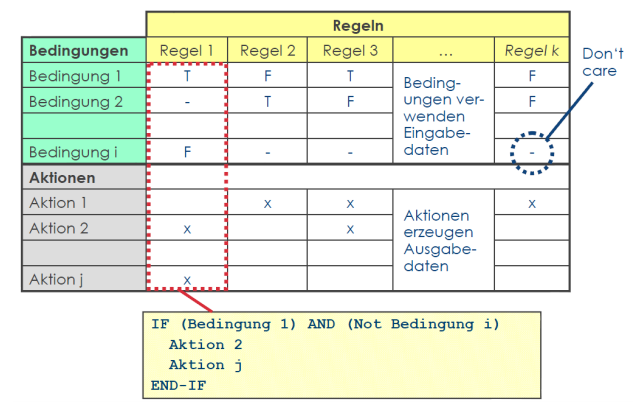

#Kapitel 5 - Dynamischer Test
Programme: statische Beschreibung von dyn. Prozessen, Dyn. Tests prüfen die durch Interpretation resultierende Prozesse, Testobjekt wird ausgeführt - Bedingungen und Voraussetzungen für die Tests und Ziele festlegen, Testfälle spezifizieren (Eingangs / Ausgangsdaten), Testauführung festlegen

**Black-box Verfahren:**  Keine Informationen über Inneres, Point of Observation, Steuerung Ablauf durch Auswahl Eingabetestdaten (Point of Control liegt ausserhalb Testobjekt)

**Spezifikationsorientierte Verfahren ("Funktionale Testverfahren"):** Modelle / Anforderungen an Testobjekt werden zur Spezifikation herangezogen, systematische Ableitung Testfälle

**Erfahrungsbasierte Verfahren:** Nutzen Wissen / Erfahrung von Menschen zur Ableitung Tests, Wissen von Testern, Dev, Anwendern, Betroffenen über SW, Wissen über wahrscheinliche Fehler und Verteilung

**White-box Test:** Testfälle aufgrund Programmstruktur (strukturorientierte Testverfahren), Informationen über Aufbau SW, Überdeckungsgrad Code für vorhandene Testfälle messen, Ableitung weiterer Testfälle, Point of Observation innerhalb Testobjekt, Point of Control kann inerhalb Testobjekt liegen

##Blackbox-Test
Spezifikationsorientiert, wenig Testfälle, trotzdem qualitativ gute Tests /-abdeckung

###Äquivalenzklassenbildung
Repräsentative Eingaben, Gültige Eingaben, Ungültige Eingaben  
Möglichst wenig Testfälle, möglichst wirkungsvoll, Spezifikation nach Eingabegrössen und deren Gültigkeitsbereiche, pro Gültigkeitsbereich: 1 Äquivalenzklasse, bei Verdacht anderes Verhalten: Unterteilung in neue ÄK, Je Mitte ÄK: Repräsentant als Testfall wählen, Vollständigkeit: Alle Repräsentanten sind getestet, Äquivalenzklassenüberdeckung

####Testfälle mit mehreren Parametern
Eindeutige Kennzeichnung ÄK, Pro Param mind 2 ÄK: Eine mit gültigen Werten, eine mit ungültigen

####Testfälle minimieren
Kombinieren Testfälle aus allen Repräsentanten nach Häufigkeit ud Benutzungsprofile sortieren, Priorisierung Reihenfolge, Nur benutzungsrelevanten Testfälle, Sicherstellen, dass jeder Repräsentation einer ÄK mit Repräsentation anderer Klasse zur Ausführung kommt, Minimalkriterium: 1 Repräsentation jeder ÄK, Repräsentanten ungültiger ÄK nicht mit R. von gültigen ÄK kombinieren

####Testendkriterium
z.B. ÄK-Überdekcung

####Vorteile / Nachteile
**Vorteile:** Anzahl TF kleiner als bei unsystematischer Fehlersuche, Geeignet für Programme mit vielen Ein- / Ausgabebedingungen  
**Nachteile:** Betrachtet Bedingungen für einzelne EIn- / Ausgabeparameter, Beachtung Wechselwirkungen / Abhänigkeiten aufwändig

####Empfehlung
Kombination mit fehlerorientiertem Verfahren

###Grenzwertanalyse
Wertebereiche, Wertebereichsgrenzen, Bei Verzweigungs- / Schleifenbedingungen: oft Grenzbereiche, Fallunterscheidungen fehlerträchtig (off by one), Kombination andere Verfahren, Zusammenfallen Grenzwerte benachbarter Äk

####Testendkriterium
Überdeckung = (Anzahl / Gesamtzahl) * 100%

####Vor- / Nachteile
**Vorteile:** Grenzen ÄK häufiger Fehler als innerhalb, Grenzwertanalyse bei richtiger Anwendung einer der nützlichsten Methoden, Effiziente Kombination andere Verfahren
**Nachteile:** Rezepte Auswahl Testdaten schwierig, Bestimmung relevante GW schwierig, Kreativität Findung Testdaten notwendig, oft nicht effizient genug angewendet, da zu einfach erscheinen

###Zustandsbezogener Test
Komplexe (innere) Zustände und Zustandsübergänge, Ausgangsbasis: Spezifikation Programm als Zustandsgraph (endlicher Automat), Testfall aus: Ausgangszustand, Ereignis (Eingabedaten), Soll-Folge-zustand (Soll-Resultat)

**Zustandsüberdeckung:** Jeder Zustand muss mind. einmal erreicht werden  
**Zustandspaarüberdeckung:** Von jedem Zustand muss in jeden möglichen Folgezustand gewechselt werden
**Tranisationsüberdeckung:** Alle Zustandsübergänge müssen mindestens einmal wirksam werden

####Roundtrip-Folgen
Beginnend im Startzustand, Endend im Endzustand oder Zsd der bereits in dieser oder anderen Roundtrip-Folge enthalten war, Zustandsübergangsbaum

####Arbeitsschritte
  1.  Analyse Zustandsdiagramm
  2.  Prüfung Vollständigkeit
  3.  Ableiten Übergangsbaum für Zsd-Konformanztest
  4.  Erweitern Übergangsbaum für Zsd-Robustheitstest
  5.  Generieren Botschaftssequenzen / Ergänzen der Botschaftsparameter
  6.  Ausführen der Tests und Überdeckungsmessung

####Zustandsbezogene Testfälle
Vollständig zustandsbezogener Testfall: Anfangszustand Testobjekt, Eingaben Testobjekt, Erwartete Ausgaben / Verhalten, Erwarteter Endzustand - Pro Testfall: Zustand vor Übergang, Auslösendes Ereignis, Erwartete Reaktion (durch Übergang ausgelöst), nächster erwarteter Zustand

####Testendkriterien
Minimalkriterien: Z-Überdeckung= (Anzahl / Gesamtzahl) * 100%
Weitere Kriterien: Zustandsübergangs-Überdekckung

###Entscheidungstabellentest
Bedingungen / Aktionen, Beschreibung Geschäftsregeln, Abhängig mehrere logische Eingangswerte: verschiedene Aktionen, Unterstützen Vollständigkeit Test, pro Spalte: Testfall, je Regel: mind. 1 Testfall

####Testfälle
Bsp Überdeckungskriterien: Alle Bedingungen mind. einmal N und J, Alle Aktionen mind. x mal, Alle Spalten,
Konkrete Testdaten aus Wertebereichen ableiten

####Anwendungsfallbezogener Test
Use Cases / Geschäftsszenarien beschreiben Interaktionen zwischen Akteuren - Systemen, Ergebnis / Wert für Anwender, Vorbedingungen, Hauptszenarie, Alternativszenario, Prozessabläufe

####Ablauforientierte Testfälle
So auswählen, dass geforderte Überdeckung Anwendungsfall erzielt wird: Normale / Alternative / Ausnahme Abläufe, Mögliche Wiederholungen innerhalb Szenarien

####Diverse Blackboxtestarten
Zufallstest (Zufälliger Repräsentation für TF, evtl. Berücksichtigung statistische Verteilung), Smoke-Test (prinzipielle Lauffähigkeit, kein Testorakel, Versuch offensichtlicher Absturz erzeugen, "Installationstest"), Syntax-Test (Ermittlung Testfälle bei Vorliegen formale Spezifikation Syntax der Eingaben, Regeln syntaktische Beschreibung um Testfälle zu spezifizieren)

##Whitebox Verfahren
Nutzung interner Informationen, Gesucht: fehleraufdeckende Stichproben der möglichen Programmabläufe / Datenverwendungen, Testverfahren zur Herleitung / Auswahl TF sowie zur Bestimmung Vollständigkeit Prüfung (Überdeckungsgrad), Daher: strukturorientierte / bezogene / strukturelle TF

###Kontrollflussbasiert (Strukturtest)
**Anweisungsüberdeckung:** Anteil ausgeführte Anweisungen, vStatement Coverage, c0-Test  
**Zweigüberdeckung:** Anteil ausgeführte Programmzweige (Branch coverage), Grundlage: Kontrollflussgraph, c1-Test

###Anweisungsüberdeckung
Dyn., kontrollflussbasiert, mind. einmalige Ausführung aller Anweisungen des Testobjekts, Überdeckung = (Anzahl. / Gesamtzahl) * 100%

Testfall anhand Pfad durch Kontrollflussgraph bestimmt, alle Kanten durchlaufen, Berechnung: nur gezählt, ob Anweisung durchlaufen wird, wenn Deckungsgrad erreicht: Beendigung

####Diskussion
Schwaches Kriterium, 100% Abdeckung in Praxis nicht immer erreichbar (gewisse Ausnahmen nur schwer Testbar), Leere Kante: Überbrückt ein / mehrere Knoten, ohne Bedeutung

###Entscheidungs- / Zweigüberdeckung
Kontrollflussbasiert, fordert Überdeckung aller Entscheidungen Testobjekt zu allen Fällen, jede entscheidung ist zu allen Fällen auszuwerten, TF anhand Pfad im Kontrollflussgraph, Häufigkeit Entscheidungsergebnisse spielt keine Rolle, Überdeckung = Anz. / Gesamt * 100%

###Entscheidungs- vs. Zweigüberdeckung
EÜ: Betrachtet Entscheidungen, mind. einmal zu allen Möglichkeiten auswerten, Testfall auf Basis Entscheidungen  
ZÜ: Alle Zweige abdecken, jeder Testfall anhand Pfad durch Graph

##Test der Bedingungen
Wahrheitswerte, Atomare Teilbedingungen, Zusammengesetzte Bedingungen (Verknüpfungen atomare TB mit booleschen Operatoren), Entscheidungen: zusammengesetzte Bedingungen  

EÜ: ausschliesslich Ergebnis-Wahrheitswert berücksichtigt, Problem: Bedingung aus TB: im Test strukturelle Koplexität Bedingung berücksichtigen - unterschiedliche Anforderungen, Abstufung Testintensität  

ÜK: Verhältnisse zwischen erreichten / geforderten Wahrheitswerten, Verfahren Komplexität im Mittelpunkt Anstreben 100% Abdeckung

###Einfache Bedingungsüberdeckung
Kontrollflussbasiert, dyn, Jede Entscheidung auf Wahr und Falsch prüfen, max. 2n Testfälle

###Mehrfachbedingungsüberdeckung
Teste jede Kombination der Wahrheitswerte aller atomaren Ausdrücke, 2n Testfälle, wächst exponentiell mit Anzahl unterschiedlicher atomarer Ausdrücke, Auswertung Gesamtbedingung: beide Wahrheitswerte, auch Kriterien EB

###Minimale Mehrfachbedingungsüberdeckung
Teste Gesamtausdruck einmal zu wahr und einmal zu falsch, + jede Kombination Wahrheitswerte bei denen Änderung des Wharheitswertes eines atomaren Ausdrucks den Wahrheitswert des gesamten Ausdrucks ändern kann (MM-Kombination),

##Instrumentierung
Auswertung Test: Ermittlung welche programmteile ausgeführt wurden, Testobjekt an strategisch wichtgien Stellen instrumentieren, zusätzliche Anweisungen einbauen, grössere Programme: nur Werkzeuge

##Erfahrungsbasierte Testfallermittlung
Erfolg syst. Test stark von Qualität Dokumente Abhängig, Q: Lesbarkeit, Testbarkeit, Vollständigkeit, Eindeutigkeit, Widerspruchsfreiheit, oft Formalisierungsgrad / Granularität nicht adäquat - Grundidee: Erfahrung / Wissen Tester bei Definition einbeziehen, Kompensation Qualität, Bsp: Error-Guessing

###Error Guessing
Testentwurfsverfahren, Erfahrung / Wissen Tester, Vorhersage Fehlerzustände in Komponente, 
