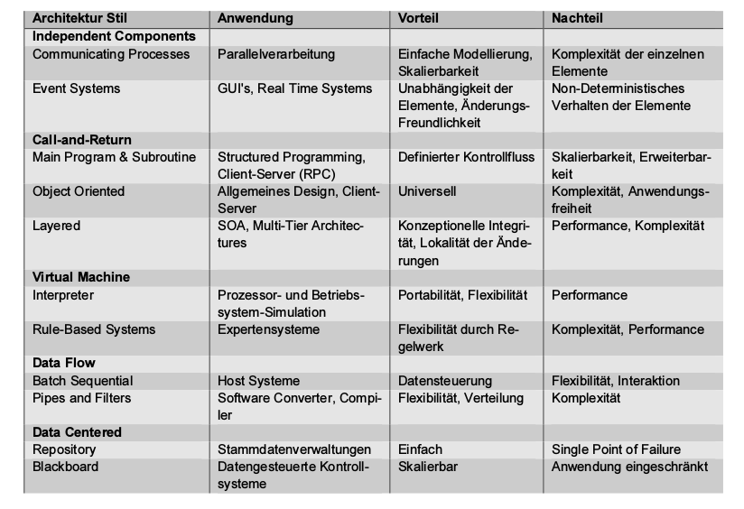

##Architektur Style
###Einleitung
Allgemein nach Detail:
  - Enterprise
  - Application
  - Module

  - EAM (Enterprise Architecture Management)
  - Standards
  - Style
  - EA Pattern
  - Pattern for SE (z.B. SOLID)

###Architektur Stile
Fymilie von Software-Systemen, welche aufgrund Struktur und Semantik verwandt sind.

####Definition
**Bestandteile:** Vocabulary (Design-Elemente), Rules and Constraintes (Design-Regeln / -Einschränkungen), Semantics (Bedeutung Design-Elemente eindeutig), Analytics (Prüfung Vokabular, Regeln, Einschränkungen)

Architektonischer Stil weniger eingeschränkt und weniger vollständig als definierte Architektur

**Typen:**
  - **Independent Components:**
    Set unabhängiger (unabhängig lauffähiger) Komponenten, Kommunikation über Nachrichten
    - Communicating Processes (Parallelverarbeitung), Kommunikation (synchron / asynchron) via Kommunikationskanal zwischen Elementen
    - Event-Systems (GUI's, Real Time Systems), Prozesskommunikation via Event-Systems, 2 Dimensionen (Zeit, Regeln), Zeitnahe Verarbeitung, CEP: Complex Event Processing System (z.B. ESYER) = FAST-DATA, MVC als Event-System
      - Implicit Invocation: Linda (Urform implizites Eventsystem), Event-Space, Meldung Event, dann vergessen, einzelner Event spielt keine Rolle, eignet sich für viele Events
      - Explicit Invocation: MQ Series (bekanntestes System, garantiert Übermittlung), Event & Prozess: gemeinsamer Vertrag (z.B. Typ), jeder einzelne Event spielt eine Rolle, eignet sich für zählbare Events

  - **Call-and-Return:**
    - Main Programm & Subroutine: Klassisches Programmierparadigma, eindeutiger Kontrollfluss, debugbar, Urform: Remote Procedure Call
    - Object Oriented: folgt Main Programm & Subroutine, Zugriffe auf Objekte via Schnittstellen, Fokus: Information Hiding, Kapselung Daten
    - Layered: Aufgaben logisch verteilen
      - Hierarchische Layers
      - Nicht-Hierarchische Layer, Zugriff via Interfaces

  - **Virtual Machine:**
    - Interpreter: beschreibt abstrakte Maschine, definierte Elemente für inneren Aufbau, Java VM (simuliert Prozessor, Method Area, Heap, Java Stacks, PC Registers, Native Method Stacks),
    - Rule-Based System: Hat Wissensbasis (entweder fix oder trainiert), Generalisierung Interpreter, Trennung Maschine und Regeln zur Beschreibung Maschine, Backward- und Forward-Chaining
  - **Data Flow:**
    - Batch Sequential: Transformation auf Daten von einander unabhängigen Elementen, Host- / Grossrechner-Technologie, wörtliche Umsetzung EVA
    - Pipes and Filters: z.B. Unix Pipes, flexible Verareitung Input, Streaming
  - **Data Centered:**
    - Repository: DB
    - Blackboard: Künstliche Intelligenz, Datenbestand meldet sich bei Änderung bei Systemen, z.B. Kanban-Board

**Hinweise:** Innerhalb Stilfamilie mischen nicht zu empfehlen
