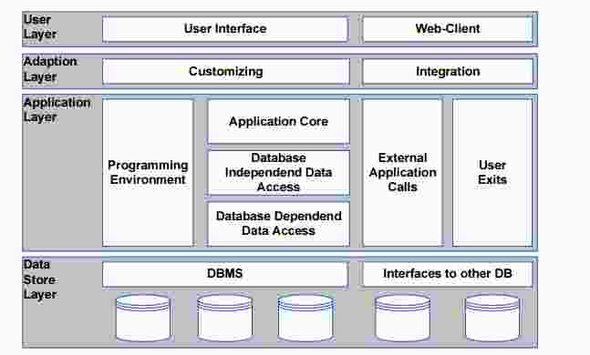
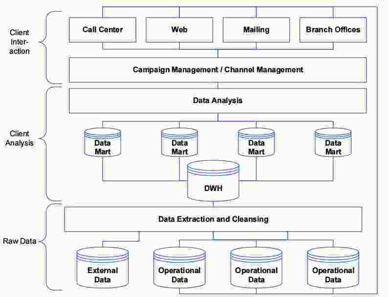
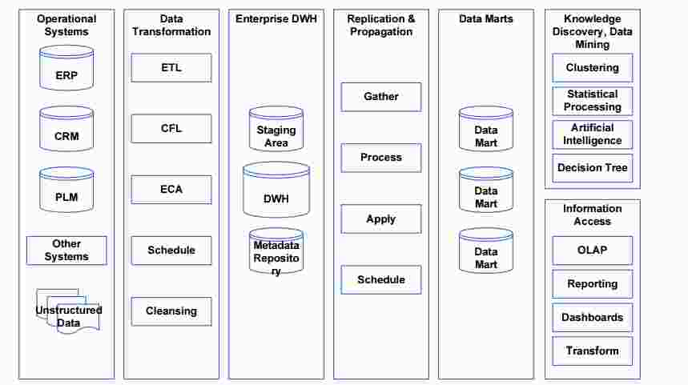

# Architecture Operational Systems
## Systemtypen
  - Anwendungsgebiet
  - Funktionaler Umfang
  - Standard Software
    - Typischer Aufbau

**Typen:**
  - Operational Systems (Unterstützung Leistungsprozesse)
    - Industry Independant Systems: Standardlösungen, z.B. ERP, CRM, SCM)
    - Industry Specific Systems: Speziallösungen
    - Intercompany Systems: Unterstützung Firmenübergreifender Prozesse (z.B. Datenaustausch)
      - Data Exchange
      - Electronic Markets
  - Dispositive Systems (Unterstützung Führungs- / Entscheidungsprozesse, BI, Reporting)
    - Management Information Systems: Unterstützung Führungskräfte für Entscheidungsfindung
    - Corporate Planning Systems: Planung / Simulation zukünftiger unternehmerischer Tätigkeiten
  - Systems for unstructured Data (Anderes) (Anteil in Unternehmen: 50-80%)
    - Office Automation: Backofficeprozesse
    - Multimedia Systems
    - Knowledgebased Systems

### Operative Systemtypench
Unterstützung Leistungsprozesse (Kernprozesse Wertschöpfung, z.B. Einkauf, Herstellung, Vertrieb), Unterstützende Prozesse (Personal, Finanzen, Controlling), am "Jetzt" orientiert

  - Industry Independant Systems
    - ERP
    - CRM
    - SCM
  - Industry Specific Systems
    - Production
    - Retail
    - Banking
    - Insurance
  - Intercompany Systems
    - Data Exchange
    - Electronic Markets

#### Enterprise Resource Planning
Betriebliche Planung, Buchführung, Verwaltung Unternehmensressourcen, hervorgegangen aus MRP (Manufacturer Resource Planing)

**Grundfunktionalität:**
  - Finanzwesen
  - Controlling
  - Herstellung
  - Materialwirtschaft
  - Produktionsplanung
  - Vertrieb
  - Personalverwaltung

SAP: FI, CO (meisterverkaufte), struktur ähnlich einem Betriebssystem

#### Customer Relationship Management
Markt - Target - Interessierter Kunden - Potenzielle Kunden - Kunde, CRM: Interessierter Kunde bis Kunde  

Lead - Opportunity (Sales Chance) - Offering - Contract / Deal

  - Sales force
  - Siebel (Wirtschaftlich am erfolgreichsten) - Kunden: u.a. ZKB

**Standardaufbau**

  - Operatives CRM (wie beschrieben)
  - Analytisches CRM (Wenn Kunde Kunde ist, was möchte er noch?)
  - Kolaboratives CRM (Für Inserateverkäufer wichtig)

**Fragen**

  - Was hat der Kunde bereits gekauft?
  - Was braucht der Kunde noch?

  - Markt bis Kunde: 1 Jahr (Gesundheit: 3 Jahre)
  - 10 Öffentliche Ausschreibungen: 8 Verloren, 2 Gewonnen

#### Logistik System (Supply Chain Management)
Meistens individual Systeme (Fragementierung der Branche), Zwischen Lastwagen und Kunde: ca. 2-5 Zwischenhändler, Korrekte Menge, an bestimmten Ort, in bestimmter Qualität zur bestimmten Zeit abliefern

  - Direct Supply Chain (Lieferant - Unternehmen - Kunde)
  - Extended Supply Chain (1. Lieferant (Rohstoff) - Endkunde)
  - Ultimate Supply Chain (Einfluss Finanzdienstleister, Transport- und Marktforschungsunternehmen)

Übereinstimmung Finanzierungs- / Warenfluss

**Managementphilosophie:**
  - Alle Beteiligten verhalten sich integriert (miteinander)
  - Informationsaustausch zwischen allen Beteiligten
  - Risiko- / Gewinnverteilung
  - Zusammenarbeit
  - Ein Ziel: Kundenzufriedenheit
  - Prozessintegration
  - Langzeit-Partnerschaft

Standardisierungs: SCOR (Supply-Chain Operations Reference-model), Supplier, Enterprise, Client - Kernprozesse: Plan, Source, Make, Deliver, Return
  -  Plan: Gesamtplanung Prozesse, Verwaltung Geschäftsregeln, Performance, Inventar, Transportkapazitäten, Regulatorien, Risiken
  - Source: Terminierung / Prüfung Lieferung, Auslösung Zahlung, Auswahl Lieferanten
  - Make: Terminierung Produktion, Produktfreigabe, Verpackung, Schlussprüfung
  - Deliver: Verwaltung Bestellprozess, Auswahl & Kontrolle Lieferung
  - Return: Rückgabe, Freigabe Rückgabe, Abwicklung Unterhaltsarbeiten / Reparaturen, Behandlung Garantiefälle

### Dispositive Systemtypen

  - Management Information Systems
    - DWH
    - EDWH (Enterprise DWH)
    - CPM (Corporate Performance Management System, KPIs)
  - Corporate Planning Systems
    - Mining: Explorative Analyse
    - Analytics: Aufbereitung
    - Simulation

### Systems for unstructured Data
  - Office Automation: Backofficeprozesse
    - Communication
    - DMS: Document Management System
    - WMS: Workflow Management System
    - CMS: Content Management System
  - Multimedia Systems
    - Video Converencing
  - Knowledgebased Systems
    - Expert Systems
    - Language Processing

#### CSCW (Computer Supported Cooperative Work)
Zusammenarbeit von Menschen in Gruppen unterstützen, E-Mail, Workflow-Systems, Video Conferences, ...

  - Immer für Gruppenarbeit (2 oder mehr interagierende Personen, die einander beeinflussen) ausgelegt.

##### Enterprise Content Management

**Architektur:**
  - Clients: Portals & Web Applications, LOB & ISV Solutions, Desktop Applications
  - Services: Capture, Classification & Taxonomy, Records-, Document-, Image-, Archive-, Web Content-, Forms-, Reports-Management, Search & Discovery, Content Centric BPM, Collaboration
  - Repositories: File Server, Image / Movie DB, Archive

    - Suchbarkeit
    - Workflow
    - Verknüpfung: Dokumente mit Metadaten, Verknüfpung zu Geschäftsfall
    - Sicherheit
    - Nachvollziehbarkeit
    - Versionierung
    - Sicherung
    - Mehrsprachigkeit
    - Komposition

**CQ**
  - Distributer: Dynamisch Inhalt herstellen
  - Render: Aus dynamischen Inhalten statischen Inhalt erzeugen
  - Guardian: Überwachung System

## Hints
Neuen MA einstellen: ca. 50'000 .-

## Zusammenfassung
  - Verschiedene Systemtypen
  - Breites Spektrum im operativen und distributiven Bereich, sehr wenige Daten (nur strukturierte), 80 % der Systeme für 20% der Daten zuständig
  - Wenige Anbieter für Bearbeitung unstrukturierter Daten
  - Viele Anbieter für Bearbeitung strukturierter Daten
  - Gesamtarchitektur besteht aus mehreren Vieews / Blickpunkten
  - Neues System: Was ist es für ein System? Wie haben es die anderen gemacht?
