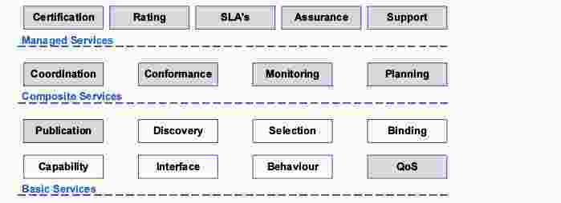
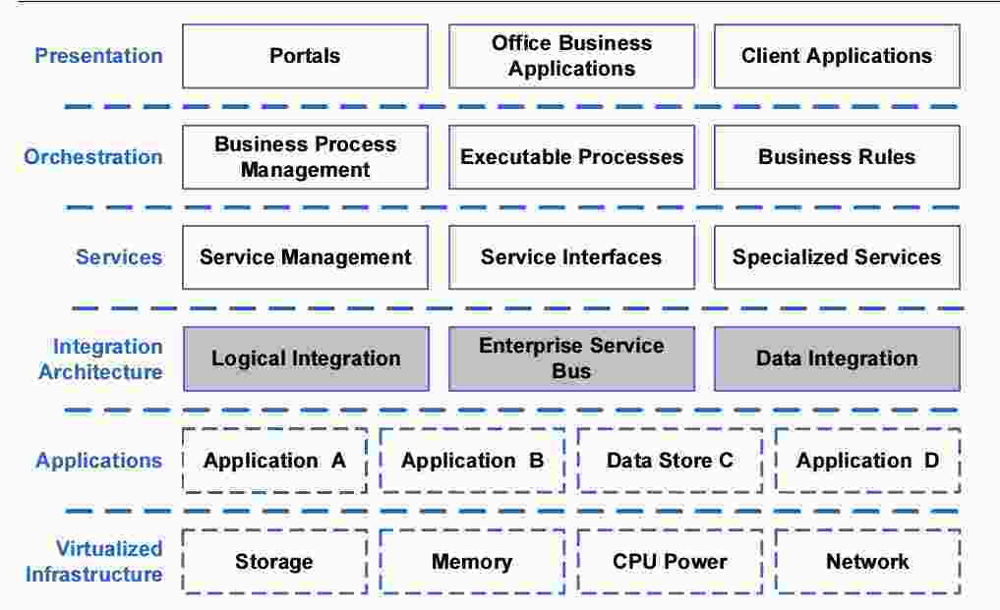
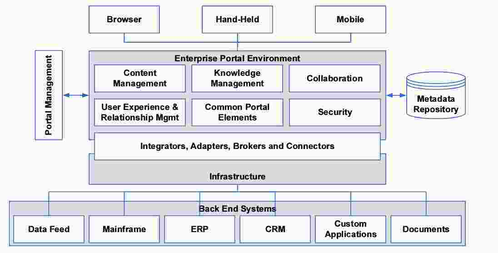
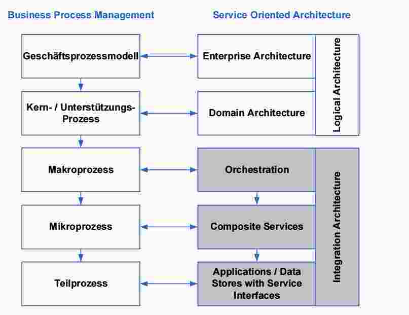
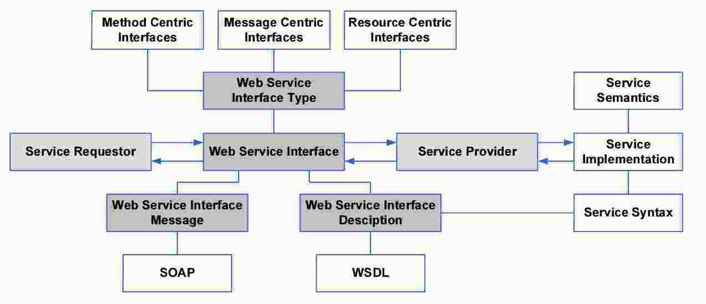

# Service Oriented Architecture
Ganzheitliche Betrachtung IT-Systemlandschaft, Unterstützungsfunktion betriebliche Prozesse,
Standardarchitektur, logische Teilung Applikationen, Integrationsmechanismen, Dienste und Orechestrierung

Ganzheitliche Betrachunt IT-System
Architektur kann auf Entitäten, Objekten oder Services aufgebaut werden. SOA: Betrachtungsweise IT-Landschaft, im Bereich DevOps einzige auf Basis Services, Service hat Service-Implementation (Wird geleistet), technisch oder "Mensch" ist egal, Daten: elektronische Daten oder Informationen welche für Umgang mit Service benötigt werden.

  - Service: Standardisierte Darstellung von Funktionalitäten
  - Service Oriented Computing (SOC): Paradigma, Dienste als Basis für Applikationen, Basisdienst + Basisoperationen
  - Service hat definierte Schnittstelle (von aussen zugreifbar)
  - Einzige Interaktion via Schnittstelle
  - Keine Vererbung
  - Nur Abhängigkeitsbäume
  - Service Contract: Informelle Spezifikation Service-Funktionalität
    - Praxis: Keine Möglichkeit zur formalen / maschinellen Spezifikation, Ausnahme: Onthologien / Semantisches Web (Nur Forschung)
  - Bereitgestellt von Service Provider
  - Servicenehmer: Software, die einen Dienst in Form eines Interface Proxy intern darstellt.

  **Dienste statt Applikationen**  
  Wiederverwendung ganzer Systeme durch Kapselung und definierte Service-Schnittstellen

**Service Oriented Architecture:** Basis: Kein Beginn auf grüner Wiese, Weiterverwendung bestehender Landschaft / Systeme, lässt Anwendungen länger leben -> zementiert Anwendungen, Inflexibilität bezüglich neuen Technologien / innovationen, Architektur ist nicht hierarchisch, Logik wird in 2 Schichten geteilt: 1x statische Logik auf Ebene Application, 1x veränderliche / dynamische Logik (z.B. Prozesse, Regeln) in der orchestration Schicht, Einsatz standardisierter Schnittstellen

**Layering:**
  - Managed Services (Certification, Rating, SLA's, Assurance, Support):  fast nur organisatorische Aufgaben
  - Composite Services (Coordination, Conformance, Monitoring, Planning): Dienste für Bereitstellung zusammen-gesetzter Services, organisatorische Aufgaben
  - Basic Services (Publication, Discovery, Selection, Binding, Capability, Interface, Behaviour, Quality of Service): Basis-Services für Komposition weiterer Services

**Eigenschaften:**  
  - Trennung Business-Logik in dynamische (Prozesse / Regeln) und statische (applikatorische Umsetzung) Bereiche
  - Integration Architecutre: logische Komponente, nicht unbedingt durch ESB, minimal: Netzwerk
  - Weiterverwendung: integraler Bestandteil
  - Service Layer: SOAP und WSDL, weitere nicht zwingend

**Referenzmodelle:**
  - W3C: Fokus: globales Netz an Funktionalitäten, mehrere Metamodelle (Policy-, Action-, Message-, Ressource-Modelle), wie interagieren Services? Servie Oriented Model
  - GeneriCo: Idee: standardisierte Branche, Abbildung standardisierter Prozesse, Referenzarchitektur für jedes Unternehmen (wenn generisch genug), besteht aus Enterprise Applications, Security Layer, External Access via Portals, Custom Applications -> führt zu Service-Landkarte (auf Basis generalisierter Architektur), ähnelt Architektur eines Legacy-Systems (da generisch), Abbildung von Prozessen 1:1 auf Services möglich

## SOA Komponenten

Nicht betrachtet in Kurs: Virtualized Infrastructure, Presentation

  - **Presentation:**
    - Portale
      - Referenzarchitektur:  outdated, nicht mobile tauglich (zu umfangreich), Trick: verschiedene UIs für verschiedene Geräte, Mehrfachimplementation Portal, Alternative: HTML5
    - Office Business Applications: Dokument als Ressource
    - Client Applications: z.B. Java oder .NET
  - **Orchestration:** bildet Teil der Businesslogik ab, dynamischer Teil
    - Business Process Management: Abbildung Enterprise Prozess auf technische ausführbare Organisation der Gesamtarchitektur, Domänenarchitektur: nur in Konzernen, pro Abteilung / Bereich
    
    - Executable Processes: Formale Beschreibung eines Prozesses zur Steuerung eines IT-Systems (BPMN, BPEL), Idee: Modellierung auf abstrakter Ebene, Steuerung Process-Engine / Interpreter, jeder Prozess ist wiederrum ein Service, beliebige Verschachtelung, SOAP, WSDL, BPEL, Integration z.B. via ESB und Process Engine
    - Business Rules: Rule Engines, Einsatz in 3 Bereichen: Konsistenzregeln, Fakten: Steuerung komplexer Aktionen auf Basis bestimmter Fakten, Aktionsregeln: Steuerung von Aktionen als Reaktionen auf bestimmte Ereignisse - Organisation z.B. nach Business Events zur Steuerung der Prozesse
  - **Serivice-Ebene / Service Management**
    - Service Management
      - Version & Status Mgmt: Versionierte Schnittstellen, gleichzeitig in betriebliche
      - Testing
      - Billing / Verrechnung
      - Client-info
      - Administration: Service-Owner / -Manager, etc.
    - Service Interfaces
      
      - Service Semantics: inoffizieller Vertrag
  - Integration Architecture
    -  Später detailliert

**3 Arten von Service-Schnittstellen**  
  - Call & Return Schnittstellen (Aufruf, einfach, impliziert Funktionalität, getCustomer)
  - Message-Oriented-Interface (umfangreiche Meldung einpacken, an Service senden -> process this, Service führt Verarbeitung durch und gibt strukturierte Antwort zurück)
  - Ressource-Oriented-Interfaces (Manipulation auf Ressource hat Service Aktionen zur Folge, abhängig von Ressource, z.B. REST)

**3 Arten von Prozessen:**  
  - Human-Centric-Process: Abhängig von Interaktion Menschen (z.B. Approval-Prozesse)
  - System-Centric-Processes: Nur Systeme (z.B. Booking Confirmation oder Backup)
  - Document-Centric-Processes (z.b. Steuererklärung)

Fragen: Noch zeitgemäss? alternative? (iot, cloud), Micro-Service-Architecture

## Wichtigste Punkte
  - Schichten: Presentation, Orchestration, Services, Integration, App / Data
  - 3 Grundeigenschaften: Standardisierte Services / Produkte (O, S, I, A/D), Trennung dynamische / statische Logik, Weiterverwendung bestehender Services (nicht Wiederverwendung)
  - Typische Komponenten: O: Rule Engine, Process Engine - S: Aufbau Service Schnittstelle (Interface, Impl, Daten, informeller Vertrag, Semantik: informell, Syntax: formel), Cross Cutting Services - I: später, Choreographie
