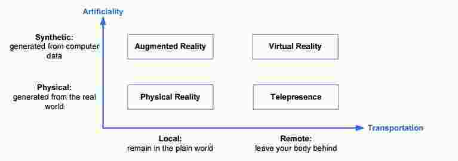
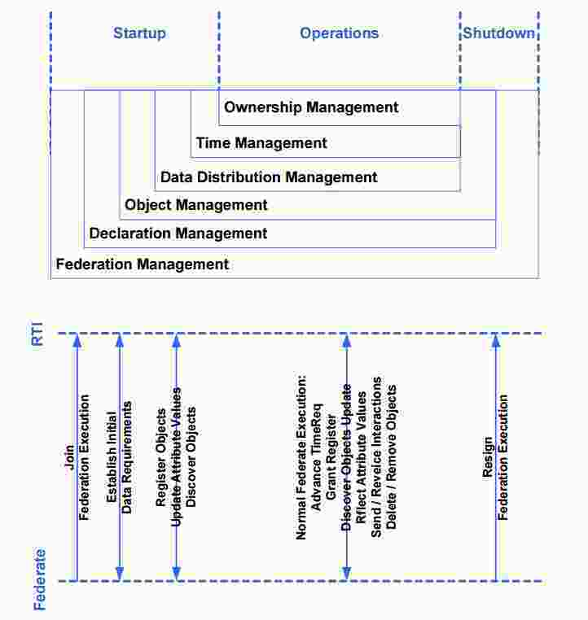
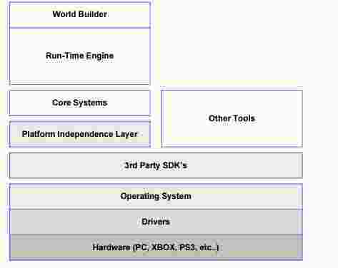
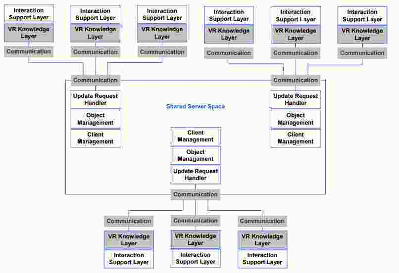
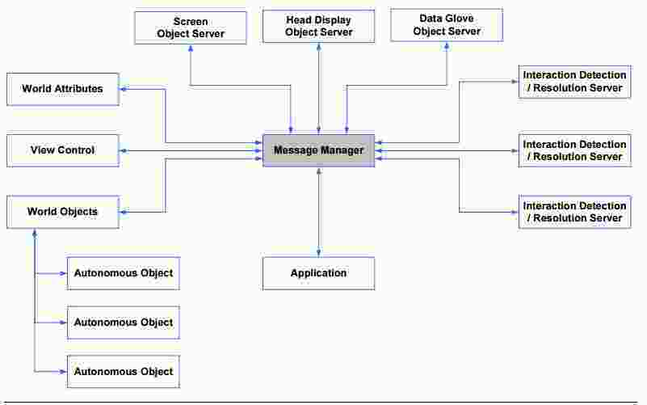
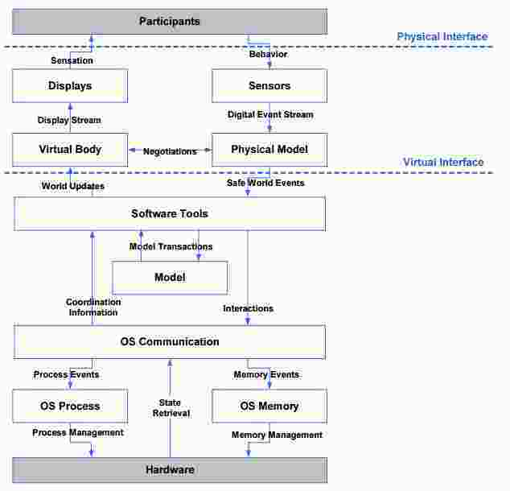

# Distributed Real Time Systems
Entwicklung (EA-Games): ca. 20 Millionen, Real-Time oder Near-Real-Time, Simpler Unterschied zu normalen Anwendungen: Unabhängige Interaktionszyklen, Simulationstecnik ist älter als Game-Engines

### Distributed Real Time Applications
  - Simulations
  - Virtual Environements
  - Computer Games

Urform der Game-Engine: unreal

  - Augmented Reality: Erweiterte Realität, visuelle Überlagerung in Echtzeit
  - Virtual Reality: berechnete Realität
  - Physical Reality: Reale Welt
  - Telepresence: Durch Verwendung von Technologie erscheint ein Individuum lokal präsent, obwohl physisch an einem anderen Ort.

**Wann ist ein Spiel ein Spiel:**
  1.  Es gibt Regeln (können nicht verletzt werden).
  2.  Es gibt Teilnehmende. Anzahl zu bestimmter Zeit gegeben.
  3.  Man muss gewinnen können.

### Allgemeine Architekturkriterien
  - Performance: Zwingend in Echtzeit
  - Security: Schutz des Individuums, der verwendeten Daten
  - Scalability: Wechselnde Anzahl User, kein Einfluss auf Performance
  - Availability: 7x24h
  - Usability: Spezielle Peripheriegerät in 3D Environement
  - Flexibility: dynamisch neue virtuelle Umgebungen verwalten können
  - Portability: Unterschiedliche Geräte
  - Reusability: Replizierbarkeit verschiedener Schichten / Komponenten
  - Testability: Spezielle Testgeräte und Testmaschinen
  - Separation of Concern: Klare Trennung einzelner Komponenten, Vermischung führt zu Performance Einbussen
  - Comprehension: Hohe Verständlichkeit der Aufgabe einzelner Komponenten
  - Correctnesss / Completeness: Engpässe umgehen können, Verlust ganzer System- / Infrastrukturteile ausgleichen können
  - Referencial Transparency: Hohe Granularität und Verteilung einzelner Komponenten erfordert hohe Abstraktion der Funktionsweise
  - Buildability: Endgeräte einfach und billig
  - Coupling: banal
  - Cohesion: banal, Unterordnung an Gesamtanforderungen

### Zentrale Faktoren
Hardware der Endgeräte + Beschaffenheit des Netzwerkes

### Hintergrund
SIMNET: Erstes voll einsatzfähige Virtual Reality System überhaupt, heute werden diese Distributed Interactive Simulators (DIS) genannt, unterstützt werden bis zu 10'000 menschliche Spieler sowie 9000 Software Avatare

## High Level Architecture
### Einleitung
Generelle Architektur für Simulationssysteme, IEEE Open Standard 1516, Baseline Definition: HLA Rules (10 Regeln, definierten Verhalten des Systems), HLA Interface Specification (SST zwischen HLA Federates und Runtime Infrastructure), HLA Object Model Template (OMT): Voralge für Spezifikation Objektmodell, Simulation: Alle haben gleiche Sicht auf Zeit.

Runtime Infrastructure (RTI): Support Utilities, Simulation, Interface to life players

### Federation
Sammlung von Federates, die über RTI ineragieren, einen Simulationslauf durchführen (Federation Execution), Federates: Komponenten

### HLA Rules
**Federation Rules:**
  - Müssen mit Hilfe Object Model Template dokumentiert werden
  - Instanzierung von OM Objekten nur in Federates, nicht in RTI
  - Datenaustausch dzwischen Federates erfolgt durch RTI
  - Ein Attribut einer Objektinstanz darf nur einem Federate zugeordnet sein

**Federate Rules:**
  - Federades werden durch Simulation Object Model beschrieben
  - Federates publizieren Objektattribute in ihrem SOM, sie können diese auch wieder entfernen, Messages zwischen einzelnen SOM
  - Die Bedingungen für Aktualisierung von Objektattributen sind veränderbar
  - Federates übernehmen die zeitliche Koordination mit anderen Federates für den Datenaustausch

### HLA Interfaces
Federate meldet sich bei RTI an

### Runtime Infrastructure

### Andere Architekturen
Distributed Interactive Simulation, Parallel Discrete Event Simulation

## Networked Virtual Environements
Virtuelle Umgebungen, Echtzeit, spezifische Art von simulationen, grundsätzlich keine Unterschiede zur Architektur von Simulationssystemen, Anwendungen: Games, Telemedizin, virtuelle Laboratorien, Simulationen

**Eigenschaften:**
  - Alle Anwenderinnen sind in demselben virtuellen Raum präsent (evtl. nicht sichtbar)
  - TeilnehmerInnen sind durch Avatare repräsentiert
  - Aktionen anderer TeilnehmerInnen werden in Echtzeit wahrgenommen
  - TeilnehmerInnen können miteinander kommunizieren
  - Interaktion mit anderen TeilnehmerInnen und virtuellen Objekten

### Rahmenbedingungen
  -  Zielsysteme
    - Anzahl TeilnehmerInnen
    - Kompleixtät Objekte und Verhaltensweisen
    - Ausmass Interaktion
  - Netzwerk
    - Connection zwischen Infrastrukturkomponenten
    - Unicast: von bestimmten Sender an best. Empfänger
    - Multicast

### Toolkits und integrierte Architekturen

Toolkits-basierte Architekturen umfassen Werkzeuge und Libraries zur Erstellung und Interaktion mit virutellen Umgebungen. Umfassen: Kontrolle der Objekte in Umgebung, Bewegung Repräsentation des Avators, Dynamische Viewpoints, Objekt-Relationship, Display-Management, Ressourcen-Synchronisation

Integrierte Architekturen: Liefern voll funktionsfähiges System, welches alle Basisaufgaben eines NVE realisiert, Grundsatz für Realisierung: Komponenten ersetzen oder ergänzen

### Architekturen
#### Shared Scalable Server
Welt zentral auf Server, nicht auf den Clients, eher für Online-Games

### High Interactive Distributed Real-Time Architecture (HIDRA)
Verteilung auf Clients, Message-Funktionalität auf Server, mehr für Einzelplatzspiele

### Funktionale Architektur

## Multiplayer Computer Games
  - Networking Issues:
    - Bandbreite
    - Latenz
    - Rechenleistung
    - Message Compression and Aggregation
    - Interest Management (Area of Interest)
    - Dead Reckoning: Darstellung wird interpretiert ohne Update
  - Scheduling
    - Lineares Scheduling
    - Priority Round-Robin Scheduling
    - Context Dependend Scheduling
    - Temporal Bounding Volume: Objekt in nichtsichtbarem TBV muss nicht nachgeführt werden.
    - Update Free Regions: Update nur notwendig, bei welchen Objekte sichtbar sind.

  - Referenzarchitektur
## Zusammenfassung
Einfluss auf Anforderungen und somit Lösungsarchitektur: Spielregeln (Spielelogik), Nähe zur Realität /  Darstellung der Physik (Performance Anforderungen), Ursprung aus (Kampf-)-Simulationstechnik, Erstes System: SIMNET, führte zu erster standardisierter Architektur (Wichtig: Taktgeber - Runtime Engine, Federate: Ein- / Ausklickbarer Bestandteil der Welt)

2 verschiedene Architekturen für Networked Virtual Environements (Shared Scalable Server für Online-Games, High Interactive Distributed Real-Time Architecture (HIDRA) - eher Einzelplatzgames), Funktionale Architektur, Historisches Datum: 15.Nov. 2001 (xbox), 30. Sept 2003 (PC), Unterscheidung erlebter Welt und physikalischer Simulation Gesamtwelt

## Prüfungsvorbereitung
Ca. 15 Fragen (~2 Stunden)
  - Skizzieren Sie die Architektur einer HIDRA auf einer SOA
  - Was ist in TOGAF ein Solution Building Block?
    - Realisiert einen oder mehrere ABB, SBB ist konkret, ABB ist abstrakt
  - Welchem Systemtyp würden Sie Facebook auf Architektursicht zuordnen?
    - Mehrere Antworten möglich, gute Begründung (Systems for unstructured Data - Social Systems)
  - Erklären Sie den Begriff Virtual Reality (Auswahl aus mehreren Definitionen)
    -  Begründung
  - Welches sind die heute wichtigsten Architekturstandards?
    - Java, .NET, Client-Server
  - Welcer Architekturstiel kann mit welcher Standardarchitektur umgesetzt werden?
