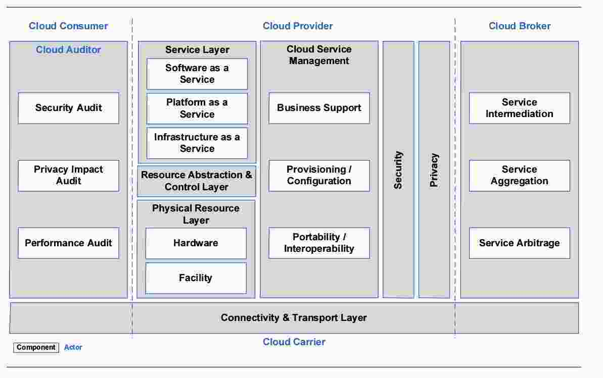
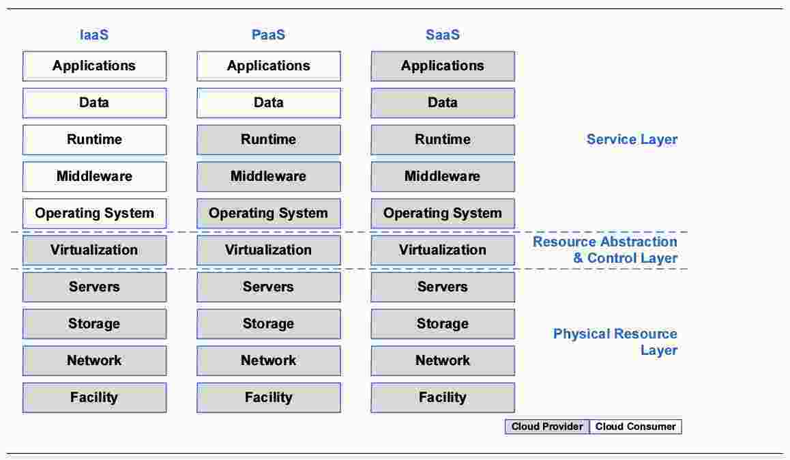
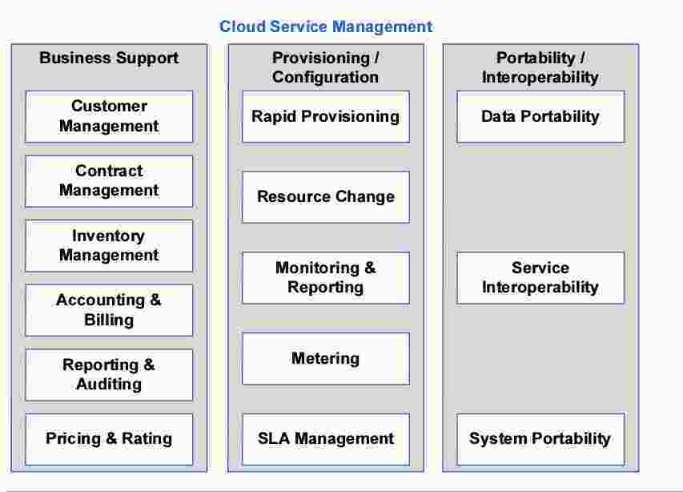

# Cloud Computing
Internet of Things - BigData - Enterprise , Data Analytics Ecosystem in the Cloud, FOG Computing (IOT Daten werden vorverdichtet), Wichtige Technologien: SOA, Grid-Computing, Virtualisierung, Economiy of Scale: Mehr Masse, desto billiger Bereitstellung, CPU, I/O (Bandbreite) und Memory (RAM & Storage), Schwierig bereitzustellen / teuer: I/O

## Einleitung
### Kostentreiber
Lizenzen, Personal, Software Wartung & Support, kleiner: Hardware Wartung / Support, Hardware Implementierung & Integration, Hardware-Betrieb  
Unter 15 User: Cloud in der Regel billiger

### Definition Cloud
Verschiedenste Definitionen, eine davon: Globales Delivery Modell, überall und jederzeit abrufbar  

**Vollständige Definition durch NIST:** Cloud  Computing ist ein Modell, welches den  allgegenwärtigen und komfortablen „on-demand“ netzwerkbasierten Zugriff auf einen Pool konfigurierbarer Rechenleistung (Netzwerke, Server, Speicher, Anwendungen und Dienste), die einfach bereitgestellt und mit minimalem Verwaltungsaufwand seitens des Servicegebers freigeschaltet werden kann, erlaubt.

### Charakteristika
  - On-Demand Self-Service (Customer Self Service)
  - Broad Network Access (Zugriff via standardisierte Mechanismen)
  - Resource Pooling: Bereitstellung via mandantenfähiges Betriebsmodell (Konsequenzen: Schwierigkeiten wie z.B. Virtualisierung Netzwerk)
  - Rapid Elasticity
  - Measured Service

  **Kosten:** IT: normal via Umlagefaktoren auf Abteilungen, etc (z.B. via Anzahl User), Cloud Computing: Alles muss gezählt werden

### Bereitstellungsmodelle
  - Private Cloud (in Enterprise)
  - Community Cloud
  - Public Cloud
  - Hybrid Cloud: 2 Dimensionen, Kombination zwischen Private / Public Cloud oder Kombintation On-Premise und Clouds

### Business Cases
  - Economy of Scale
  - Pay-Per-Use
  - Self-Service
  - Elastizität der Dienste
  - Time2Market
  - IT-Sicherheit und Datenschutz
  - Technologieexpertise
  - Downtime
  - Data-at-Rest

## Basis 1: Virtualisierung
Alle Techniken, welche die Faktoren CPU, Storage, Memory, I/O und Netzwerk zur Verfügung stellen.

  - Partitionierung: Aufteilung einzelner Systeme in mehrere logische Systeme
  - Aggregation: Verbindung mehrerer physischer Systeme zu grösseren logischen Systemen
  - Emulation: Abbildung unterschiedlicher Systemarchitekturen aufeinander.

### Server-Virtualisierung
  - Hardware-Partitioning: OS werden durch Partitionierung auf HW-Ebene vollständig getrennt.
  - Hypervisor Based no HW Integration: Hypervisor / VMM spezielle SW, die ausslischlich Fkt für Zuordnung physischer Ressourcen zu virtuellen Servern realisiert.
  - Hypervisor Based with HW Integration: Auswechselbare HW
  - Software Virtualization (VM-Ware)
  - Operating System Virtualization: Mach-Kernel (Plan9-Kernel)

### Storage-Virtualisierung
Basiert auf SAN, Kontrolldaten: Wo gespeichert, wie viele Kopien

**Architekturen:**  
  - In-Band Architektur: Nutz- / Kontrolldaten aufdemselben Weg übertragen, Virtualisierung via Appliance, keine zusätzlichen Komponenten auf Server notwendig
  - Out-of-Band Architektur: Ursprung: Telekomm, Nutzdaten / Kontrolldaten gehen getrennte Wege, Daten über das SAN, Virtualisierung auf Appliance (nur Kontrolldaten), Server benötigt zusätzliche SW
  - Split-Path Architektur: Nutzdaten / Kontrolldaten getrennt, keine Zusatz-SW auf Server notwendig, Trennung in intelligentem Switch-Port / Fast Port

### Netzwerk Virtualisierung
Alle Komponenten eines oder mehrerer Netzwerke müssen virtualisiert werden, Technologie ist in Entwicklung, VLAN Standard beschränkt die Anzahl auf 4000, global nicht ausreichend

**Wichtigste Techniken:**
  - Portbased VLAN
  - Tagged VLAN
  - Label Switching
  - Proprietäre Techniken: Hyper-V, VxLAN,...

## Basis 2: Grid-Computing
Motivation: Viele Daten von Sensoren, Geschichte: Entwickelt während dem Bau des CERN, Grundidee: Massive Sensor- / Demografischedaten, o.ä. auf einmal Analysieren, Gesamtsicht auf alle Daten, one size fits all, keine Mandantenfähigkeit

### Definition
Grid: Ableitung aus Analogie zum Stromnetz, Grid ist Infrastruktur zur integrierten, kollaborativen Nutzung von Ressourcen, die verschiedenen Organisationen gehören und von diesen verwaltet werden

### Grid Basismodell:
  - Application
  - Collective: Protokolle zur globalen Verwaltung / Zugriff
  - Resource: Aushandlung, Initiierung, Monitoring, Kontrolle, Verrechnung, bEzahlung der gemeinsamen Benutzung von Operationen.
  - Connectivity: Zentrale Kommunikations- und Authentisierungs-Protokolle für Grid Netzwerk Transaktionen
  - Fabric: Alle Ressourcen, auf die über Grid Protokolle zugegriffen werden können.
    - Type: Computational
    - Type: Storage
    - Type: Network
    - Type: Code Repositories
    - Type: Catalogs (Analytics)

### Aufgabenstellungen / Anwendungen
  - Data Intensive Computing
  - Collaborative Computing
  - Distributed Supercomputing
  - High Troughput Processing

  - Grid Computing for Science
    - Computing Grid
    - Data Grid (wichtigstes)
    - Service Grid
    - Intelligent Grid

## Referenzarchitekturen
Einfachste Form: Kombination aus standardisierten Services (aufgebaut wie eine SOA), Schichten für Service-Bereitstellung und -Management

### NIST
Nur geringer Leistungsbereich, Vielzahl von Services für Bereitstellung und Management, definierte Rollen, Bausteine:

**Service-Orchestration (IaaS, PaaS, SaaS)**

**Service-Management**

**Aktoren / Rollen**
  - Cloud Consumer
  - Cloud Provider: Anbieter
  - Cloud Carrier: Netzbetreiber (Sunrise, Salt, Swisscom...)
  - Cloud Broker: Mittelsmann, Anbieter oder interne Organisation
  - Cloud Auditor: Unabhängige Beurteilung von Cloud-Services / Infrastrukturen

### Weitere
  - IBM CCRA: Technisch, nur drei Rollen
  - Oracle CRA: Andere Herangehensweise, Ziel: Inhouse Funktionalität auf Knopfdruck in die Cloud migrieren und zurück. Bestehende Welt möglichst 1:1 verschieben
  - Microsoft Windows Azure: Client- / Integration- / Application- / Data-Layer
  - Swiss ICT: Cloud Architecture Blueprint

### Hints
  - NIST merken
  - First Followers: IBM, Oracle, SAP
  - 5 Rollen
  - Oracle und SAP: Verwendung von Appliances zur Verknüpfung von internen mit externen Diensten

## Cloud Computing Anbieter
Wann grosser Anbieter: > 1 Mio. Server im Einsatz. ausgelegt auf:
  - Hosting Webanwendungen
  - Bereitstellung von Inhalten und Medien
  - Batchverarbeitungen
  - Fehlertoleranz und hohe Verfügbarkeit
  - Umfangreiche Verarbeitung und riesige Datenmengen
  - Ad-Serving
  - Notfallwiederherstellung für lokale Anwendungen

8 Regionen, 3 Bereitstellungszonen (unabhängige Bereiche, Redundanz, Daten- / Strom-Unabhängigkeit), Edge-Locations (wichtig für CDN's, CDN: Infrastruktur zur schnellen / ruckelfreien Bereitstellung von Medieninhalten auf der ganzen Welt)

### Amazon
Cloud-Angebot entstanden aus Peaks im Versandhandel (Weihnachten, Ostern), Amazon Web Services (AWS),

### Google
Google App Engine, Verteilung / Leistung kann nicht gesteuert werden (ist transparent), Einsatzgebiete:
  - Entwicklung mobiler Back-Ends
  - Big Data Anwendungen
  - Spiele

### Microsoft
Idee: OS Windows in der Cloud, Historie: Ursprung OS für Rechen-OS: OS390, UNIX - Mach - Plan J - Azure, Azure: 1 grosses OS, Cloud seit 2010, 4 primäre Modelle: Virtual Machines, Cloud Services, Web Sites, Mobile Services

### Hints
  - Microsoft: OS als Idee, mehr Services, höhere Granularität, tendiert zu SaaS
  - Andere: Zuerst ausgelegt auf Paas und IaaS
  - Oracle: Nur Saas und PaaS
  - SAP: Nur SaaS

## Einsatzgebiete und Risikofaktoren
**Einsatzgebiete:** Raster im Script (Seite 46)

**Risiken:**
  - Datendiebstahl / Datenverlust (direkt)
  - Datenverlust (indirekt)
  - Missbrauch von (Nutzer-) Daten
  - ...

## Zusammenfassung / Hints
Basis für Cloud-Computing: Virtualisierung, SOA, Grid Computing - Komplexeste Virtualisierung: Netzwerk, Software Defnied Netzworking, Grid-Computing: Aggregierung von Ressourcen, "1 grosse Ressource", Keine Mandantenfähigkeit (Gegensatz zu Cloud-Computing), Public-Cloud: Globale Lösungen, welche vor allem im Consumer-Bereich verwendet werden (iCloud, Office 365, Dropbox, ...)

## Aufgabe Amazon
Redundantes Web-Hosting bestehend aus:
  - Elastic Load Balancing
  - 2 Web Server (Windows)
  - 4 Application Server (2 Windows, 2 Linux)
  - 4 Database Server (MSSQL?)
